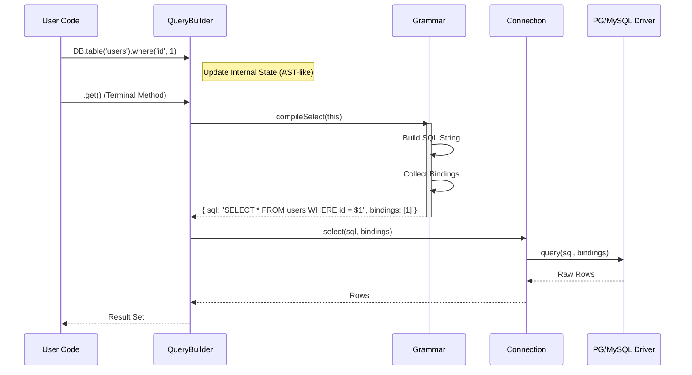
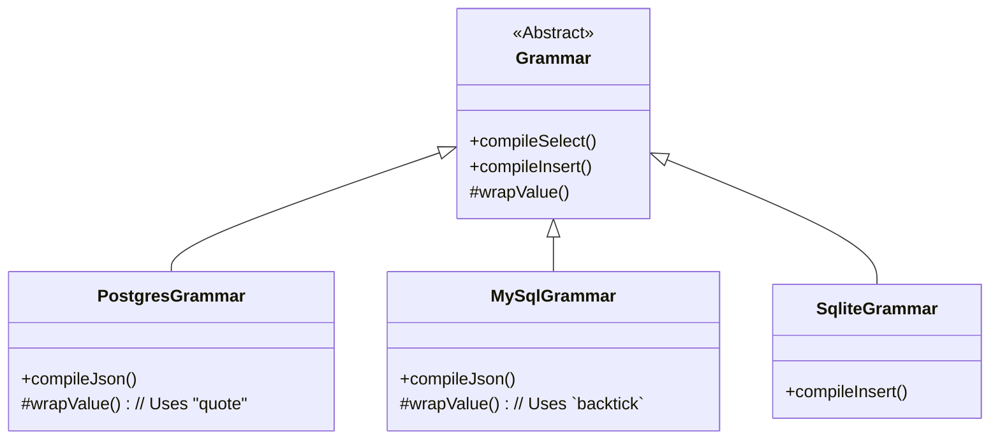

# Atlas ORM Architecture: The Database Orbit

**Version**: 1.0.0
**Module**: `@gravito/atlas`
**Focus**: Query Builder, Grammar Compilation, Connection Management

---

## 1. 架構概覽 (Overview)

Atlas 是 Gravito 的標準資料庫層，它採用了 **Query Builder (查詢建構器)** 模式，旨在提供流暢 (Fluent) 且安全的資料庫操作介面。

核心組件：
1.  **DB Facade**: 靜態入口，管理連接工廠。
2.  **Connection Manager**: 處理驅動 (Drivers) 與連接池 (Pooling)。
3.  **Query Builder**: 狀態機，負責收集查詢條件。
4.  **Grammar**: 編譯器，將 Builder 狀態轉換為 SQL 字串。

---

## 2. 查詢執行流程 (Query Execution Flow)



---

## 3. Grammar 編譯系統 (Grammar Compilation)

Atlas 不依賴通用的 SQL AST 庫，而是使用繼承式的 Grammar 系統來處理資料庫方言 (Dialects)。

### 類別結構



### 編譯策略
*   **String Concatenation**: 為了極致性能，Grammar 使用高效的字串拼接。
*   **Late Binding**: 綁定參數 (Bindings) 直到最後一刻才被展平 (Flatten)，這允許嵌套查詢 (Sub-queries) 正確地合併其參數。

---

## 4. 連接管理 (Connection Management)

Atlas 支援多資料庫連接與讀寫分離。

```typescript
// 配置範例
DB.addConnection('read_replica', { ... });
DB.addConnection('write_master', { ... });
```

### 工廠模式
`ConnectionFactory` 根據配置的 `driver` 欄位動態加載適配器：

*   `postgres` -> `PostgresConnection` (使用 `pg` pool)
*   `mysql` -> `MySqlConnection` (使用 `mysql2` pool)
*   `sqlite` -> `SqliteConnection` (使用 `better-sqlite3`)

### Transaction Scope
事務是通過 Closure (閉包) 管理的，這確保了連接的正確釋放與 Commit/Rollback。

```typescript
await DB.transaction(async (trx) => {
    // trx 是一個綁定了特定連線的 QueryBuilder 實例
    await trx.table('users').update(...);
    
    // 如果這裡拋出錯誤，自動 Rollback
    // 如果執行完畢，自動 Commit
});
```

---

## 5. 設計決策 (Design Decisions)

### 為何不使用 TypeORM 或 Prisma？

1.  **Cold Start**: Prisma 的 Rust Binary 和 TypeORM 的龐大 Metadata 反射在 Serverless/Edge 環境下啟動較慢。Atlas 專注於 **Lightweight**。
2.  **Bun Compatibility**: Atlas 優先支援 Bun 的原生驅動 (如 `bun:sqlite`)，以獲得更好的 I/O 性能。
3.  **Explicit Control**: 開發者有時需要對 SQL 有完全的控制權。Query Builder 提供了比 ORM 更透明的 SQL 生成邏輯，同時比手寫 SQL 更安全。

### 安全性 (Security)
*   **強制參數化 (Mandatory Parameterization)**: Grammar 層預設生成參數化 SQL (e.g., `WHERE name = $1`)。
*   **Safe Raw SQL (New in 1.1)**: 為了徹底解決 Raw SQL 的注入風險，我們引入了 Tagged Template Literals (`sql` tag)。
    ```typescript
    import { sql } from '@gravito/atlas';

    // ❌ 危險 (不建議)
    .whereRaw(`id = ${inputId}`) 
    
    // ✅ 推薦 (自動參數化)
    // 編譯為: WHERE id = $1, Bindings: [inputId]
    .whereRaw(sql`id = ${inputId}`)
    ```
    `sql` 標籤會自動提取模板字串中的變數，將其轉換為綁定參數，確保即使在 Raw 模式下也是 100% 安全的。

---

## 6. Atlas vs Drizzle & Prisma

為什麼在 Drizzle ORM 如此流行的當下，我們仍選擇自研 Atlas？

### 6.1 設計哲學 (Design Philosophy)

| 特性 | Drizzle ORM | Prisma | **Atlas (Gravito)** |
| :--- | :--- | :--- | :--- |
| **核心理念** | "If you know SQL, you know Drizzle" | "Data Browser & Schema First" | **"Fluent Interface & Developer Joy"** |
| **語法風格** | 函數式 (Functional), 接近 SQL 結構 | 物件導向 (Object-like), Schema 定義 | **鏈式調用 (Chaining), 類 Laravel** |
| **Runtime** | Thin Wrapper | Heavy Rust Binary | **Pure JS/TS String Builder** |

*   **Why Not Drizzle?**
    *   Drizzle 非常優秀，但其 API 設計極度依賴 TypeScript 類型推斷與 Schema 定義。
    *   Atlas 的目標是提供更**語義化**的高層封裝 (High-Level Abstraction)，例如 `scopeActive()`, `with('posts')` 等 Active Record 風格的便利性，這在快速開發 API 時能大幅減少心智負擔。我們希望寫代碼像寫文章一樣流暢，而不僅僅是寫「類型安全的 SQL」。

### 6.2 效能分析 (Performance)

Atlas 的 Runtime 效能處於 **Tier 0** (與 Drizzle 持平，遠快於 Prisma)。

*   **String Builder vs Object Mapping**:
    *   Atlas 的核心是一個高效的字串拼接器。在 V8/JSC 引擎中，字串操作經過了極致優化。
    *   它**沒有** Prisma 那樣的序列化/反序列化 (Serialization/Deserialization) 開銷，也**沒有** 跨語言調用 (JS <-> Rust) 的延遲。
*   **啟動速度 (Cold Start)**:
    *   由於是純 JS 實作且無大型 Schema 生成過程，Atlas 在 Serverless 環境下的冷啟動時間幾乎可以忽略不計 (< 5ms)。

### 6.3 結論

選擇 Atlas 不是因為它比 Drizzle 更強大，而是因為它更**適合 Gravito 的生態系**。它與 Gravito 的 DI 容器、FormRequest 以及未來的 Admin Panel 深度整合，提供了一致且優雅的全棧開發體驗。

---

## 7. 安全性演進與修復實踐 (Security Evolution & Fixes)

安全性是 Atlas 的核心考量。我們在評估早期版本後，針對 Raw SQL 的潛在注入風險進行了重大的架構升級。

### 7.1 從「人為防護」到「結構化防護」

在早期實作中，Raw SQL 依賴開發者自覺地使用第二個參數進行綁定：
```typescript
// 舊版：依賴開發者手動輸入 '?' 並確保與數組對應
.whereRaw('status = ? AND level > ?', [status, level])
```
這種做法雖然安全，但容易產生**人為疏失**（如參數順序錯誤或遺漏綁定），且在處理複雜的動態查詢時極易出錯。

### 7.2 修復方案：Tagged Template Literals (`sql` 標籤)

我們實作了標籤樣板字面量 (Tagged Template Literal)，這是一種在編譯階段與執行階段之間建立的安全層。

#### 底層運作邏輯：
1.  **參數提取**: `sql` 標籤會將模板字串中的變數自動分離。
2.  **預佔位符化**: 將所有變數位置自動替換為 `?` 佔位符。
3.  **封裝為 Expression**: 返回一個內建 `sql` 字串與 `bindings` 數組的 `Expression` 物件。

```mermaid
graph LR
    User[sql`id = ${id}`] --> TagFn[sql Tag Function]
    TagFn --> Parts[Part 1: 'id = ', Part 2: '']
    TagFn --> Values[Value: id]
    Parts & Values --> Final[Expression: 'id = ?', [id]]
```

### 7.3 安全性提升總結

*   **消除字串拼接**: 開發者不再需要使用 `+` 或 `${}` 來手寫 SQL，系統強制要求使用 `sql` 標籤來處理 Raw 表達式。
*   **類型安全**: `QueryBuilder` 的 Raw 方法現在優先接受 `Expression` 物件，這確保了輸入源是經過標籤化處理的。
*   **自動轉義**: 透過底層驅動的參數化查詢，任何傳入 `sql` 標籤的變數都會被視為數據而非指令，從根本上杜絕了 SQL 注入攻擊。
