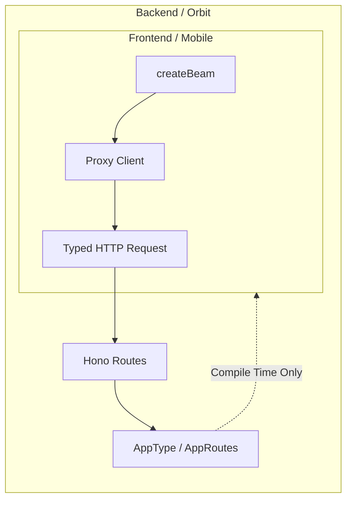

# Beam Architecture: The Type-Safe RPC Orbit

**Version**: 1.0.0
**Module**: `@gravito/beam`
**Focus**: Type-safe RPC, Zero-Overhead Client, Shared Types

---

## 1. 核心設計哲學 (Core Philosophy)

在傳統的前後端分離架構中，保持 API 接口與前端調用的一致性是一大痛點。通常需要引入 OpenAPI (Swagger) 生成工具或 GraphQL。

Beam 選擇了一種更輕量、更適合 TypeScript Monorepo 的路徑：**Shared Type Inference (共享類型推斷)**。

*   **Zero-Overhead**: 不引入額外的 Runtime (如 GraphQL 的 Resolver 或 tRPC 的 Adapter)。
*   **Native Hono Integration**: 直接利用 Hono 強大的泛型推斷能力，將後端的路由類型 "Teleport" 到前端。

---

## 2. 運作原理 (Mechanism)

Beam 的核心在於利用 TypeScript 的 `import type` 語法，僅導入類型定義而不導入後端代碼。



### 關鍵技術：`hc<T>` Wrapper
Beam 並非重新發明 RPC 客戶端，而是對 Hono 官方的 `hc<T>` 進行了極致簡化的封裝。

```typescript
// 內部實作概念
export function createBeam<T>(baseUrl: string, options?: ClientOptions) {
  // 直接委派給 Hono Client，但在類型層面提供了更友好的介面
  return hc<T>(baseUrl, options);
}
```

這保證了：
1.  **包體積**: `< 1kb` (Minified + Gzip)。
2.  **效能**: 與原生 `fetch` 幾乎無異。

---

## 3. 類型模式 (Type Patterns)

Beam 支援兩種主要的類型導出模式，以適應不同的專案規模。

### 3.1 AppType Pattern (Simple)
適用於小型專案或單一 `app.ts` 入口。

```typescript
// Server
const app = new Hono().get('/hello', ...);
export type AppType = typeof app;

// Client
const client = createBeam<AppType>(...);
await client.hello.$get();
```

### 3.2 AppRoutes Pattern (Modular)
適用於大型專案，使用 `app.route()` 進行模組化路由組合時。這是 Gravito 官方模板推薦的模式。

```typescript
// Server
function createApp() {
  return new Hono()
    .route('/api', apiRoute)
    .route('/auth', authRoute);
}
// 使用 ReturnType 推斷組合後的類型
export type AppRoutes = ReturnType<typeof createApp>;

// Client
const client = createBeam<AppRoutes>(...);
await client.api.users.$get();
```

---

## 4. 為什麼選擇 Beam?

| 特性 | REST (Axios) | GraphQL (Apollo) | tRPC | **Beam (Gravito)** |
| :--- | :--- | :--- | :--- | :--- |
| **類型安全** | ❌ (需手動定義) | ✅ (Codegen) | ✅ (Native) | **✅ (Native)** |
| **Runtime 開銷** | 低 | 高 (Parsing) | 中 (Adapter) | **極低 (Zero)** |
| **前後端耦合** | 低 | 中 | 高 | **高 (Type-level)** |
| **適用場景** | 公共 API | 複雜查詢 | Next.js 全棧 | **Gravito 全棧** |

Beam 是 Gravito 生態系中 "Frontend-Backend Symbiosis" (前後端共生) 理念的體現。它讓前端開發者感覺像是在直接調用後端函數，同時保持了 HTTP 的標準性。
