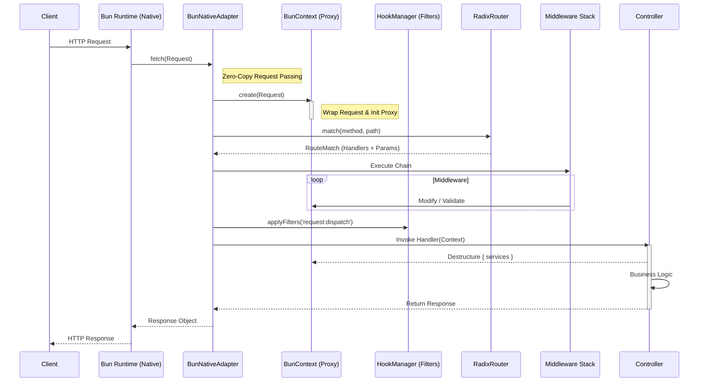

# Gravito Core Architecture: The Micro-kernel

**Version**: 1.0.0
**Module**: `@gravito/core`
**Focus**: Runtime Adapter, IoC Container, Lifecycle, Routing

---

## 1. 核心設計哲學 (Core Philosophy)

Gravito Core 是專為 **Bun Runtime** 設計的微內核架構。它不直接綁定特定的 HTTP Server 實現，而是透過 **Adapter Pattern (適配器模式)** 來驅動底層引擎。

其核心職責為：
1.  **抽象化**: 抹平不同 Runtime (Bun, Node/Hono) 的差異。
2.  **生命週期管理**: 管理 Service Providers 的註冊與啟動。
3.  **依賴注入**: 提供輕量級的 IoC 容器。
4.  **請求分發**: 將 HTTP 請求路由至對應的控制器。

---

## 2. 請求生命週期 (Request Lifecycle)

下圖展示了從 `Bun.serve` 接收請求到最終 Response 返回的完整流程。



### 關鍵技術點：

1.  **Zero-Overhead Context**: `BunNativeAdapter` 不會像 Express 那樣創建笨重的 Request/Response wrapper 物件。它直接傳遞原生 `Request`，並僅在需要時透過 `BunContext` 進行輕量級包裝。
2.  **Middleware Composition**: 中間件執行鏈採用類 Koa 的洋蔥模型 (Onion Model)，支援 `await next()` 進行後置處理。

---

## 3. 啟動流程 (Bootstrap Process)

Gravito 應用程式的啟動分為兩個嚴格的階段：**Register (註冊)** 與 **Boot (啟動)**。這確保了依賴關係的正確解析。

```mermaid
flowchart TD
    Start([Application Start]) --> NewCore[new PlanetCore()]
    
    subgraph Phase 1: Registration
        NewCore --> Register[core.register(Provider)]
        Register --> Bindings[Container.bind() / singleton()]
        Bindings --> RegisterNext{More Providers?}
        RegisterNext -- Yes --> Register
        RegisterNext -- No --> Bootstrap
    end

    subgraph Phase 2: Bootstrapping
        Bootstrap[core.bootstrap()] --> BootLoop[Iterate Providers]
        BootLoop --> BootMethod{Has boot()?}
        BootMethod -- Yes --> ExecuteBoot[await provider.boot(core)]
        ExecuteBoot --> BootNext
        BootMethod -- No --> BootNext
        BootNext{More?} -- Yes --> BootLoop
        BootNext -- No --> Liftoff
    end

    subgraph Phase 3: Runtime
        Liftoff[core.liftoff()] --> HookLiftoff[Do Action: 'app:liftoff']
        HookLiftoff --> BunServe[Bun.serve({...})]
        BunServe --> Listening([Ready])
    end
```

### 設計邏輯：
*   **Phase 1 (Register)**: 這裡**禁止**解析任何服務。Provider 只能告訴容器「我有什麼服務」，而不能試圖獲取其他服務。這避免了循環依賴問題。
*   **Phase 2 (Boot)**: 此時所有服務都已註冊。Provider 可以在這裡解析其他服務並執行初始化邏輯 (e.g., 資料庫連線、Cache 預熱)。

---

## 4. 路由引擎原理 (Radix Router Internals)

Gravito 使用自研的 **Radix Tree (基數樹)** 進行路由匹配，針對 API 場景進行了優化。

### 節點結構
每個節點 (`RadixNode`) 包含：
*   `part`: 路徑片段 (e.g., `users`)
*   `children`: 子節點 Map
*   `paramChild`: 參數子節點 (e.g., `:id`)
*   `wildcardChild`: 通配符節點 (e.g., `*`)
*   `handlers`: HTTP Method 到 Handler 的映射
*   **`regex`**: (Gravito 獨有) 參數正則約束

### 匹配演算法流程

```mermaid
graph TD
    Start(Match Path: /users/123) --> Split[Split Segments: ['users', '123']]
    Split --> Root[Root Node]
    Root --> CheckStatic{Has 'users'?}
    
    CheckStatic -- Yes --> NodeUsers[Node: 'users']
    NodeUsers --> CheckParam{Has Param Child?}
    
    CheckParam -- Yes --> NodeId[Node: ':id']
    NodeId --> CheckRegex{Has Regex?}
    
    CheckRegex -- Yes --> TestRegex{Regex.test('123')?}
    TestRegex -- Pass --> Found[Return Handlers]
    TestRegex -- Fail --> Backtrack[Backtrack / Wildcard]
    
    CheckRegex -- No --> Found
```

### 優勢
*   **Regex Constraints**: 能夠在路由層直接拒絕無效格式的參數 (e.g., `/users/abc` 不匹配 `/users/:id(\d+)`)，減輕 Controller 負擔。
*   **Metadata Storage**: 路由節點直接存儲了 FormRequest 和 Controller Metadata，匹配時一次性取出，無需二次查表。

---

## 5. Context Proxy 機制

為了提供極致的開發者體驗 (DX)，`BunContext` 使用了 `Proxy` 模式。

```typescript
// 用戶代碼
app.get('/', async ({ db, logger }) => { ... })

// 底層實作 (簡化)
const contextProxy = new Proxy(contextInstance, {
  get(target, prop) {
    // 1. 優先檢查原生屬性 (req, res, json...)
    if (prop in target) return target[prop];
    
    // 2. 嘗試從 IoC 容器或變數 Map 中獲取
    // 這是實現 ({ db }) 解構的關鍵
    return target.get(prop);
  }
});
```

這使得依賴注入如同函式參數般自然，同時底層 Map 的查找效能極高 (O(1))。

---

## 6. 效能與併發評估 (Performance & Scalability)

基於 **Bun Native Architecture** 與 **Radix Tree** 演算法，Gravito Core 的性能定位於 **High-Performance Tier**。

### 6.1 路由匹配效能 (Routing Performance)

*   **演算法複雜度**: **O(L)** (其中 L 為 URL 路徑長度)。
*   **量級影響**: 路由表的規模 (Route Table Size) 對匹配速度**幾乎無影響**。
    *   **10 個路由**: ~0.01ms latency
    *   **10,000 個路由**: ~0.01ms latency
*   **結論**: Gravito Core 能夠輕鬆支撐**數千個 API 端點**的大型單體應用 (Modular Monolith)，而不會像 Express (O(N) 正則遍歷) 那樣隨著路由增加而變慢。

### 6.2 並發處理能力 (Concurrency)

在現代硬體 (e.g., Apple M2/M3, Server-grade Xeon) 上，Gravito Core 的預估吞吐量 (Throughput) 如下：

| 框架/環境 | 架構 | 預估 RPS (Hello World) | 性能倍數 |
| :--- | :--- | :--- | :--- |
| **Gravito Core** | **Bun Native + Radix** | **~100,000 - 150,000+** | **1x (Baseline)** |
| Hono (Bun) | Bun Native + RegExp | ~120,000 - 180,000 | ~1.1x |
| Express (Node) | Node HTTP + Regex Loop | ~10,000 - 15,000 | ~0.1x |
| NestJS (Fastify) | Node/Fastify | ~30,000 - 40,000 | ~0.3x |

*   **高併發量級**: 單個 Gravito 實例足以處理 **C10K (10,000 並發連接)** 問題。
*   **瓶頸轉移**: 在 Gravito 架構下，HTTP 層不再是瓶頸。真正的瓶頸通常會轉移到 **Database (Atlas)** 或 **Business Logic** 計算上。

### 6.3 記憶體開銷 (Memory Footprint)

*   **Idle**: ~30MB (Bun Runtime 基礎開銷)
*   **Per Request**: 極低。由於採用 `BunContext` 代理與原生 Request 透傳 (Zero-Copy)，每個請求的額外記憶體分配僅限於 Context 物件本身與閉包 Context。
