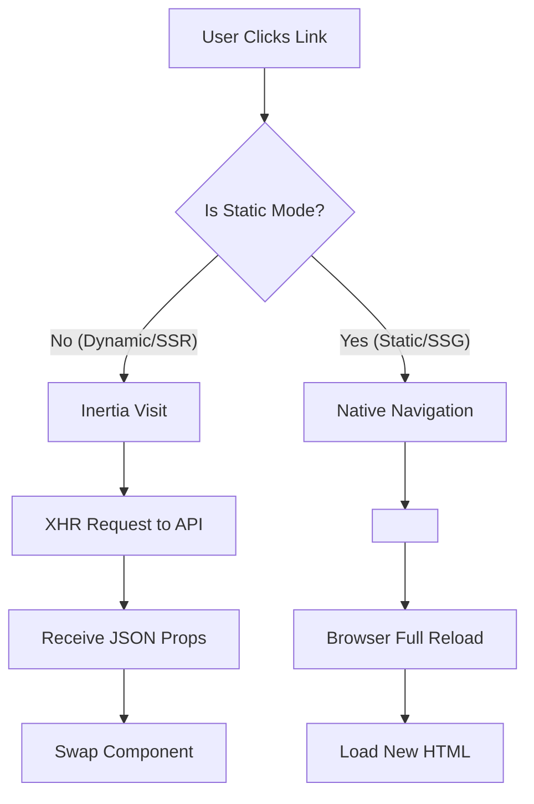
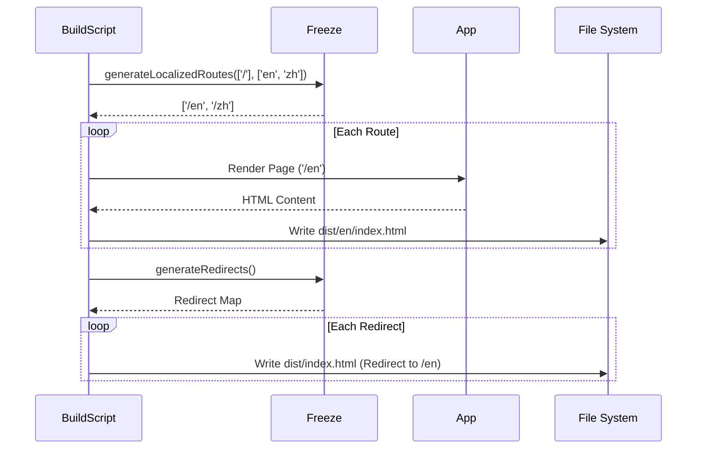

# Freeze SSG Architecture: Static Site Generation

**Version**: 1.0.0
**Module**: `@gravito/freeze`
**Focus**: SSG, i18n Routing, Hybrid Navigation

---

## 1. 核心設計哲學 (Core Philosophy)

Freeze 的目標是實現 **"Hybrid Deployment"**：同一套 Gravito 應用程式代碼，既可以部署為動態的 Node.js/Bun 伺服器 (SSR)，也可以編譯為純靜態 HTML (SSG) 部署至 CDN。

為了達成此目標，Freeze 解決了兩個核心衝突：
1.  **導航衝突**: SPA 需要 API 支持 (Inertia)，而 SSG 僅有 HTML。
2.  **路由衝突**: 動態伺服器可根據 Header 判斷語言，靜態伺服器只能依賴 URL 路徑。

---

## 2. 雙模路由機制 (Dual-Mode Routing)

Freeze 透過 `FreezeDetector` 在運行時動態檢測環境，並改變前端行為。



### 實現細節
*   **Detector**: 檢查 `window.location.hostname` 是否在 `staticDomains` 白名單或符合靜態託管特徵 (e.g., `.github.io`)。
*   **Link Component**: 前端適配器 (`freeze-vue`, `freeze-react`) 封裝了基礎 Link 組件。
    *   動態環境渲染為 `<Link>` (Inertia)。
    *   靜態環境渲染為 `<a>` (Native)。

---

## 3. 本地化路由策略 (Localization Strategy)

在純靜態環境中，我們無法讀取 `Accept-Language` 請求頭。因此，Freeze 強制採用 **URL-based Localization**。

### 3.1 抽象路徑 vs 具體路徑
*   **Abstract Route**: `/about` (開發者認知的路徑)
*   **Concrete Route**: `/en/about`, `/zh/about` (實際生成的檔案)

### 3.2 靜態轉址 (Static Redirection)
當使用者訪問抽象路徑 `/about` 時，由於沒有後端伺服器進行 302 重定向，Freeze 在構建時會生成一個 **"Redirect HTML"**：

```html
<!-- dist/about/index.html -->
<html>
<head>
  <meta http-equiv="refresh" content="0; url=/en/about">
  <script>window.location.href='/en/about'</script>
</head>
</html>
```

這確保了即使用戶輸入簡短的 URL，也能被正確導引至預設語言版本。

---

## 4. 構建流程 (Build Pipeline)

Freeze 介入 Gravito 的構建流程，將動態路由轉換為靜態文件結構。



---

## 5. SEO 與 Sitemap

Freeze 在構建時會自動生成符合 Google 規範的多語言 Sitemap。

### `x-default` 與 `hreflang`
對於每個頁面，Freeze 自動計算並注入 `alternates`：

```xml
<url>
  <loc>https://example.com/en/about</loc>
  <xhtml:link rel="alternate" hreflang="en" href="https://example.com/en/about"/>
  <xhtml:link rel="alternate" hreflang="zh" href="https://example.com/zh/about"/>
  <xhtml:link rel="alternate" hreflang="x-default" href="https://example.com/en/about"/>
</url>
```

這確保了搜尋引擎能正確理解頁面的語言版本關係，避免重複內容懲罰。

---

## 6. 總結 (Summary)

Freeze 是 Gravito "大一統" 願景的最後一塊拼圖。它讓開發者能夠使用熟悉的 **Monolith** 模式開發，最後卻能交付出 **Serverless** 甚至 **Static** 的產品，極大降低了維運成本與部署門檻。
