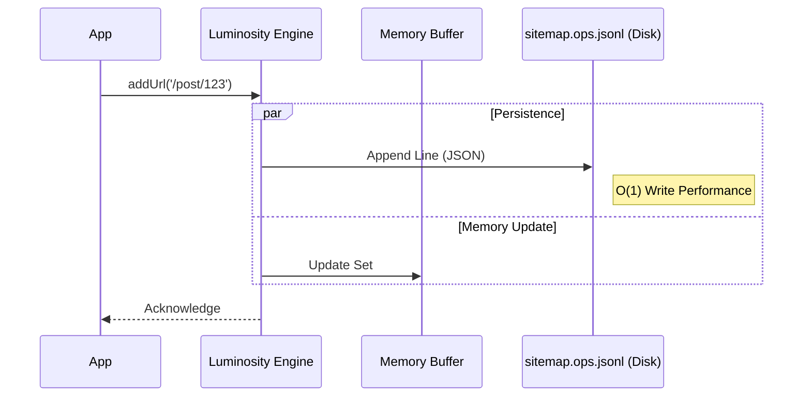
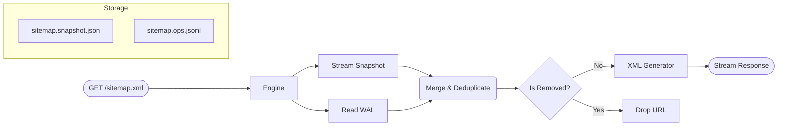
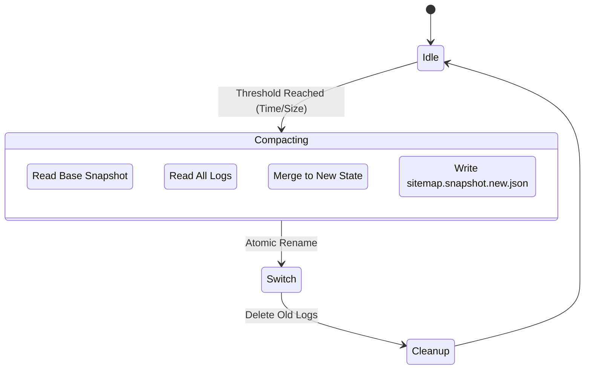

# Luminosity Engine Architecture: The SEO Core

**Version**: 1.0.0
**Module**: `@gravito/luminosity`
**Focus**: LSM-Tree, Streaming XML, Sitemap Generation

---

## 1. 核心設計挑戰 (The Challenge)

在構建百萬級頁面的 Sitemap 時，傳統 Web 框架面臨三大難題：
1.  **Memory Limit**: 一次性將 50,000 個 URL 的 XML 結構載入記憶體會導致 OOM (Out of Memory)。
2.  **Lock Contention**: 在高併發寫入時 (e.g., 使用者生成內容 UGC)，頻繁讀寫同一個 XML 檔案會導致鎖競爭。
3.  **Latency**: 每次新增 URL 都重寫整個檔案是極度低效的 (O(n))。

Luminosity 引入了資料庫領域的 **LSM-Tree (Log-Structured Merge-Tree)** 算法來解決這些問題。

---

## 2. LSM-Tree 寫入架構 (Write Path)

Luminosity 採用 **Append-Only** 策略來保證極致的寫入效能。

### 技術細節：
*   **Zero-Lock**: 由於是 Append 操作，作業系統可以並行處理多個寫入請求而無需應用層鎖。
*   **JSON Lines**: 使用 `.jsonl` 格式，每一行代表一個 Operation (`add` 或 `remove`)。崩潰恢復時只需重放日誌。

---

## 3. 讀取與合併流程 (Read Path)

當爬蟲 (Googlebot) 請求 `sitemap.xml` 時，引擎執行 **Merge-on-Read**。

### 技術細節：
*   **Streaming**: 整個流程是串流的。Snapshot 檔案透過 `ReadableStream` 讀取，合併後的 URL 透過 Generator 逐個生成 XML 標籤，並直接 pipe 到 HTTP Response。
*   **Memory Efficiency**: 無論 Sitemap 有多大，記憶體中僅保留當前的 Buffer (幾 KB)。

---

## 4. 壓縮機制 (Compaction Process)

為了防止 WAL 無限增長，背景進程會定期執行 Compaction。

### 設計邏輯：
*   **Atomic Rename**: 寫入新的 Snapshot 後，使用 `fs.rename` 原子操作替換舊檔，確保在壓縮過程中讀取請求不會失敗。
*   **Threshold**: 可配置觸發條件 (e.g., 每小時或每 1000 個 Ops)。

---

## 5. 多模式架構 (Tri-Mode)

Luminosity 支援三種運行模式以適應不同環境：

| 模式 | 適用場景 | 儲存機制 | 優點 | 缺點 |
| :--- | :--- | :--- | :--- | :--- |
| **Dynamic** | 小型網站 (< 1k Pages) | 無 (Runtime計算) | 簡單，無狀態 | 每次請求都需重算，CPU 消耗大 |
| **Cached** | 中型網站 (< 50k Pages) | 記憶體 + 定時刷新 | 響應快 | 佔用記憶體，重啟後資料丟失 |
| **Incremental** | 大型網站 (> 1M Pages) | **LSM-Tree (Disk)** | **無限擴展**，寫入極快，記憶體佔用低 | 依賴持久化文件系統 (EFS/Volume) |

---

## 6. 自動分頁 (Auto-Pagination)

遵循 Sitemap Protocol 標準，單個 XML 文件限制為 50,000 URLs。

*   **Sitemap Index**: 當 URL 數量 > 50k 時，Luminosity 自動生成 `<sitemapindex>`。
*   **Query-based Pagination**: 實際的 URL 列表通過 `/sitemap.xml?page=N` 獲取。LSM 引擎在 Read Merge 階段會自動執行 `skip(page * limit)` 與 `take(limit)` 操作。
