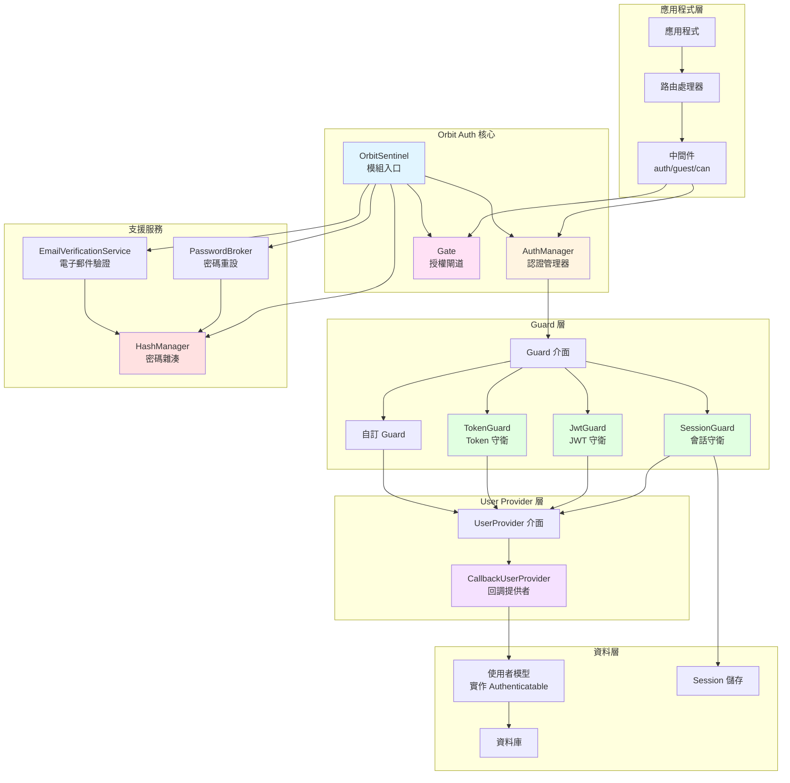
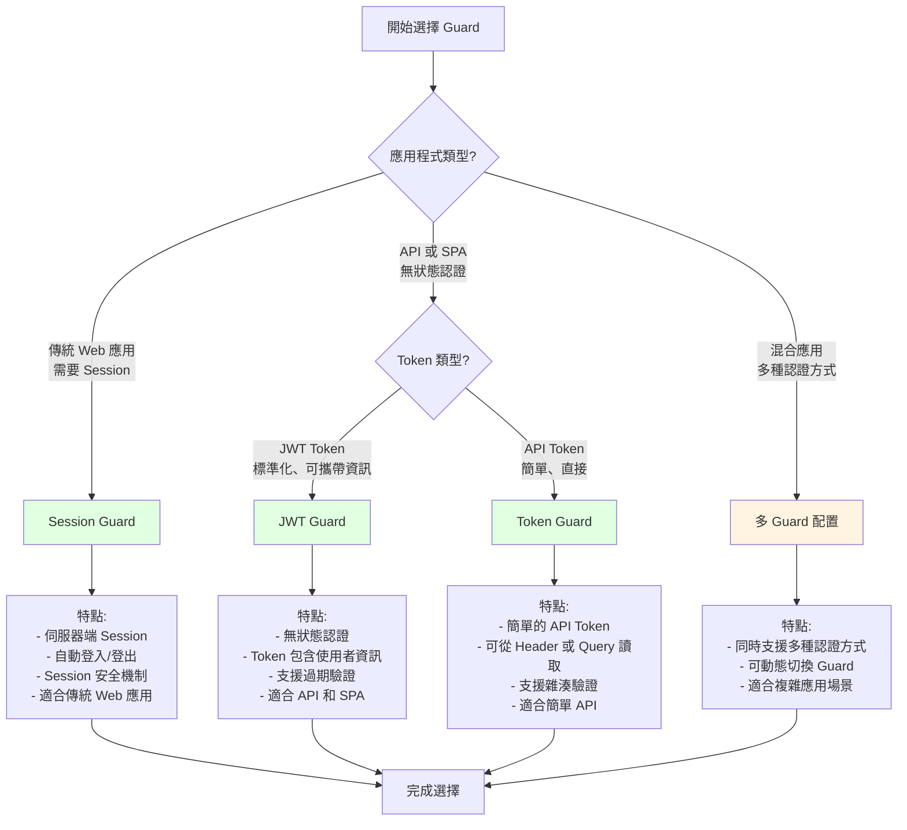
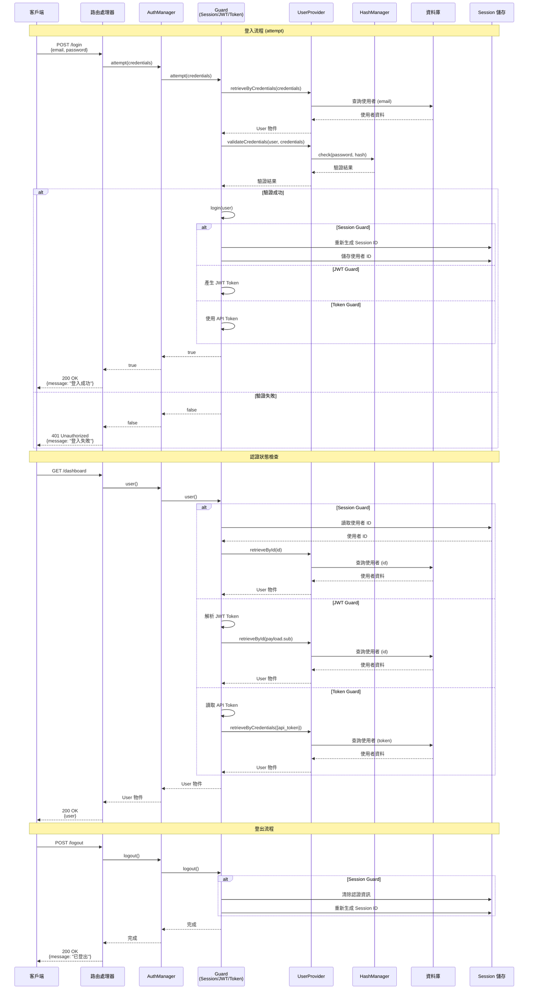
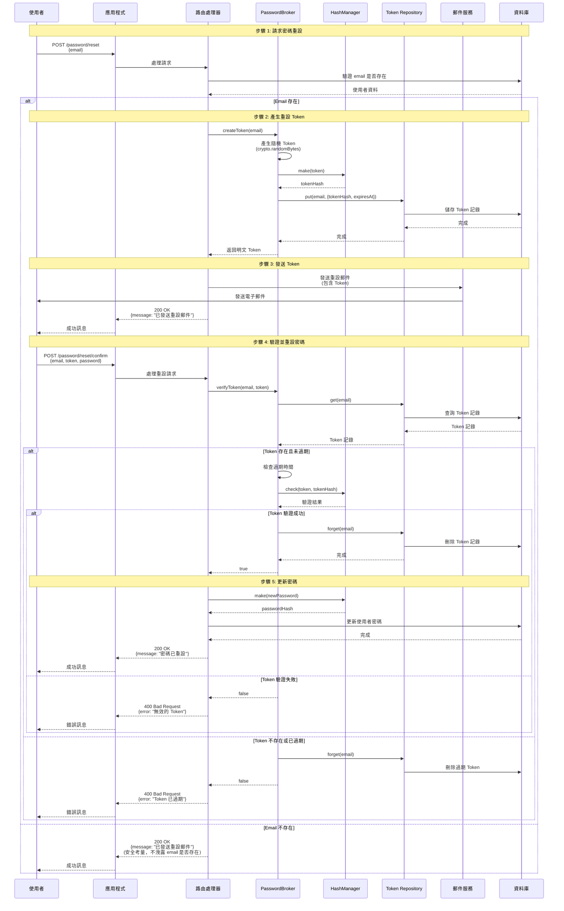
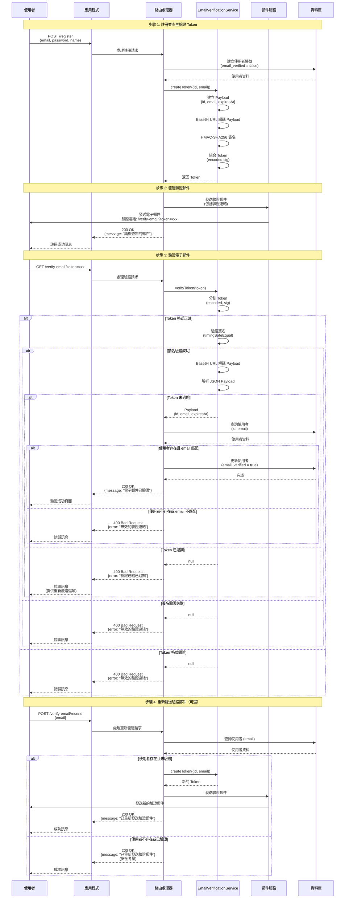
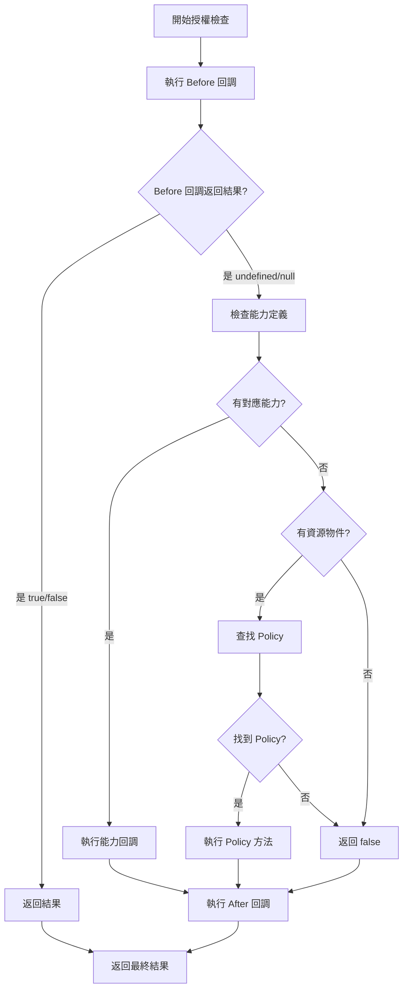
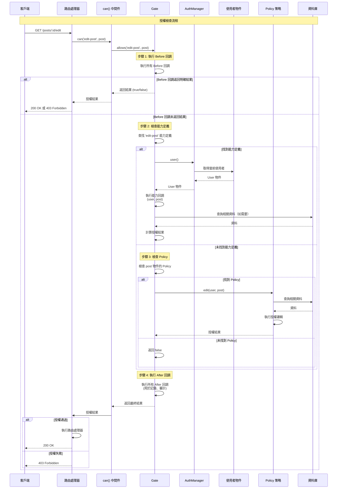

# @gravito/sentinel

> The Authentication and Authorization Orbit for Galaxy Architecture.

## 概述

### 模組簡介

`@gravito/sentinel` 是 Gravito Galaxy 架構中的認證與授權 Orbit 模組，提供完整且靈活的認證系統。本模組採用類似 Laravel 的認證架構設計，讓熟悉 Laravel 的開發者能夠快速上手，同時也為 TypeScript/JavaScript 生態系統提供了現代化的認證解決方案。

### 功能特色

Orbit Auth 提供以下核心功能：

- **多種認證守衛（Guards）**：支援 Session、JWT 和 Token 三種認證方式
- **靈活的使用者提供者（User Providers）**：目前支援 CallbackUserProvider，可自訂使用者檢索邏輯
- **授權系統（Gates）**：提供類似 Laravel Gate 的授權機制，支援能力定義和檢查
- **密碼管理**：內建 HashManager，支援 bcrypt 和 argon2id 雜湊演算法
- **密碼重設功能**：提供 PasswordBroker 服務，支援密碼重設流程
- **電子郵件驗證**：提供 EmailVerificationService，支援電子郵件驗證功能
- **中間件支援**：提供 `auth()`、`guest()` 和 `can()` 中間件，方便保護路由
- **與 PlanetCore 深度整合**：作為 Gravito Orbit，可無縫整合到 PlanetCore 應用程式中

### 支援的認證方式

Orbit Auth 支援三種主要的認證方式：

1. **Session Guard**：使用伺服器端 Session 維護認證狀態，適合傳統 Web 應用程式
2. **JWT Guard**：使用 JSON Web Token 進行無狀態認證，適合 API 和 SPA 應用
3. **Token Guard**：使用簡單的 API Token 進行認證，適合簡單的 API 場景

每種 Guard 都有其適用場景，您可以根據應用程式需求選擇合適的認證方式，或同時使用多種 Guard。

### 與 Laravel Auth 的相似性

Orbit Auth 的設計靈感來自 Laravel 的認證系統，如果您熟悉 Laravel，會發現許多相似的概念：

- **Guard 系統**：與 Laravel 的 Guard 概念相同，負責處理認證狀態
- **User Provider**：類似 Laravel 的 User Provider，負責從資料來源檢索使用者
- **Gate 授權**：與 Laravel Gate 功能相似，支援能力定義和授權檢查
- **中間件**：提供類似 Laravel 的認證中間件（`auth`、`guest`、`can`）
- **密碼雜湊**：使用與 Laravel 相同的 bcrypt 和 argon2id 演算法

然而，Orbit Auth 也針對 TypeScript/JavaScript 生態系統進行了優化：

- **TypeScript 原生支援**：完整的型別定義，提供更好的開發體驗
- **Hono 整合**：專為 Hono 框架設計，充分利用 Hono 的 Context 系統
- **現代化 API**：使用 async/await 和 Promise，符合現代 JavaScript 開發習慣

## 安裝與基本設定

### 安裝步驟

使用 Bun 安裝 `@gravito/sentinel`：

```bash
bun add @gravito/sentinel
```

**注意**：Orbit Auth 需要以下依賴：

- `gravito-core`：Gravito 核心模組（peer dependency）
- `hono`：Hono 框架（peer dependency，版本 ^4.0.0）

如果您使用 Session Guard，還需要安裝 `@gravito/pulsar`：

```bash
bun add @gravito/pulsar
```

### 最小配置範例

以下是一個最簡單的 Orbit Auth 配置範例，使用 Session Guard 和 CallbackUserProvider：

```typescript
import { PlanetCore } from 'gravito-core'
import { OrbitSentinel, type AuthConfig, CallbackUserProvider } from '@gravito/sentinel'
import { OrbitPulsar } from '@gravito/pulsar'

// 建立 PlanetCore 實例
const core = new PlanetCore()

// 安裝 Session Orbit（Session Guard 需要）
const session = new OrbitPulsar({
  driver: 'memory', // 或使用其他 Session 驅動
})
session.install(core)

// 定義認證配置
const authConfig: AuthConfig = {
  defaults: {
    guard: 'web',        // 預設使用 'web' guard
    passwords: 'users',  // 預設使用 'users' provider 進行密碼重設
  },
  guards: {
    web: {
      driver: 'session',      // 使用 Session Guard
      provider: 'users',      // 使用 'users' provider
      sessionKey: 'auth_session' // Session 鍵名
    }
  },
  providers: {
    users: {
      driver: 'callback'  // 使用 CallbackUserProvider
    }
  }
}

// 建立並安裝 OrbitSentinel
const auth = new OrbitSentinel({
  ...authConfig,
  bindings: {
    providers: {
      // 實作 CallbackUserProvider 的回調函數
      users: () => new CallbackUserProvider(
        // retrieveById: 根據 ID 取得使用者
        async (id) => {
          // 實作您的使用者查詢邏輯
          // 例如：return await db.users.findById(id)
          return null
        },
        // validateCredentials: 驗證憑證（密碼）
        async (user, credentials) => {
          // 實作您的密碼驗證邏輯
          // 例如：return await hash.check(credentials.password, user.password)
          return false
        },
        // retrieveByToken: Remember Me（目前未實作，可傳 null）
        async (identifier, token) => null,
        // retrieveByCredentials: 根據憑證取得使用者（用於 attempt）
        async (credentials) => {
          // 實作您的使用者查詢邏輯
          // 例如：return await db.users.findByEmail(credentials.email)
          return null
        }
      )
    }
  }
})

auth.install(core)
```

### 與 PlanetCore 整合

Orbit Auth 作為一個 Gravito Orbit，透過 `install()` 方法整合到 PlanetCore 中。安裝後，Orbit Auth 會在每個請求的 Context 中注入以下服務：

- **`auth`**：AuthManager 實例，用於處理認證操作
- **`gate`**：Gate 實例，用於授權檢查
- **`hash`**：HashManager 實例，用於密碼雜湊
- **`passwords`**：PasswordBroker 實例（如果啟用密碼重設功能）
- **`emailVerification`**：EmailVerificationService 實例（如果啟用電子郵件驗證）

您可以在路由處理器中透過 Context 存取這些服務：

```typescript
import { Hono } from 'hono'

const app = new Hono()

// 使用 core.app 作為 Hono 應用
app.get('/user', async (c) => {
  // 取得 AuthManager
  const auth = c.get('auth')
  
  // 檢查是否已認證
  if (await auth.check()) {
    // 取得當前使用者
    const user = await auth.user()
    return c.json({ user })
  }
  
  return c.json({ message: '未認證' }, 401)
})

// 將路由掛載到 core.app
core.app.route('/', app)
```

**完整整合範例**：

```typescript
import { PlanetCore } from 'gravito-core'
import { OrbitSentinel, type AuthConfig, CallbackUserProvider, HashManager } from '@gravito/sentinel'
import { OrbitPulsar } from '@gravito/pulsar'
import { Hono } from 'hono'

// 初始化 PlanetCore
const core = new PlanetCore()

// 安裝 Session
const session = new OrbitPulsar({ driver: 'memory' })
session.install(core)

// 建立 HashManager（用於密碼雜湊）
const hashManager = new HashManager({
  algorithm: 'bcrypt',
  bcrypt: { cost: 10 }
})

// 配置認證
const authConfig: AuthConfig = {
  defaults: {
    guard: 'web',
    passwords: 'users',
  },
  guards: {
    web: {
      driver: 'session',
      provider: 'users',
      sessionKey: 'auth_session'
    }
  },
  providers: {
    users: {
      driver: 'callback'
    }
  }
}

// 安裝 OrbitSentinel
const auth = new OrbitSentinel({
  ...authConfig,
  bindings: {
    providers: {
      users: () => new CallbackUserProvider(
        async (id) => {
          // 實作：根據 ID 查詢使用者
          // 這裡是範例，請替換為您的實際邏輯
          return null
        },
        async (user, credentials) => {
          // 實作：驗證密碼
          const password = credentials.password as string
          if (!password) return false
          return await hashManager.check(password, user.getAuthPassword() || '')
        },
        async (identifier, token) => null, // Remember Me 待實作
        async (credentials) => {
          // 實作：根據憑證查詢使用者（例如：email）
          // 這裡是範例，請替換為您的實際邏輯
          return null
        }
      )
    }
  }
})

auth.install(core)

// 定義路由
core.app.get('/user', async (c) => {
  const auth = c.get('auth')
  if (await auth.check()) {
    const user = await auth.user()
    return c.json({ user })
  }
  return c.json({ message: '未認證' }, 401)
})

// 啟動應用程式
// ...
```

### 中間件快速開始

使用內建的中間件保護您的路由。

```typescript
import { auth, guest, can } from '@gravito/sentinel'

// 保護路由（需要認證）
app.get('/dashboard', auth(), (c) => c.text('Dashboard'))

// 僅限訪客（已認證時會重定向）
app.get('/login', guest(), (c) => c.text('Login'))

// 授權檢查
app.get('/admin', auth(), can('manage-users'), (c) => c.text('Admin Panel'))
```

### Gate 與 Policy 快速開始

使用 Gate 定義授權邏輯。

```typescript
// 定義邏輯
const gate = c.get('gate')

// 簡單的閉包能力
gate.define('edit-post', (user, post) => {
  return user.id === post.user_id
})

// 檢查能力
if (await gate.allows('edit-post', post)) {
  // ...
}
```

### Guard 快速開始

存取認證管理器以處理認證狀態。

```typescript
const auth = c.get('auth')

// 取得當前使用者
const user = await auth.user()

// 檢查是否已認證
if (await auth.check()) {
  // ...
}

// 登入（Session guard）
await auth.login(user)

// 登出
await auth.logout()
```

## 📚 核心概念

Orbit Auth 的核心架構由四個主要組件構成：**Guard（守衛）**、**User Provider（使用者提供者）**、**Gate（授權閘道）** 和 **Authenticatable 介面**。理解這些組件是有效使用 Orbit Auth 的關鍵。

### 整體架構圖

以下圖表展示了 Orbit Auth 的整體架構和各組件之間的關係：



### Guard（守衛）

Guard 負責處理使用者的認證狀態。Orbit Auth 提供三種內建的 Guard 實作，每種都適用於不同的使用場景。

**Guard 選擇流程圖：**

以下流程圖幫助您選擇合適的 Guard：



**Guard 比較表：**

| 特性 | Session Guard | JWT Guard | Token Guard |
|------|---------------|-----------|-------------|
| **認證方式** | 伺服器端 Session | JWT Token | API Token |
| **狀態管理** | 有狀態 | 無狀態 | 無狀態 |
| **適用場景** | 傳統 Web 應用 | API、SPA | 簡單 API |
| **Token 位置** | Session 儲存 | Authorization Header / Query | Header / Query |
| **安全性** | 高（Session 安全機制） | 中（依賴 Token 過期） | 中（可選雜湊驗證） |
| **擴展性** | 低（需要 Session 儲存） | 高（無狀態） | 高（無狀態） |
| **Remember Me** | ⚠️ 待實作 | ❌ 不適用 | ❌ 不適用 |

#### Session Guard

Session Guard 使用會話（Session）來維護使用者的認證狀態，適合傳統的 Web 應用程式。

**特點：**
- 使用伺服器端 Session 儲存認證狀態
- 支援登入/登出功能
- 自動處理 Session 重新生成以增強安全性
- ⚠️ Remember Me 功能目前尚未實作（標記為 TODO）

**配置範例：**

```typescript
const authConfig: AuthConfig = {
  defaults: {
    guard: 'web',
  },
  guards: {
    web: {
      driver: 'session',
      provider: 'users',
      sessionKey: 'auth_session' // 自訂 Session 鍵名
    }
  }
}
```

**使用範例：**

```typescript
import { auth } from '@gravito/sentinel'

// 在路由處理器中取得 AuthManager
app.post('/login', async (c) => {
  const authManager = c.get('auth')
  
  // 嘗試使用憑證登入
  const success = await authManager.attempt({
    email: c.req.query('email'),
    password: c.req.query('password')
  })
  
  if (success) {
    return c.json({ message: '登入成功' })
  }
  
  return c.json({ message: '登入失敗' }, 401)
})

// 檢查認證狀態
app.get('/dashboard', auth(), async (c) => {
  const authManager = c.get('auth')
  const user = await authManager.user()
  
  return c.json({ user })
})

// 登出
app.post('/logout', auth(), async (c) => {
  const authManager = c.get('auth')
  await authManager.logout()
  
  return c.json({ message: '已登出' })
})
```

**Session Guard 的工作流程：**

1. 使用者登入時，`login()` 方法會：
   - 重新生成 Session ID（防止 Session Fixation 攻擊）
   - 將使用者 ID 儲存到 Session 中
   - 設定當前使用者實例

2. 後續請求中，`user()` 方法會：
   - 從 Session 中讀取使用者 ID
   - 透過 User Provider 取得完整的使用者物件
   - 快取使用者實例以避免重複查詢

3. 登出時，`logout()` 方法會：
   - 清除 Session 中的認證資訊
   - 重新生成 Session ID
   - 清除記憶體中的使用者實例

#### JWT Guard

JWT Guard 使用 JSON Web Token 進行無狀態認證，適合 API 和單頁應用程式（SPA）。

**特點：**
- 無狀態認證，不需要伺服器端 Session
- Token 包含使用者資訊，減少資料庫查詢
- 支援 Token 過期驗證
- 可從 Authorization Header 或 Query Parameter 讀取 Token

**配置範例：**

```typescript
const authConfig: AuthConfig = {
  guards: {
    api: {
      driver: 'jwt',
      provider: 'users',
      secret: process.env.JWT_SECRET || 'your-secret-key',
      algo: 'HS256' // 可選，預設為 HS256
    }
  }
}
```

**使用範例：**

```typescript
import { sign } from 'hono/jwt'

// 登入並發放 JWT Token
app.post('/api/login', async (c) => {
  const authManager = c.get('auth')
  const email = c.req.query('email')
  const password = c.req.query('password')
  
  // 驗證憑證
  const isValid = await authManager.validate({ email, password })
  
  if (isValid) {
    const user = await authManager.getProvider().retrieveByCredentials({ email })
    
    if (user) {
      // 產生 JWT Token
      const token = await sign(
        { sub: user.getAuthIdentifier() },
        process.env.JWT_SECRET || 'your-secret-key',
        'HS256'
      )
      
      return c.json({ token })
    }
  }
  
  return c.json({ message: '認證失敗' }, 401)
})

// 使用 JWT Guard 保護 API 路由
app.get('/api/profile', async (c) => {
  // 切換到 JWT Guard
  const authManager = c.get('auth')
  const user = await authManager.guard('api').user()
  
  if (!user) {
    return c.json({ message: '未認證' }, 401)
  }
  
  return c.json({ user })
})
```

**JWT Guard 的工作流程：**

1. 登入時，應用程式產生包含使用者 ID 的 JWT Token
2. 客戶端在後續請求中將 Token 放在：
   - `Authorization: Bearer <token>` Header，或
   - Query Parameter：`?token=<token>`
3. JWT Guard 驗證 Token 的有效性：
   - 檢查簽名是否正確
   - 檢查是否過期
   - 從 Token 的 `sub` 欄位取得使用者 ID
4. 透過 User Provider 載入完整的使用者物件

#### Token Guard

Token Guard 使用 API Token 進行認證，適合簡單的 API 認證場景。

**特點：**
- 使用簡單的 Token 字串進行認證
- 支援從 Query Parameter 或 Header 讀取 Token
- 可選的 Token 雜湊功能（需自行實作）
- 適合機器對機器（M2M）的 API 認證

**配置範例：**

```typescript
const authConfig: AuthConfig = {
  guards: {
    api: {
      driver: 'token',
      provider: 'users',
      inputKey: 'api_token',    // 從 Query/Header 讀取的鍵名
      storageKey: 'api_token',  // 資料庫中儲存的欄位名
      hash: false               // 是否對 Token 進行雜湊
    }
  }
}
```

**使用範例：**

```typescript
// 產生 API Token（通常在註冊或設定頁面）
app.post('/api/tokens', auth(), async (c) => {
  const authManager = c.get('auth')
  const user = await authManager.user()
  
  // 產生隨機 Token
  const token = crypto.randomBytes(32).toString('hex')
  
  // 儲存到資料庫（需要自行實作）
  await db.users.update(user.id, { api_token: token })
  
  return c.json({ token })
})

// 使用 Token Guard 保護 API
app.get('/api/data', async (c) => {
  const authManager = c.get('auth')
  const user = await authManager.guard('api').user()
  
  if (!user) {
    return c.json({ message: '無效的 API Token' }, 401)
  }
  
  return c.json({ data: '受保護的資料' })
})
```

**Token Guard 的工作流程：**

1. 從請求中取得 Token：
   - 優先從 Query Parameter 讀取（`?api_token=xxx`）
   - 如果沒有，則從 `Authorization: Bearer <token>` Header 讀取
2. 使用 `retrieveByCredentials` 方法，以 Token 為條件查詢使用者
3. 如果找到使用者，則認證成功

**Guard 比較表：**

| 特性 | Session Guard | JWT Guard | Token Guard |
|------|--------------|-----------|-------------|
| 狀態管理 | 有狀態（Session） | 無狀態（Token） | 無狀態（Token） |
| 適用場景 | Web 應用程式 | API、SPA | 簡單 API、M2M |
| 安全性 | 高（Session 重新生成） | 中（依賴 Token 過期） | 中（需自行管理） |
| 擴展性 | 低（需要 Session 儲存） | 高（無狀態） | 高（無狀態） |
| Remember Me | ⚠️ 待實作 | 不適用 | 不適用 |

### User Provider（使用者提供者）

User Provider 負責從資料來源（資料庫、API 等）檢索和驗證使用者。目前 Orbit Auth **僅支援 CallbackUserProvider**，其他 Provider 的實作方式待 ORM 重新實作後補充。

#### CallbackUserProvider

CallbackUserProvider 透過回調函數（Callback）來實作使用者檢索邏輯，提供最大的彈性，可以與任何資料來源整合。

**核心方法：**

CallbackUserProvider 需要四個回調函數：

1. **`retrieveById`**：根據 ID 取得使用者
2. **`validateCredentials`**：驗證使用者憑證（通常是密碼）
3. **`retrieveByToken`**（可選）：根據 Remember Token 取得使用者
4. **`retrieveByCredentials`**（可選）：根據憑證（如 API Token）取得使用者

**完整配置範例：**

```typescript
import { CallbackUserProvider } from '@gravito/sentinel'
import { HashManager } from '@gravito/sentinel'

const auth = new OrbitSentinel({
  ...authConfig,
  bindings: {
    providers: {
      users: () => new CallbackUserProvider(
        // 1. retrieveById: 根據 ID 取得使用者
        async (id) => {
          const user = await db.users.findById(id)
          return user ? new User(user) : null
        },
        
        // 2. validateCredentials: 驗證密碼
        async (user, credentials) => {
          const hashManager = new HashManager()
          return await hashManager.check(
            credentials.password as string,
            user.password
          )
        },
        
        // 3. retrieveByToken: Remember Me 功能（可選）
        async (identifier, token) => {
          // 目前 Remember Me 尚未實作，返回 null
          // 未來實作時，這裡應該查詢資料庫中的 remember_token 欄位
          return null
        },
        
        // 4. retrieveByCredentials: 根據其他憑證取得使用者（可選）
        async (credentials) => {
          // 例如：根據 API Token 取得使用者
          if (credentials.api_token) {
            const user = await db.users.findByApiToken(credentials.api_token)
            return user ? new User(user) : null
          }
          
          // 例如：根據 Email 取得使用者（用於登入）
          if (credentials.email) {
            const user = await db.users.findByEmail(credentials.email)
            return user ? new User(user) : null
          }
          
          return null
        }
      )
    }
  }
})
```

**實作 retrieveById**

這個方法用於根據使用者 ID 載入使用者物件，在 Session Guard 和 JWT Guard 中都會使用到。

```typescript
async (id) => {
  // 從資料庫查詢使用者
  const userData = await db.users.findById(id)
  
  if (!userData) {
    return null
  }
  
  // 轉換為實作 Authenticatable 的使用者物件
  return new User({
    id: userData.id,
    email: userData.email,
    password: userData.password_hash,
    // ... 其他欄位
  })
}
```

**實作 validateCredentials**

這個方法用於驗證使用者提供的憑證（通常是密碼），在登入流程中使用。

```typescript
import { HashManager } from '@gravito/sentinel'

async (user, credentials) => {
  // 檢查是否有提供密碼
  if (!credentials.password) {
    return false
  }
  
  // 使用 HashManager 驗證密碼
  const hashManager = new HashManager()
  return await hashManager.check(
    credentials.password as string,
    user.password // 使用者物件中儲存的雜湊密碼
  )
}
```

**實作 retrieveByCredentials**

這個方法用於根據各種憑證查詢使用者，支援多種認證方式。

```typescript
async (credentials) => {
  // 根據 Email 查詢（用於登入）
  if (credentials.email) {
    const userData = await db.users.findByEmail(credentials.email as string)
    return userData ? new User(userData) : null
  }
  
  // 根據 API Token 查詢（用於 Token Guard）
  if (credentials.api_token) {
    const userData = await db.users.findByApiToken(credentials.api_token as string)
    return userData ? new User(userData) : null
  }
  
  // 根據其他自訂欄位查詢
  if (credentials.username) {
    const userData = await db.users.findByUsername(credentials.username as string)
    return userData ? new User(userData) : null
  }
  
  return null
}
```

**實作 retrieveByToken（Remember Me）**

這個方法用於 Remember Me 功能，目前功能尚未完全實作，但可以先準備好回調函數。

```typescript
async (identifier, token) => {
  // 目前 Remember Me 尚未實作
  // 未來實作時，應該：
  // 1. 根據 identifier（使用者 ID）和 token 查詢資料庫
  // 2. 驗證 token 是否有效且未過期
  // 3. 返回使用者物件或 null
  
  const userData = await db.users.findByRememberToken(identifier, token)
  if (!userData) {
    return null
  }
  
  // 檢查 token 是否過期（需要自行實作過期邏輯）
  if (userData.remember_token_expires_at < new Date()) {
    return null
  }
  
  return new User(userData)
}
```

**實際使用範例：整合 MongoDB**

```typescript
import { MongoClient } from 'mongodb'
import { CallbackUserProvider } from '@gravito/sentinel'
import { HashManager } from '@gravito/sentinel'

const client = new MongoClient(process.env.MONGODB_URI!)
const db = client.db('myapp')
const usersCollection = db.collection('users')

const auth = new OrbitSentinel({
  ...authConfig,
  bindings: {
    providers: {
      users: () => new CallbackUserProvider(
        // retrieveById
        async (id) => {
          const userData = await usersCollection.findOne({ _id: id })
          return userData ? new User(userData) : null
        },
        
        // validateCredentials
        async (user, credentials) => {
          const hashManager = new HashManager()
          return await hashManager.check(
            credentials.password as string,
            user.password
          )
        },
        
        // retrieveByToken (Remember Me)
        async (identifier, token) => {
          const userData = await usersCollection.findOne({
            _id: identifier,
            remember_token: token,
            remember_token_expires_at: { $gt: new Date() }
          })
          return userData ? new User(userData) : null
        },
        
        // retrieveByCredentials
        async (credentials) => {
          if (credentials.email) {
            const userData = await usersCollection.findOne({
              email: credentials.email
            })
            return userData ? new User(userData) : null
          }
          
          if (credentials.api_token) {
            const userData = await usersCollection.findOne({
              api_token: credentials.api_token
            })
            return userData ? new User(userData) : null
          }
          
          return null
        }
      )
    }
  }
})
```

#### 回調函數詳細說明

##### 1. retrieveById - 根據 ID 取得使用者

**用途：** 這個回調函數是**必需的**，用於根據使用者的唯一識別符（ID）載入使用者物件。在以下場景中會被呼叫：

- Session Guard 從 Session 中讀取使用者 ID 後載入使用者
- JWT Guard 從 Token 的 `sub` 欄位取得使用者 ID 後載入使用者
- 手動呼叫 `authManager.user()` 時

**函數簽名：**
```typescript
async (id: string | number) => Promise<Authenticatable | null>
```

**實作要點：**

1. **必須處理 ID 類型**：ID 可能是字串或數字，根據你的資料庫設計處理
2. **必須返回 null**：如果找不到使用者，必須返回 `null`，不要拋出異常
3. **必須返回 Authenticatable 物件**：返回的使用者物件必須實作 `Authenticatable` 介面

**完整實作範例（包含錯誤處理）：**

```typescript
// PostgreSQL 範例
async (id) => {
  try {
    const userData = await db.query(
      'SELECT * FROM users WHERE id = $1',
      [id]
    )
    
    if (!userData.rows || userData.rows.length === 0) {
      return null
    }
    
    return new User(userData.rows[0])
  } catch (error) {
    // 記錄錯誤但不拋出，返回 null 表示找不到使用者
    console.error('Error retrieving user by ID:', error)
    return null
  }
}

// MongoDB 範例
async (id) => {
  try {
    // MongoDB 的 _id 可能是 ObjectId，需要轉換
    const ObjectId = require('mongodb').ObjectId
    const objectId = typeof id === 'string' ? new ObjectId(id) : id
    
    const userData = await usersCollection.findOne({ _id: objectId })
    
    if (!userData) {
      return null
    }
    
    return new User(userData)
  } catch (error) {
    console.error('Error retrieving user by ID:', error)
    return null
  }
}

// MySQL/SQLite 範例
async (id) => {
  try {
    const [rows] = await db.execute(
      'SELECT * FROM users WHERE id = ?',
      [id]
    )
    
    if (!rows || rows.length === 0) {
      return null
    }
    
    return new User(rows[0])
  } catch (error) {
    console.error('Error retrieving user by ID:', error)
    return null
  }
}
```

**效能優化建議：**

- 如果使用者資料很大，只查詢必要的欄位
- 考慮使用快取（Redis）來減少資料庫查詢
- 使用索引確保 ID 查詢效能

```typescript
// 優化版本：只查詢必要欄位
async (id) => {
  const userData = await db.query(
    'SELECT id, email, password_hash, role FROM users WHERE id = $1',
    [id]
  )
  
  if (!userData.rows || userData.rows.length === 0) {
    return null
  }
  
  return new User(userData.rows[0])
}
```

##### 2. validateCredentials - 驗證使用者憑證

**用途：** 這個回調函數是**必需的**，用於驗證使用者提供的憑證（通常是密碼）。在以下場景中會被呼叫：

- 使用 `authManager.attempt()` 登入時
- 使用 `authManager.validate()` 驗證憑證時

**函數簽名：**
```typescript
async (user: Authenticatable, credentials: Record<string, unknown>) => Promise<boolean>
```

**實作要點：**

1. **必須驗證密碼**：通常使用 `HashManager` 來驗證密碼雜湊
2. **必須返回布林值**：`true` 表示驗證成功，`false` 表示驗證失敗
3. **處理邊界情況**：檢查憑證是否存在、使用者是否存在等

**完整實作範例（包含多種驗證方式）：**

```typescript
import { HashManager } from '@gravito/sentinel'

// 基本密碼驗證
async (user, credentials) => {
  // 檢查是否有提供密碼
  if (!credentials.password || typeof credentials.password !== 'string') {
    return false
  }
  
  // 檢查使用者是否有密碼（新使用者可能還沒有設定密碼）
  const userPassword = user.getAuthPassword?.()
  if (!userPassword) {
    return false
  }
  
  // 使用 HashManager 驗證密碼
  const hashManager = new HashManager()
  return await hashManager.check(
    credentials.password,
    userPassword
  )
}

// 進階版本：支援多種驗證方式
async (user, credentials) => {
  // 密碼驗證
  if (credentials.password) {
    const userPassword = user.getAuthPassword?.()
    if (!userPassword) {
      return false
    }
    
    const hashManager = new HashManager()
    const isValid = await hashManager.check(
      credentials.password as string,
      userPassword
    )
    
    if (!isValid) {
      return false
    }
  }
  
  // 可以加入其他驗證邏輯，例如：
  // - 檢查帳號是否啟用
  // - 檢查是否被鎖定
  // - 檢查是否需要雙因素驗證
  
  if ((user as any).status === 'disabled') {
    return false
  }
  
  if ((user as any).locked_until && new Date((user as any).locked_until) > new Date()) {
    return false
  }
  
  return true
}

// 包含錯誤處理的版本
async (user, credentials) => {
  try {
    if (!credentials.password || typeof credentials.password !== 'string') {
      return false
    }
    
    const userPassword = user.getAuthPassword?.()
    if (!userPassword) {
      return false
    }
    
    const hashManager = new HashManager()
    return await hashManager.check(
      credentials.password,
      userPassword
    )
  } catch (error) {
    // 記錄錯誤但返回 false（安全考量：不洩露錯誤詳情）
    console.error('Error validating credentials:', error)
    return false
  }
}
```

**安全最佳實踐：**

1. **永遠不要記錄密碼**：即使是在錯誤日誌中
2. **使用時間安全的比較**：`HashManager.check()` 已經實作了時間安全的比較
3. **限制嘗試次數**：在應用層實作登入嘗試次數限制
4. **返回一致的錯誤訊息**：不要因為不同的錯誤原因返回不同的訊息（避免資訊洩露）

##### 3. retrieveByCredentials - 根據憑證查詢使用者

**用途：** 這個回調函數是**可選的**，但對於某些 Guard（如 Token Guard）是必需的。用於根據各種憑證查詢使用者，支援多種認證方式。

**函數簽名：**
```typescript
async (credentials: Record<string, unknown>) => Promise<Authenticatable | null>
```

**何時需要實作：**

- ✅ **必須實作**：使用 Token Guard 時（需要根據 API Token 查詢使用者）
- ✅ **建議實作**：使用 `attempt()` 或 `validate()` 方法時（需要根據 email/username 查詢使用者）
- ⚠️ **可選**：如果只使用手動 `login()` 方法，可能不需要

**完整實作範例（支援多種查詢方式）：**

```typescript
// 基本版本：支援 Email 和 API Token
async (credentials) => {
  // 根據 Email 查詢（用於登入）
  if (credentials.email && typeof credentials.email === 'string') {
    const userData = await db.query(
      'SELECT * FROM users WHERE email = $1',
      [credentials.email]
    )
    
    if (userData.rows && userData.rows.length > 0) {
      return new User(userData.rows[0])
    }
  }
  
  // 根據 API Token 查詢（用於 Token Guard）
  if (credentials.api_token && typeof credentials.api_token === 'string') {
    const userData = await db.query(
      'SELECT * FROM users WHERE api_token = $1 AND api_token IS NOT NULL',
      [credentials.api_token]
    )
    
    if (userData.rows && userData.rows.length > 0) {
      return new User(userData.rows[0])
    }
  }
  
  return null
}

// 進階版本：支援多種查詢欄位
async (credentials) => {
  try {
    // 優先順序：email > username > api_token
    
    if (credentials.email && typeof credentials.email === 'string') {
      const userData = await db.query(
        'SELECT * FROM users WHERE email = $1 AND deleted_at IS NULL',
        [credentials.email.toLowerCase().trim()] // 正規化 email
      )
      
      if (userData.rows && userData.rows.length > 0) {
        return new User(userData.rows[0])
      }
    }
    
    if (credentials.username && typeof credentials.username === 'string') {
      const userData = await db.query(
        'SELECT * FROM users WHERE username = $1 AND deleted_at IS NULL',
        [credentials.username]
      )
      
      if (userData.rows && userData.rows.length > 0) {
        return new User(userData.rows[0])
      }
    }
    
    if (credentials.api_token && typeof credentials.api_token === 'string') {
      // API Token 可能需要雜湊比較
      const hashManager = new HashManager()
      const tokenHash = await hashManager.make(credentials.api_token)
      
      const userData = await db.query(
        'SELECT * FROM users WHERE api_token_hash = $1 AND api_token_expires_at > NOW()',
        [tokenHash]
      )
      
      if (userData.rows && userData.rows.length > 0) {
        return new User(userData.rows[0])
      }
    }
    
    return null
  } catch (error) {
    console.error('Error retrieving user by credentials:', error)
    return null
  }
}

// MongoDB 版本
async (credentials) => {
  try {
    if (credentials.email) {
      const userData = await usersCollection.findOne({
        email: credentials.email.toString().toLowerCase(),
        deleted_at: null
      })
      
      if (userData) {
        return new User(userData)
      }
    }
    
    if (credentials.api_token) {
      const userData = await usersCollection.findOne({
        api_token: credentials.api_token.toString(),
        api_token_expires_at: { $gt: new Date() }
      })
      
      if (userData) {
        return new User(userData)
      }
    }
    
    return null
  } catch (error) {
    console.error('Error retrieving user by credentials:', error)
    return null
  }
}
```

**效能優化建議：**

- 為常用的查詢欄位（email、username、api_token）建立資料庫索引
- 使用正規化（如 email 轉小寫）確保一致性
- 考慮使用快取熱門查詢

```typescript
// 使用索引優化查詢
// 在資料庫中建立索引：
// CREATE INDEX idx_users_email ON users(email);
// CREATE INDEX idx_users_api_token ON users(api_token);
```

##### 4. retrieveByToken - Remember Me 功能

**用途：** 這個回調函數是**可選的**，用於 Remember Me 功能。目前 Remember Me 功能尚未完全實作，但可以先準備好回調函數。

**函數簽名：**
```typescript
async (identifier: string | number, token: string) => Promise<Authenticatable | null>
```

**實作要點：**

1. **驗證 Token 有效性**：檢查 token 是否存在且未過期
2. **安全性考量**：Token 應該經過雜湊處理
3. **返回 null**：如果 token 無效或過期，返回 `null`

**完整實作範例（為未來功能準備）：**

```typescript
// PostgreSQL 版本
async (identifier, token) => {
  try {
    // 查詢使用者的 remember token
    const userData = await db.query(
      `SELECT * FROM users 
       WHERE id = $1 
       AND remember_token = $2 
       AND remember_token_expires_at > NOW()`,
      [identifier, token]
    )
    
    if (!userData.rows || userData.rows.length === 0) {
      return null
    }
    
    return new User(userData.rows[0])
  } catch (error) {
    console.error('Error retrieving user by token:', error)
    return null
  }
}

// 使用雜湊 Token 的版本（更安全）
async (identifier, token) => {
  try {
    const hashManager = new HashManager()
    
    // 先取得使用者
    const userData = await db.query(
      'SELECT * FROM users WHERE id = $1',
      [identifier]
    )
    
    if (!userData.rows || userData.rows.length === 0) {
      return null
    }
    
    const user = userData.rows[0]
    
    // 驗證 token 雜湊
    if (!user.remember_token_hash) {
      return null
    }
    
    const isValid = await hashManager.check(
      token,
      user.remember_token_hash
    )
    
    if (!isValid) {
      return null
    }
    
    // 檢查是否過期
    if (user.remember_token_expires_at < new Date()) {
      return null
    }
    
    return new User(user)
  } catch (error) {
    console.error('Error retrieving user by token:', error)
    return null
  }
}

// MongoDB 版本
async (identifier, token) => {
  try {
    const ObjectId = require('mongodb').ObjectId
    const objectId = typeof identifier === 'string' ? new ObjectId(identifier) : identifier
    
    const userData = await usersCollection.findOne({
      _id: objectId,
      remember_token: token,
      remember_token_expires_at: { $gt: new Date() }
    })
    
    if (!userData) {
      return null
    }
    
    return new User(userData)
  } catch (error) {
    console.error('Error retrieving user by token:', error)
    return null
  }
}
```

**注意事項：**

- ⚠️ **目前 Remember Me 功能尚未完全實作**：SessionGuard 中有 TODO 標記
- 可以先準備好回調函數，待功能實作完成後即可使用
- Token 應該設定合理的過期時間（建議 30 天）

#### 完整整合範例

以下是一個完整的整合範例，展示如何將 CallbackUserProvider 與不同的資料庫整合：

##### PostgreSQL 完整範例

```typescript
import { PlanetCore } from 'gravito-core'
import { OrbitSentinel, CallbackUserProvider, HashManager, type AuthConfig } from '@gravito/sentinel'
import { Pool } from 'pg'

// 建立資料庫連線
const pool = new Pool({
  connectionString: process.env.DATABASE_URL
})

// 使用者模型
class User implements Authenticatable {
  constructor(private data: {
    id: string
    email: string
    password_hash: string
    role: string
    api_token?: string | null
    remember_token?: string | null
    remember_token_expires_at?: Date | null
  }) {}
  
  getAuthIdentifier(): string {
    return this.data.id
  }
  
  getAuthPassword(): string {
    return this.data.password_hash
  }
  
  get email(): string {
    return this.data.email
  }
  
  get role(): string {
    return this.data.role
  }
}

// 配置 Auth
const authConfig: AuthConfig = {
  defaults: {
    guard: 'web',
    passwords: 'users',
  },
  guards: {
    web: {
      driver: 'session',
      provider: 'users',
      sessionKey: 'auth_session'
    },
    api: {
      driver: 'token',
      provider: 'users',
      inputKey: 'api_token',
      storageKey: 'api_token'
    }
  },
  providers: {
    users: {
      driver: 'callback'
    }
  }
}

// 建立 OrbitSentinel 實例
const core = new PlanetCore()
const auth = new OrbitSentinel({
  ...authConfig,
  bindings: {
    providers: {
      users: () => new CallbackUserProvider(
        // retrieveById
        async (id) => {
          const result = await pool.query(
            'SELECT id, email, password_hash, role, api_token FROM users WHERE id = $1',
            [id]
          )
          
          if (result.rows.length === 0) {
            return null
          }
          
          return new User(result.rows[0])
        },
        
        // validateCredentials
        async (user, credentials) => {
          if (!credentials.password || typeof credentials.password !== 'string') {
            return false
          }
          
          const hashManager = new HashManager()
          return await hashManager.check(
            credentials.password,
            user.getAuthPassword()
          )
        },
        
        // retrieveByToken (Remember Me)
        async (identifier, token) => {
          const result = await pool.query(
            `SELECT id, email, password_hash, role 
             FROM users 
             WHERE id = $1 AND remember_token = $2 AND remember_token_expires_at > NOW()`,
            [identifier, token]
          )
          
          if (result.rows.length === 0) {
            return null
          }
          
          return new User(result.rows[0])
        },
        
        // retrieveByCredentials
        async (credentials) => {
          if (credentials.email && typeof credentials.email === 'string') {
            const result = await pool.query(
              'SELECT id, email, password_hash, role FROM users WHERE email = $1',
              [credentials.email.toLowerCase()]
            )
            
            if (result.rows.length > 0) {
              return new User(result.rows[0])
            }
          }
          
          if (credentials.api_token && typeof credentials.api_token === 'string') {
            const result = await pool.query(
              'SELECT id, email, password_hash, role FROM users WHERE api_token = $1',
              [credentials.api_token]
            )
            
            if (result.rows.length > 0) {
              return new User(result.rows[0])
            }
          }
          
          return null
        }
      )
    }
  }
})

auth.install(core)
```

##### MongoDB 完整範例

```typescript
import { MongoClient } from 'mongodb'
import { OrbitSentinel, CallbackUserProvider, HashManager, type AuthConfig } from '@gravito/sentinel'

const client = new MongoClient(process.env.MONGODB_URI!)
await client.connect()
const db = client.db('myapp')
const usersCollection = db.collection('users')

class User implements Authenticatable {
  constructor(private data: any) {}
  
  getAuthIdentifier(): string {
    return this.data._id.toString()
  }
  
  getAuthPassword(): string {
    return this.data.password_hash
  }
}

const authConfig: AuthConfig = {
  defaults: {
    guard: 'web',
    passwords: 'users',
  },
  guards: {
    web: {
      driver: 'session',
      provider: 'users',
    },
    api: {
      driver: 'token',
      provider: 'users',
      inputKey: 'api_token',
      storageKey: 'api_token'
    }
  },
  providers: {
    users: {
      driver: 'callback'
    }
  }
}

const core = new PlanetCore()
const auth = new OrbitSentinel({
  ...authConfig,
  bindings: {
    providers: {
      users: () => new CallbackUserProvider(
        async (id) => {
          const ObjectId = require('mongodb').ObjectId
          const userData = await usersCollection.findOne({ 
            _id: new ObjectId(id) 
          })
          return userData ? new User(userData) : null
        },
        
        async (user, credentials) => {
          if (!credentials.password) return false
          const hashManager = new HashManager()
          return await hashManager.check(
            credentials.password as string,
            user.getAuthPassword()
          )
        },
        
        async (identifier, token) => {
          const ObjectId = require('mongodb').ObjectId
          const userData = await usersCollection.findOne({
            _id: new ObjectId(identifier),
            remember_token: token,
            remember_token_expires_at: { $gt: new Date() }
          })
          return userData ? new User(userData) : null
        },
        
        async (credentials) => {
          if (credentials.email) {
            const userData = await usersCollection.findOne({
              email: credentials.email.toString().toLowerCase()
            })
            return userData ? new User(userData) : null
          }
          
          if (credentials.api_token) {
            const userData = await usersCollection.findOne({
              api_token: credentials.api_token.toString()
            })
            return userData ? new User(userData) : null
          }
          
          return null
        }
      )
    }
  }
})

auth.install(core)
```

#### 最佳實踐與常見陷阱

##### ✅ 最佳實踐

1. **錯誤處理**：所有回調函數都應該包含 try-catch，並在錯誤時返回 `null` 或 `false`
2. **型別檢查**：檢查憑證的型別和存在性，避免型別錯誤
3. **資料正規化**：Email 應該轉為小寫並去除空白
4. **效能優化**：只查詢必要的欄位，使用索引
5. **安全性**：不要記錄敏感資訊（如密碼），使用雜湊處理 Token

##### ❌ 常見陷阱

1. **忘記返回 null**：找不到使用者時必須返回 `null`，不要拋出異常
2. **型別錯誤**：沒有檢查憑證的型別，導致執行時錯誤
3. **SQL 注入**：使用參數化查詢，不要直接拼接 SQL
4. **效能問題**：查詢所有欄位而不是只查詢必要的欄位
5. **安全性問題**：在日誌中記錄密碼或敏感資訊

**注意事項：**

- ⚠️ **目前僅支援 CallbackUserProvider**：其他內建的 User Provider（如 EloquentUserProvider）待 ORM 重新實作後才會提供
- 所有回調函數都應該是 `async` 函數，返回 `Promise`
- `retrieveByToken` 和 `retrieveByCredentials` 是可選的，但如果 Guard 需要這些功能（如 Token Guard 需要 `retrieveByCredentials`），則必須實作
- 確保使用者物件實作了 `Authenticatable` 介面

## 🔐 認證功能詳細說明

Orbit Auth 提供了完整的認證功能，包括登入、登出、認證狀態檢查、憑證驗證等。本節將詳細說明如何使用這些功能，所有範例都使用 CallbackUserProvider。

### 登入/登出流程

以下流程圖展示了 Orbit Auth 的認證流程：



#### 使用 attempt() 方法登入

`attempt()` 方法是最常用的登入方式，它會自動驗證憑證並登入使用者。

**基本用法：**

```typescript
import { Hono } from 'hono'
import { auth } from '@gravito/sentinel'

const app = new Hono()

app.post('/login', async (c) => {
  const authManager = c.get('auth')
  const body = await c.req.json()
  
  // 使用 attempt 方法嘗試登入
  const success = await authManager.attempt({
    email: body.email,
    password: body.password
  })
  
  if (success) {
    return c.json({ 
      message: '登入成功',
      user: await authManager.user()
    })
  }
  
  return c.json({ 
    message: '登入失敗：電子郵件或密碼錯誤' 
  }, 401)
})
```

**工作流程：**

1. `attempt()` 方法會呼叫 `retrieveByCredentials` 回調函數，根據 email 查詢使用者
2. 如果找到使用者，呼叫 `validateCredentials` 回調函數驗證密碼
3. 如果驗證成功，自動呼叫 `login()` 方法登入使用者
4. 返回 `true` 表示登入成功，`false` 表示失敗

**完整範例（包含錯誤處理和驗證）：**

```typescript
import { Hono } from 'hono'
import { z } from 'zod'
import { auth } from '@gravito/sentinel'

const app = new Hono()

// 登入請求驗證 Schema
const loginSchema = z.object({
  email: z.string().email('請輸入有效的電子郵件地址'),
  password: z.string().min(6, '密碼長度至少為 6 個字元')
})

app.post('/login', async (c) => {
  try {
    const body = await c.req.json()
    
    // 驗證輸入
    const validated = loginSchema.safeParse(body)
    if (!validated.success) {
      return c.json({ 
        message: '輸入驗證失敗',
        errors: validated.error.errors 
      }, 422)
    }
    
    const authManager = c.get('auth')
    
    // 嘗試登入
    const success = await authManager.attempt({
      email: validated.data.email,
      password: validated.data.password
    })
    
    if (success) {
      const user = await authManager.user()
      
      return c.json({ 
        message: '登入成功',
        user: {
          id: user?.getAuthIdentifier(),
          email: (user as any).email
        }
      })
    }
    
    // 登入失敗（不洩露具體原因，避免資訊洩露）
    return c.json({ 
      message: '登入失敗：電子郵件或密碼錯誤' 
    }, 401)
    
  } catch (error) {
    console.error('Login error:', error)
    return c.json({ 
      message: '伺服器錯誤，請稍後再試' 
    }, 500)
  }
})
```

#### 使用 login() 方法手動登入

如果你已經驗證了使用者憑證，可以直接使用 `login()` 方法登入使用者。

**使用場景：**

- 註冊後自動登入
- 社交登入（OAuth）後登入
- 管理員手動登入使用者

**基本用法：**

```typescript
app.post('/register', async (c) => {
  const body = await c.req.json()
  const authManager = c.get('auth')
  const hashManager = new HashManager()
  
  // 1. 建立新使用者
  const passwordHash = await hashManager.make(body.password)
  const newUser = await db.users.create({
    email: body.email,
    password_hash: passwordHash,
    role: 'user'
  })
  
  // 2. 建立 Authenticatable 物件
  const user = new User(newUser)
  
  // 3. 手動登入
  await authManager.login(user)
  
  return c.json({ 
    message: '註冊成功並已自動登入',
    user: {
      id: user.getAuthIdentifier(),
      email: user.email
    }
  })
})
```

**Remember Me 功能（目前尚未完全實作）：**

```typescript
// 目前 Remember Me 功能尚未完全實作
// 但可以先準備好程式碼，待功能實作完成後即可使用
app.post('/login', async (c) => {
  const body = await c.req.json()
  const authManager = c.get('auth')
  const remember = body.remember === true
  
  const success = await authManager.attempt({
    email: body.email,
    password: body.password
  }, remember) // 第二個參數為 remember
  
  if (success) {
    return c.json({ message: '登入成功' })
  }
  
  return c.json({ message: '登入失敗' }, 401)
})
```

#### 登出

使用 `logout()` 方法登出使用者。

**基本用法：**

```typescript
app.post('/logout', auth(), async (c) => {
  const authManager = c.get('auth')
  
  await authManager.logout()
  
  return c.json({ message: '已成功登出' })
})
```

**登出流程：**

1. 清除 Session 中的認證資訊（Session Guard）
2. 重新生成 Session ID（防止 Session Fixation 攻擊）
3. 清除記憶體中的使用者實例

**完整範例：**

```typescript
app.post('/logout', auth(), async (c) => {
  try {
    const authManager = c.get('auth')
    
    // 可以在登出前記錄一些資訊
    const user = await authManager.user()
    console.log(`User ${user?.getAuthIdentifier()} logged out`)
    
    await authManager.logout()
    
    return c.json({ 
      message: '已成功登出' 
    })
  } catch (error) {
    console.error('Logout error:', error)
    return c.json({ 
      message: '登出時發生錯誤' 
    }, 500)
  }
})
```

### 認證狀態檢查

#### 檢查是否已認證

使用 `check()` 方法檢查當前使用者是否已認證。

**基本用法：**

```typescript
app.get('/dashboard', async (c) => {
  const authManager = c.get('auth')
  
  if (await authManager.check()) {
    const user = await authManager.user()
    return c.json({ 
      message: '歡迎回來',
      user: {
        id: user?.getAuthIdentifier(),
        email: (user as any).email
      }
    })
  }
  
  return c.json({ 
    message: '請先登入' 
  }, 401)
})
```

**使用 authenticate() 方法（自動拋出異常）：**

`authenticate()` 方法會自動檢查認證狀態，如果未認證則拋出 `AuthenticationException`。

```typescript
import { AuthenticationException } from 'gravito-core'

app.get('/dashboard', async (c) => {
  try {
    const authManager = c.get('auth')
    
    // 如果未認證，會自動拋出 AuthenticationException
    const user = await authManager.authenticate()
    
    return c.json({ 
      message: '歡迎回來',
      user: {
        id: user.getAuthIdentifier(),
        email: (user as any).email
      }
    })
  } catch (error) {
    if (error instanceof AuthenticationException) {
      return c.json({ 
        message: '請先登入' 
      }, 401)
    }
    
    return c.json({ 
      message: '伺服器錯誤' 
    }, 500)
  }
})
```

**使用中間件（推薦方式）：**

使用 `auth()` 中間件是最簡潔的方式：

```typescript
import { auth } from '@gravito/sentinel'

app.get('/dashboard', auth(), async (c) => {
  const authManager = c.get('auth')
  const user = await authManager.user()
  
  // 這裡已經確保使用者已認證
  return c.json({ 
    message: '歡迎回來',
    user: {
      id: user?.getAuthIdentifier(),
      email: (user as any).email
    }
  })
})
```

#### 取得當前使用者

使用 `user()` 方法取得當前已認證的使用者。

**基本用法：**

```typescript
app.get('/profile', auth(), async (c) => {
  const authManager = c.get('auth')
  const user = await authManager.user()
  
  if (!user) {
    return c.json({ message: '使用者不存在' }, 404)
  }
  
  return c.json({
    id: user.getAuthIdentifier(),
    email: (user as any).email,
    role: (user as any).role
  })
})
```

**取得使用者 ID：**

```typescript
app.get('/user-id', auth(), async (c) => {
  const authManager = c.get('auth')
  const userId = await authManager.id()
  
  return c.json({ userId })
})
```

#### 檢查是否為訪客

使用 `guest()` 中間件或手動檢查：

```typescript
import { guest } from '@gravito/sentinel'

// 使用中間件（推薦）
app.get('/login', guest(), async (c) => {
  // 如果已登入，會自動重定向或返回錯誤
  return c.html('<h1>登入頁面</h1>')
})

// 手動檢查
app.get('/login', async (c) => {
  const authManager = c.get('auth')
  
  if (await authManager.check()) {
    // 已登入，重定向到首頁
    return c.redirect('/dashboard')
  }
  
  return c.html('<h1>登入頁面</h1>')
})
```

### 憑證驗證

#### 使用 validate() 方法驗證憑證

`validate()` 方法只驗證憑證，不會登入使用者。

**使用場景：**

- 在登入前先驗證憑證是否正確
- 檢查使用者是否有權限執行某個操作
- 在更新密碼前驗證舊密碼

**基本用法：**

```typescript
app.post('/verify-password', auth(), async (c) => {
  const body = await c.req.json()
  const authManager = c.get('auth')
  const user = await authManager.user()
  
  if (!user) {
    return c.json({ message: '請先登入' }, 401)
  }
  
  // 驗證密碼（不登入）
  const isValid = await authManager.validate({
    email: (user as any).email,
    password: body.password
  })
  
  if (isValid) {
    return c.json({ message: '密碼正確' })
  }
  
  return c.json({ message: '密碼錯誤' }, 401)
})
```

**完整範例：更新密碼前驗證舊密碼：**

```typescript
app.post('/change-password', auth(), async (c) => {
  try {
    const body = await c.req.json()
    const authManager = c.get('auth')
    const user = await authManager.user()
    
    if (!user) {
      return c.json({ message: '請先登入' }, 401)
    }
    
    // 驗證舊密碼
    const isValid = await authManager.validate({
      email: (user as any).email,
      password: body.old_password
    })
    
    if (!isValid) {
      return c.json({ 
        message: '舊密碼錯誤' 
      }, 401)
    }
    
    // 驗證新密碼格式
    if (body.new_password.length < 6) {
      return c.json({ 
        message: '新密碼長度至少為 6 個字元' 
      }, 422)
    }
    
    // 更新密碼
    const hashManager = new HashManager()
    const newPasswordHash = await hashManager.make(body.new_password)
    
    await db.users.update(user.getAuthIdentifier(), {
      password_hash: newPasswordHash
    })
    
    return c.json({ message: '密碼更新成功' })
    
  } catch (error) {
    console.error('Change password error:', error)
    return c.json({ 
      message: '更新密碼時發生錯誤' 
    }, 500)
  }
})
```

### 多 Guard 切換

Orbit Auth 支援多個 Guard，可以在不同的場景使用不同的 Guard。

#### 配置多個 Guard

```typescript
const authConfig: AuthConfig = {
  defaults: {
    guard: 'web', // 預設使用 web guard
    passwords: 'users',
  },
  guards: {
    web: {
      driver: 'session',
      provider: 'users',
      sessionKey: 'auth_session'
    },
    api: {
      driver: 'token',
      provider: 'users',
      inputKey: 'api_token',
      storageKey: 'api_token'
    },
    jwt: {
      driver: 'jwt',
      provider: 'users',
      secret: process.env.JWT_SECRET || 'your-secret-key'
    }
  },
  providers: {
    users: {
      driver: 'callback'
    }
  }
}
```

#### 切換 Guard

使用 `guard()` 方法切換到不同的 Guard：

```typescript
// 使用預設 Guard（web）
app.get('/dashboard', auth(), async (c) => {
  const authManager = c.get('auth')
  const user = await authManager.user() // 使用 web guard
  return c.json({ user })
})

// 切換到 API Guard
app.get('/api/profile', async (c) => {
  const authManager = c.get('auth')
  const user = await authManager.guard('api').user() // 使用 api guard
  return c.json({ user })
})

// 切換到 JWT Guard
app.get('/api/data', async (c) => {
  const authManager = c.get('auth')
  const user = await authManager.guard('jwt').user() // 使用 jwt guard
  return c.json({ user })
})
```

#### 完整範例：混合使用多個 Guard

```typescript
import { Hono } from 'hono'
import { auth } from '@gravito/sentinel'

const app = new Hono()

// Web 路由：使用 Session Guard（預設）
app.get('/dashboard', auth(), async (c) => {
  const authManager = c.get('auth')
  const user = await authManager.user()
  return c.json({ 
    message: 'Web Dashboard',
    user: {
      id: user?.getAuthIdentifier(),
      email: (user as any).email
    }
  })
})

// API 路由：使用 Token Guard
app.get('/api/profile', async (c) => {
  const authManager = c.get('auth')
  const user = await authManager.guard('api').user()
  
  if (!user) {
    return c.json({ 
      message: '請提供有效的 API Token' 
    }, 401)
  }
  
  return c.json({ 
    message: 'API Profile',
    user: {
      id: user.getAuthIdentifier(),
      email: (user as any).email
    }
  })
})

// JWT API 路由：使用 JWT Guard
app.get('/api/v2/data', async (c) => {
  const authManager = c.get('auth')
  const user = await authManager.guard('jwt').user()
  
  if (!user) {
    return c.json({ 
      message: '請提供有效的 JWT Token' 
    }, 401)
  }
  
  return c.json({ 
    message: 'JWT API Data',
    user: {
      id: user.getAuthIdentifier(),
      email: (user as any).email
    }
  })
})
```

### 完整登入/登出範例

以下是一個完整的登入/登出系統範例，包含所有最佳實踐：

```typescript
import { Hono } from 'hono'
import { z } from 'zod'
import { auth, guest } from '@gravito/sentinel'
import { HashManager } from '@gravito/sentinel'

const app = new Hono()

// 驗證 Schema
const loginSchema = z.object({
  email: z.string().email(),
  password: z.string().min(6)
})

const registerSchema = z.object({
  email: z.string().email(),
  password: z.string().min(6),
  name: z.string().min(2)
})

// 登入（訪客才能訪問）
app.post('/login', guest(), async (c) => {
  try {
    const body = await c.req.json()
    const validated = loginSchema.safeParse(body)
    
    if (!validated.success) {
      return c.json({ 
        message: '輸入驗證失敗',
        errors: validated.error.errors 
      }, 422)
    }
    
    const authManager = c.get('auth')
    const success = await authManager.attempt({
      email: validated.data.email,
      password: validated.data.password
    })
    
    if (success) {
      const user = await authManager.user()
      return c.json({ 
        message: '登入成功',
        user: {
          id: user?.getAuthIdentifier(),
          email: (user as any).email
        }
      })
    }
    
    return c.json({ 
      message: '登入失敗：電子郵件或密碼錯誤' 
    }, 401)
    
  } catch (error) {
    console.error('Login error:', error)
    return c.json({ 
      message: '伺服器錯誤，請稍後再試' 
    }, 500)
  }
})

// 註冊（訪客才能訪問）
app.post('/register', guest(), async (c) => {
  try {
    const body = await c.req.json()
    const validated = registerSchema.safeParse(body)
    
    if (!validated.success) {
      return c.json({ 
        message: '輸入驗證失敗',
        errors: validated.error.errors 
      }, 422)
    }
    
    // 檢查 email 是否已存在
    const existingUser = await db.users.findByEmail(validated.data.email)
    if (existingUser) {
      return c.json({ 
        message: '此電子郵件已被使用' 
      }, 409)
    }
    
    // 建立新使用者
    const hashManager = new HashManager()
    const passwordHash = await hashManager.make(validated.data.password)
    
    const newUser = await db.users.create({
      email: validated.data.email,
      password_hash: passwordHash,
      name: validated.data.name,
      role: 'user'
    })
    
    // 自動登入
    const authManager = c.get('auth')
    const user = new User(newUser)
    await authManager.login(user)
    
    return c.json({ 
      message: '註冊成功並已自動登入',
      user: {
        id: user.getAuthIdentifier(),
        email: user.email
      }
    }, 201)
    
  } catch (error) {
    console.error('Register error:', error)
    return c.json({ 
      message: '伺服器錯誤，請稍後再試' 
    }, 500)
  }
})

// 取得當前使用者（需要認證）
app.get('/me', auth(), async (c) => {
  const authManager = c.get('auth')
  const user = await authManager.user()
  
  return c.json({
    id: user?.getAuthIdentifier(),
    email: (user as any).email,
    name: (user as any).name,
    role: (user as any).role
  })
})

// 登出（需要認證）
app.post('/logout', auth(), async (c) => {
  try {
    const authManager = c.get('auth')
    await authManager.logout()
    
    return c.json({ 
      message: '已成功登出' 
    })
  } catch (error) {
    console.error('Logout error:', error)
    return c.json({ 
      message: '登出時發生錯誤' 
    }, 500)
  }
})

// 檢查認證狀態
app.get('/auth/check', async (c) => {
  const authManager = c.get('auth')
  const isAuthenticated = await authManager.check()
  
  if (isAuthenticated) {
    const user = await authManager.user()
    return c.json({ 
      authenticated: true,
      user: {
        id: user?.getAuthIdentifier(),
        email: (user as any).email
      }
    })
  }
  
  return c.json({ 
    authenticated: false 
  })
})
```

## 🚀 進階主題

本章節將深入探討 Orbit Auth 的進階使用方式，包括自訂 Guard 實作、CallbackUserProvider 的進階用法、Gate 擴展，以及與其他 Orbit 模組的整合。

### 自訂 Guard 實作

雖然 Orbit Auth 已經提供了 Session、JWT 和 Token 三種 Guard，但在某些特殊場景下，你可能需要實作自訂的 Guard。例如：

- 使用 OAuth2 或 OpenID Connect
- 使用自訂的 Token 格式
- 整合第三方認證服務
- 實作多因素認證（MFA）

#### Guard 介面

所有 Guard 都必須實作 `Guard` 介面：

```typescript
import type { Authenticatable } from '@gravito/sentinel'
import type { Guard } from '@gravito/sentinel'

interface Guard<User extends Authenticatable = Authenticatable> {
  // 檢查使用者是否已認證
  check(): Promise<boolean>
  
  // 檢查使用者是否為訪客
  guest(): Promise<boolean>
  
  // 取得當前認證的使用者
  user(): Promise<User | null>
  
  // 取得當前使用者的 ID
  id(): Promise<string | number | null>
  
  // 驗證使用者憑證
  validate(credentials: Record<string, unknown>): Promise<boolean>
  
  // 設定當前使用者
  setUser(user: User): this
  
  // 取得 User Provider
  getProvider(): UserProvider<User>
  
  // 設定 User Provider
  setProvider(provider: UserProvider<User>): void
}
```

如果 Guard 需要支援登入/登出功能（如 Session Guard），還需要實作 `StatefulGuard` 介面：

```typescript
interface StatefulGuard<User extends Authenticatable = Authenticatable> 
  extends Guard<User> {
  // 嘗試登入（驗證憑證並登入）
  attempt(credentials: Record<string, unknown>, remember?: boolean): Promise<boolean>
  
  // 登入使用者
  login(user: User, remember?: boolean): Promise<void>
  
  // 登出使用者
  logout(): Promise<void>
}
```

#### 實作自訂 Guard 範例

以下是一個實作 OAuth2 Bearer Token Guard 的完整範例：

```typescript
import type { Context } from 'hono'
import type { Authenticatable, Guard, UserProvider } from '@gravito/sentinel'

interface OAuth2TokenPayload {
  sub: string | number
  exp: number
  iat: number
  [key: string]: unknown
}

export class OAuth2Guard<User extends Authenticatable = Authenticatable> 
  implements Guard<User> {
  protected userInstance: User | null = null

  constructor(
    protected provider: UserProvider<User>,
    protected ctx: Context,
    protected tokenVerifier: (token: string) => Promise<OAuth2TokenPayload>,
    protected tokenKey = 'access_token'
  ) {}

  async check(): Promise<boolean> {
    return (await this.user()) !== null
  }

  async guest(): Promise<boolean> {
    return !(await this.check())
  }

  async user(): Promise<User | null> {
    // 如果已經載入過使用者，直接返回
    if (this.userInstance) {
      return this.userInstance
    }

    // 從請求中取得 Token
    const token = this.getTokenForRequest()
    if (!token) {
      return null
    }

    try {
      // 驗證 Token
      const payload = await this.tokenVerifier(token)
      
      // 檢查 Token 是否過期
      if (payload.exp && payload.exp < Date.now() / 1000) {
        return null
      }

      // 從 Token 中取得使用者 ID（通常是 'sub' 欄位）
      if (payload.sub) {
        this.userInstance = await this.provider.retrieveById(payload.sub)
      }
    } catch (error) {
      // Token 無效或驗證失敗
      console.error('OAuth2 token verification failed:', error)
      return null
    }

    return this.userInstance
  }

  async id(): Promise<string | number | null> {
    const user = await this.user()
    return user ? user.getAuthIdentifier() : null
  }

  async validate(credentials: Record<string, unknown>): Promise<boolean> {
    const user = await this.provider.retrieveByCredentials(credentials)
    return user ? await this.provider.validateCredentials(user, credentials) : false
  }

  setUser(user: User): this {
    this.userInstance = user
    return this
  }

  getProvider(): UserProvider<User> {
    return this.provider
  }

  setProvider(provider: UserProvider<User>): void {
    this.provider = provider
  }

  /**
   * 從請求中取得 Token
   * 支援從 Authorization header 或 query parameter 取得
   */
  protected getTokenForRequest(): string | null {
    // 優先從 Authorization header 取得
    const header = this.ctx.req.header('Authorization')
    if (header?.startsWith('Bearer ')) {
      return header.substring(7)
    }

    // 其次從 query parameter 取得
    return this.ctx.req.query(this.tokenKey) || null
  }
}
```

#### 註冊自訂 Guard

實作完自訂 Guard 後，需要使用 `AuthManager.extend()` 方法註冊：

```typescript
import { OrbitSentinel, AuthManager } from '@gravito/sentinel'
import { OAuth2Guard } from './guards/OAuth2Guard'

// 建立 OAuth2 Token 驗證器
async function verifyOAuth2Token(token: string): Promise<OAuth2TokenPayload> {
  // 這裡實作你的 OAuth2 Token 驗證邏輯
  // 例如：呼叫 OAuth2 提供者的 introspection endpoint
  const response = await fetch('https://oauth2-provider.com/introspect', {
    method: 'POST',
    headers: { 'Content-Type': 'application/json' },
    body: JSON.stringify({ token })
  })
  
  if (!response.ok) {
    throw new Error('Token verification failed')
  }
  
  return await response.json()
}

// 在應用程式啟動時註冊自訂 Guard
const core = new PlanetCore()

// 建立 AuthManager 實例（通常在 OrbitSentinel 安裝後）
core.app.use('*', async (c, next) => {
  const authManager = c.get('auth') as AuthManager
  
  // 註冊自訂 Guard
  authManager.extend('oauth2', (ctx, name, config, provider) => {
    if (!provider) {
      throw new Error(`User provider is required for OAuth2 guard`)
    }
    
    return new OAuth2Guard(
      provider,
      ctx,
      verifyOAuth2Token,
      (config.tokenKey as string) || 'access_token'
    )
  })
  
  await next()
})

// 配置 Guard
const auth = new OrbitSentinel({
  guards: {
    oauth2: {
      driver: 'oauth2',
      provider: 'users',
      tokenKey: 'access_token'
    }
  },
  // ... 其他配置
})

auth.install(core)
```

#### 使用自訂 Guard

註冊完成後，就可以在配置中使用自訂 Guard：

```typescript
// 在路由中使用自訂 Guard
app.get('/api/protected', async (c) => {
  const authManager = c.get('auth')
  
  // 使用自訂 Guard
  const guard = authManager.guard('oauth2')
  const user = await guard.user()
  
  if (!user) {
    return c.json({ error: 'Unauthorized' }, 401)
  }
  
  return c.json({ message: 'Protected resource', user: user.getAuthIdentifier() })
})
```

#### 自訂 Guard 最佳實踐

1. **錯誤處理**：妥善處理 Token 驗證失敗、過期等情況
2. **效能考量**：快取已驗證的使用者，避免重複查詢
3. **安全性**：永遠驗證 Token 的簽章和過期時間
4. **日誌記錄**：記錄認證失敗的情況，但不洩露敏感資訊
5. **測試**：為自訂 Guard 編寫完整的單元測試和整合測試

### CallbackUserProvider 進階用法

CallbackUserProvider 是 Orbit Auth 目前唯一支援的 User Provider，它透過回調函數來實作使用者檢索邏輯。本節將深入探討如何正確實作各個回調函數。

#### 回調函數完整說明

CallbackUserProvider 需要四個回調函數，其中兩個是必需的，兩個是可選的：

##### 1. retrieveById（必需）

**用途：** 根據使用者的唯一識別符（ID）載入使用者物件。

**呼叫時機：**
- Session Guard 從 Session 中讀取使用者 ID 後
- JWT Guard 從 Token 的 `sub` 欄位取得使用者 ID 後
- Token Guard 在某些情況下
- 手動呼叫 `authManager.user()` 時

**函數簽名：**
```typescript
async (id: string | number) => Promise<Authenticatable | null>
```

**實作範例（PostgreSQL）：**

```typescript
import { Pool } from 'pg'

const pool = new Pool({
  host: 'localhost',
  database: 'myapp',
  user: 'postgres',
  password: 'password'
})

const retrieveById = async (id: string | number): Promise<User | null> => {
  try {
    const result = await pool.query(
      'SELECT id, email, password_hash, role, created_at FROM users WHERE id = $1',
      [id]
    )
    
    if (result.rows.length === 0) {
      return null
    }
    
    const userData = result.rows[0]
    return new User({
      id: userData.id,
      email: userData.email,
      password: userData.password_hash,
      role: userData.role
    })
  } catch (error) {
    console.error('Error retrieving user by ID:', error)
    return null
  }
}
```

**實作範例（MongoDB）：**

```typescript
import { MongoClient } from 'mongodb'

const client = new MongoClient('mongodb://localhost:27017')
const db = client.db('myapp')
const usersCollection = db.collection('users')

const retrieveById = async (id: string | number): Promise<User | null> => {
  try {
    const userData = await usersCollection.findOne({ 
      _id: typeof id === 'string' ? new ObjectId(id) : id 
    })
    
    if (!userData) {
      return null
    }
    
    return new User({
      id: userData._id.toString(),
      email: userData.email,
      password: userData.password_hash,
      role: userData.role
    })
  } catch (error) {
    console.error('Error retrieving user by ID:', error)
    return null
  }
}
```

**實作範例（Redis + 快取）：**

```typescript
import { createClient } from 'redis'
import { Pool } from 'pg'

const redis = createClient({ url: 'redis://localhost:6379' })
const pool = new Pool({ /* ... */ })

const retrieveById = async (id: string | number): Promise<User | null> => {
  try {
    // 先嘗試從快取取得
    const cacheKey = `user:${id}`
    const cached = await redis.get(cacheKey)
    
    if (cached) {
      const userData = JSON.parse(cached)
      return new User(userData)
    }
    
    // 從資料庫查詢
    const result = await pool.query(
      'SELECT id, email, password_hash, role FROM users WHERE id = $1',
      [id]
    )
    
    if (result.rows.length === 0) {
      return null
    }
    
    const userData = result.rows[0]
    const user = new User(userData)
    
    // 存入快取（5 分鐘過期）
    await redis.setEx(cacheKey, 300, JSON.stringify(userData))
    
    return user
  } catch (error) {
    console.error('Error retrieving user by ID:', error)
    return null
  }
}
```

**最佳實踐：**
- ✅ 只查詢必要的欄位，避免查詢過多資料
- ✅ 使用資料庫索引加速查詢
- ✅ 考慮使用快取減少資料庫查詢
- ✅ 妥善處理錯誤，返回 `null` 而不是拋出異常
- ✅ 確保 ID 的類型正確（字串或數字）

##### 2. validateCredentials（必需）

**用途：** 驗證使用者的憑證（通常是密碼）。

**呼叫時機：**
- 登入時驗證密碼
- 使用 `attempt()` 方法時
- 使用 `validate()` 方法時

**函數簽名：**
```typescript
async (user: Authenticatable, credentials: Record<string, unknown>) => Promise<boolean>
```

**實作範例（使用 HashManager）：**

```typescript
import { HashManager } from '@gravito/sentinel'

const hashManager = new HashManager()

const validateCredentials = async (
  user: User,
  credentials: Record<string, unknown>
): Promise<boolean> => {
  // 檢查是否有密碼
  if (!credentials.password || typeof credentials.password !== 'string') {
    return false
  }
  
  // 取得使用者儲存的密碼雜湊
  const passwordHash = user.getAuthPassword()
  if (!passwordHash) {
    return false
  }
  
  // 使用 HashManager 驗證密碼
  try {
    return await hashManager.check(credentials.password, passwordHash)
  } catch (error) {
    console.error('Password validation error:', error)
    return false
  }
}
```

**實作範例（支援多種認證方式）：**

```typescript
const validateCredentials = async (
  user: User,
  credentials: Record<string, unknown>
): Promise<boolean> => {
  // 支援密碼認證
  if (credentials.password) {
    if (typeof credentials.password !== 'string') {
      return false
    }
    
    const passwordHash = user.getAuthPassword()
    if (!passwordHash) {
      return false
    }
    
    return await hashManager.check(credentials.password, passwordHash)
  }
  
  // 支援 API Token 認證
  if (credentials.api_token) {
    const userApiToken = (user as any).apiToken
    if (!userApiToken) {
      return false
    }
    
    // 如果 API Token 是雜湊過的，使用 HashManager 驗證
    if (userApiToken.startsWith('$')) {
      return await hashManager.check(credentials.api_token as string, userApiToken)
    }
    
    // 否則直接比較
    return userApiToken === credentials.api_token
  }
  
  // 支援 OTP 認證
  if (credentials.otp) {
    const userOtp = await getStoredOtp(user.getAuthIdentifier())
    if (!userOtp) {
      return false
    }
    
    // 檢查 OTP 是否過期
    if (userOtp.expiresAt < new Date()) {
      return false
    }
  
    // 驗證 OTP
    return userOtp.code === credentials.otp
  }
  
  return false
}
```

**最佳實踐：**
- ✅ 永遠使用安全的密碼驗證方法（如 HashManager）
- ✅ 檢查輸入類型，避免類型錯誤
- ✅ 不要洩露使用者是否存在（無論使用者是否存在，都返回相同的驗證時間）
- ✅ 記錄失敗的認證嘗試（用於安全監控）
- ✅ 支援多種認證方式時，明確區分不同的憑證類型

##### 3. retrieveByCredentials（可選但強烈建議）

**用途：** 根據憑證（如 email、username、API Token）查找使用者。

**呼叫時機：**
- 登入時根據 email/username 查找使用者
- Token Guard 根據 API Token 查找使用者
- 使用 `attempt()` 方法時

**函數簽名：**
```typescript
async (credentials: Record<string, unknown>) => Promise<Authenticatable | null>
```

**實作範例（支援 email 和 username）：**

```typescript
const retrieveByCredentials = async (
  credentials: Record<string, unknown>
): Promise<User | null> => {
  try {
    // 支援 email 登入
    if (credentials.email && typeof credentials.email === 'string') {
      const result = await pool.query(
        'SELECT id, email, password_hash, role FROM users WHERE email = $1',
        [credentials.email]
      )
      
      if (result.rows.length > 0) {
        return new User(result.rows[0])
      }
    }
    
    // 支援 username 登入
    if (credentials.username && typeof credentials.username === 'string') {
      const result = await pool.query(
        'SELECT id, email, password_hash, role FROM users WHERE username = $1',
        [credentials.username]
      )
      
      if (result.rows.length > 0) {
        return new User(result.rows[0])
      }
    }
    
    // 支援 API Token 認證
    if (credentials.api_token && typeof credentials.api_token === 'string') {
      const result = await pool.query(
        'SELECT id, email, password_hash, role FROM users WHERE api_token = $1',
        [credentials.api_token]
      )
      
      if (result.rows.length > 0) {
        return new User(result.rows[0])
      }
    }
    
    return null
  } catch (error) {
    console.error('Error retrieving user by credentials:', error)
    return null
  }
}
```

**實作範例（MongoDB，支援多欄位查詢）：**

```typescript
const retrieveByCredentials = async (
  credentials: Record<string, unknown>
): Promise<User | null> => {
  try {
    const query: Record<string, unknown> = {}
    
    // 建立查詢條件
    if (credentials.email) {
      query.email = credentials.email
    } else if (credentials.username) {
      query.username = credentials.username
    } else if (credentials.phone) {
      query.phone = credentials.phone
    } else if (credentials.api_token) {
      query.api_token = credentials.api_token
    } else {
      return null
    }
    
    const userData = await usersCollection.findOne(query)
    
    if (!userData) {
      return null
    }
    
    return new User({
      id: userData._id.toString(),
      email: userData.email,
      password: userData.password_hash,
      role: userData.role
    })
  } catch (error) {
    console.error('Error retrieving user by credentials:', error)
    return null
  }
}
```

**最佳實踐：**
- ✅ 支援多種識別方式（email、username、phone 等）
- ✅ 使用資料庫索引加速查詢
- ✅ 只查詢必要的欄位
- ✅ 妥善處理錯誤
- ✅ 考慮使用快取（但要注意快取失效）

##### 4. retrieveByToken（可選，用於 Remember Me）

**用途：** 根據 Remember Token 查找使用者，用於「記住我」功能。

**呼叫時機：**
- Session Guard 在 Session 中找不到使用者時，嘗試使用 Remember Token
- 目前 Remember Me 功能尚未完全實作，但可以先準備好這個回調

**函數簽名：**
```typescript
async (identifier: string | number, token: string) => Promise<Authenticatable | null>
```

**實作範例（PostgreSQL）：**

```typescript
const retrieveByToken = async (
  identifier: string | number,
  token: string
): Promise<User | null> => {
  try {
    const result = await pool.query(
      `SELECT id, email, password_hash, role 
       FROM users 
       WHERE id = $1 
         AND remember_token = $2 
         AND remember_token_expires_at > NOW()`,
      [identifier, token]
    )
    
    if (result.rows.length === 0) {
      return null
    }
    
    return new User(result.rows[0])
  } catch (error) {
    console.error('Error retrieving user by token:', error)
    return null
  }
}
```

**實作範例（MongoDB）：**

```typescript
const retrieveByToken = async (
  identifier: string | number,
  token: string
): Promise<User | null> => {
  try {
    const userData = await usersCollection.findOne({
      _id: typeof identifier === 'string' ? new ObjectId(identifier) : identifier,
      remember_token: token,
      remember_token_expires_at: { $gt: new Date() }
    })
    
    if (!userData) {
      return null
    }
    
    return new User({
      id: userData._id.toString(),
      email: userData.email,
      password: userData.password_hash,
      role: userData.role
    })
  } catch (error) {
    console.error('Error retrieving user by token:', error)
    return null
  }
}
```

**最佳實踐：**
- ✅ 永遠檢查 Token 的過期時間
- ✅ 使用安全的隨機 Token（至少 60 字元）
- ✅ 定期清理過期的 Remember Token
- ✅ 考慮限制每個使用者的 Remember Token 數量

#### 完整 CallbackUserProvider 配置範例

以下是一個完整的、生產就緒的 CallbackUserProvider 配置範例：

```typescript
import { OrbitSentinel, CallbackUserProvider, HashManager } from '@gravito/sentinel'
import { Pool } from 'pg'
import { randomBytes } from 'crypto'

const pool = new Pool({
  host: process.env.DB_HOST,
  database: process.env.DB_NAME,
  user: process.env.DB_USER,
  password: process.env.DB_PASSWORD
})

const hashManager = new HashManager()

// 完整的 User Provider 配置
const userProvider = new CallbackUserProvider(
  // 1. retrieveById（必需）
  async (id: string | number): Promise<User | null> => {
    try {
      const result = await pool.query(
        `SELECT id, email, password_hash, role, api_token, 
                remember_token, remember_token_expires_at
         FROM users 
         WHERE id = $1`,
        [id]
      )
      
      if (result.rows.length === 0) {
        return null
      }
      
      return new User(result.rows[0])
    } catch (error) {
      console.error('Error retrieving user by ID:', error)
      return null
    }
  },
  
  // 2. validateCredentials（必需）
  async (user: User, credentials: Record<string, unknown>): Promise<boolean> => {
    // 密碼驗證
    if (credentials.password) {
      if (typeof credentials.password !== 'string') {
        return false
      }
      
      const passwordHash = user.getAuthPassword()
      if (!passwordHash) {
        return false
      }
      
      try {
        return await hashManager.check(credentials.password, passwordHash)
      } catch (error) {
        console.error('Password validation error:', error)
        return false
      }
    }
    
    // API Token 驗證
    if (credentials.api_token) {
      const userApiToken = (user as any).apiToken
      if (!userApiToken) {
        return false
      }
      
      // 如果 API Token 是雜湊過的
      if (userApiToken.startsWith('$')) {
        return await hashManager.check(
          credentials.api_token as string,
          userApiToken
        )
      }
      
      // 否則直接比較
      return userApiToken === credentials.api_token
    }
    
    return false
  },
  
  // 3. retrieveByToken（可選，Remember Me）
  async (identifier: string | number, token: string): Promise<User | null> => {
    try {
      const result = await pool.query(
        `SELECT id, email, password_hash, role 
         FROM users 
         WHERE id = $1 
           AND remember_token = $2 
           AND remember_token_expires_at > NOW()`,
        [identifier, token]
      )
      
      if (result.rows.length === 0) {
        return null
      }
      
      return new User(result.rows[0])
    } catch (error) {
      console.error('Error retrieving user by token:', error)
      return null
    }
  },
  
  // 4. retrieveByCredentials（可選但強烈建議）
  async (credentials: Record<string, unknown>): Promise<User | null> => {
    try {
      let result
  
      // 支援 email 登入
      if (credentials.email && typeof credentials.email === 'string') {
        result = await pool.query(
          'SELECT id, email, password_hash, role, api_token FROM users WHERE email = $1',
          [credentials.email]
        )
      }
      // 支援 username 登入
      else if (credentials.username && typeof credentials.username === 'string') {
        result = await pool.query(
          'SELECT id, email, password_hash, role, api_token FROM users WHERE username = $1',
          [credentials.username]
        )
      }
      // 支援 API Token 認證
      else if (credentials.api_token && typeof credentials.api_token === 'string') {
        result = await pool.query(
          'SELECT id, email, password_hash, role, api_token FROM users WHERE api_token = $1',
          [credentials.api_token]
        )
      }
      else {
        return null
      }
      
      if (result.rows.length === 0) {
        return null
      }
      
      return new User(result.rows[0])
    } catch (error) {
      console.error('Error retrieving user by credentials:', error)
      return null
    }
  }
)

// 配置 OrbitSentinel
const auth = new OrbitSentinel({
  guards: {
    web: {
      driver: 'session',
      provider: 'users',
      sessionKey: 'auth_session'
    },
    api: {
      driver: 'token',
      provider: 'users',
      inputKey: 'api_token',
      storageKey: 'api_token',
      hash: false
    }
  },
  providers: {
    users: {
      driver: 'callback'
    }
  },
  bindings: {
    providers: {
      users: () => userProvider
    }
  }
})
```

### 擴展 Gate 功能

Gate 是 Orbit Auth 的授權系統，提供了靈活的授權檢查機制。本節將探討如何擴展 Gate 的功能。

#### 自訂 Ability（能力）

使用 `define()` 方法定義自訂的能力：

```typescript
import { OrbitSentinel } from '@gravito/sentinel'

const auth = new OrbitSentinel({ /* ... */ })
auth.install(core)

// 定義自訂能力
auth.gate.define('manage-users', async (user, ...args) => {
  if (!user) {
    return false
  }
  
  // 只有管理員可以管理使用者
  return (user as any).role === 'admin'
})

auth.gate.define('edit-post', async (user, post) => {
  if (!user) {
    return false
  }
  
  // 只有文章作者可以編輯
  return (post as any).authorId === user.getAuthIdentifier()
})

auth.gate.define('delete-comment', async (user, comment) => {
  if (!user) {
    return false
  }
  
  const userId = user.getAuthIdentifier()
  const commentData = comment as any
  
  // 評論作者或文章作者可以刪除評論
  return commentData.authorId === userId || 
         commentData.postAuthorId === userId
})
```

#### Before 和 After 回調

使用 `before()` 和 `after()` 方法註冊全域回調：

```typescript
// Before 回調：在所有授權檢查之前執行
// 如果返回 true/false，會直接使用該結果，跳過後續檢查
auth.gate.before(async (user, ability, ...args) => {
  // 超級管理員擁有所有權限
  if (user && (user as any).role === 'super_admin') {
    return true
  }
  
  // 返回 undefined 繼續後續檢查
  return undefined
})

// After 回調：在所有授權檢查之後執行
// 用於記錄、審計等目的
auth.gate.after(async (user, ability, ...args) => {
  const result = await auth.gate.allows(ability, ...args)
  
  // 記錄授權檢查結果
  await logAuthorizationCheck({
    userId: user?.getAuthIdentifier(),
    ability,
    args,
    result,
    timestamp: new Date()
  })
  
  return result
})
```

#### Policy（策略）模式

使用 `policy()` 方法為模型定義授權策略：

```typescript
// 定義 Post 模型
class Post {
  constructor(
    public id: string,
    public title: string,
    public content: string,
    public authorId: string,
    public published: boolean
  ) {}
}

// 定義 Post Policy
const PostPolicy = {
  // 任何人都可以查看已發布的文章
  view: async (user: Authenticatable | null, post: Post) => {
    return post.published
  },
  
  // 只有作者可以編輯
  edit: async (user: Authenticatable | null, post: Post) => {
    if (!user) {
      return false
    }
    return post.authorId === user.getAuthIdentifier()
  },
  
  // 只有作者可以刪除
  delete: async (user: Authenticatable | null, post: Post) => {
    if (!user) {
      return false
    }
    return post.authorId === user.getAuthIdentifier()
  },
  
  // 只有作者可以發布
  publish: async (user: Authenticatable | null, post: Post) => {
    if (!user) {
      return false
    }
    return post.authorId === user.getAuthIdentifier()
  }
}

// 註冊 Policy
auth.gate.policy(Post, PostPolicy)

// 使用 Policy
app.get('/posts/:id', async (c) => {
  const post = await getPostById(c.req.param('id'))
  const gate = c.get('gate')
  
  // 檢查是否可以查看文章
  if (await gate.denies('view', post)) {
    return c.json({ error: 'Forbidden' }, 403)
  }
  
  return c.json(post)
})

app.put('/posts/:id', async (c) => {
  const post = await getPostById(c.req.param('id'))
  const gate = c.get('gate')
  
  // 檢查是否可以編輯文章
  await gate.authorize('edit', post)
  
  // 更新文章
  const updated = await updatePost(post.id, c.req.json())
  return c.json(updated)
})
```

#### 建立 Gate 擴展模組

為了更好地組織授權邏輯，可以建立一個 Gate 擴展模組：

```typescript
// gates/PostGate.ts
import type { Authenticatable, Gate } from '@gravito/sentinel'
import type { Post } from '../models/Post'

export function setupPostGate(gate: Gate) {
  // 定義 Post 相關的能力
  gate.define('create-post', async (user) => {
    return !!user // 任何已認證的使用者都可以建立文章
  })
  
  gate.define('view-post', async (user, post: Post) => {
    // 已發布的文章任何人都可以查看
    if (post.published) {
      return true
    }
    
    // 未發布的文章只有作者可以查看
    if (!user) {
      return false
    }
    
    return post.authorId === user.getAuthIdentifier()
  })
  
  gate.define('edit-post', async (user, post: Post) => {
    if (!user) {
      return false
    }
    
    return post.authorId === user.getAuthIdentifier()
  })
  
  gate.define('delete-post', async (user, post: Post) => {
    if (!user) {
      return false
    }
    
    // 作者或管理員可以刪除
    return post.authorId === user.getAuthIdentifier() || 
           (user as any).role === 'admin'
  })
  
  // 註冊 Post Policy
  gate.policy(Post, {
    view: async (user, post: Post) => {
      return post.published || 
             (user && post.authorId === user.getAuthIdentifier())
    },
    edit: async (user, post: Post) => {
      return !!user && post.authorId === user.getAuthIdentifier()
    },
    delete: async (user, post: Post) => {
      return !!user && (
        post.authorId === user.getAuthIdentifier() || 
        (user as any).role === 'admin'
      )
    }
  })
}

// gates/CommentGate.ts
import type { Gate } from '@gravito/sentinel'
import type { Comment } from '../models/Comment'

export function setupCommentGate(gate: Gate) {
  gate.define('create-comment', async (user) => {
    return !!user
  })
  
  gate.define('edit-comment', async (user, comment: Comment) => {
    if (!user) {
      return false
    }
    
    // 評論作者可以編輯（限時 15 分鐘）
    if (comment.authorId === user.getAuthIdentifier()) {
      const createdAt = new Date(comment.createdAt)
      const now = new Date()
      const minutesDiff = (now.getTime() - createdAt.getTime()) / 1000 / 60
      
      return minutesDiff <= 15
    }
    
    return false
  })
  
  gate.define('delete-comment', async (user, comment: Comment) => {
    if (!user) {
      return false
    }
    
    // 評論作者、文章作者或管理員可以刪除
    return comment.authorId === user.getAuthIdentifier() ||
           comment.postAuthorId === user.getAuthIdentifier() ||
           (user as any).role === 'admin'
  })
}

// 在應用程式啟動時設定所有 Gate
import { setupPostGate } from './gates/PostGate'
import { setupCommentGate } from './gates/CommentGate'

const auth = new OrbitSentinel({ /* ... */ })
auth.install(core)

// 設定所有 Gate 擴展
setupPostGate(auth.gate)
setupCommentGate(auth.gate)
```

### 與其他 Orbit 模組整合

Orbit Auth 可以與其他 Orbit 模組整合，提供更強大的功能。

#### 與 Orbit Database 整合

使用 Orbit Database 來實作 User Provider：

```typescript
import { OrbitSentinel, CallbackUserProvider } from '@gravito/sentinel'
import { OrbitAtlas } from '@gravito/atlas'
import { HashManager } from '@gravito/sentinel'

const core = new PlanetCore()

// 安裝 Orbit Database
const db = new OrbitAtlas({
  // ... 資料庫配置
})
db.install(core)

// 安裝 Orbit Auth
const auth = new OrbitSentinel({
  guards: {
    web: {
      driver: 'session',
      provider: 'users'
    }
  },
  providers: {
    users: {
      driver: 'callback'
    }
  },
  bindings: {
    providers: {
      users: () => {
        // 從容器取得資料庫連接
        const dbConnection = core.container.get('db')
        
        return new CallbackUserProvider(
          // retrieveById
          async (id) => {
            const userData = await dbConnection.query(
              'SELECT * FROM users WHERE id = ?',
              [id]
            )
            return userData ? new User(userData) : null
          },
          
          // validateCredentials
          async (user, credentials) => {
            const hashManager = new HashManager()
            return await hashManager.check(
              credentials.password as string,
              user.getAuthPassword()
            )
          },
          
          // retrieveByCredentials
          async (credentials) => {
            if (credentials.email) {
              const userData = await dbConnection.query(
                'SELECT * FROM users WHERE email = ?',
                [credentials.email]
              )
              return userData ? new User(userData) : null
            }
            return null
          }
        )
      }
    }
  }
})

auth.install(core)
```

#### 與 Orbit Cache 整合

使用 Orbit Cache 快取使用者資料：

```typescript
import { OrbitCache } from '@gravito/stasis'
import { OrbitSentinel, CallbackUserProvider } from '@gravito/sentinel'

const core = new PlanetCore()

// 安裝 Orbit Cache
const cache = new OrbitCache({
  // ... 快取配置
})
cache.install(core)

// 在 User Provider 中使用快取
const userProvider = new CallbackUserProvider(
  async (id) => {
    const cache = core.container.get('cache')
    
    // 嘗試從快取取得
    const cacheKey = `user:${id}`
    const cached = await cache.get(cacheKey)
    
    if (cached) {
      return new User(cached)
    }
    
    // 從資料庫查詢
    const userData = await db.query('SELECT * FROM users WHERE id = ?', [id])
    
    if (userData) {
      // 存入快取（5 分鐘）
      await cache.set(cacheKey, userData, 300)
      return new User(userData)
    }
    
    return null
  },
  // ... 其他回調
)
```

#### 與 Orbit Queue 整合

使用 Orbit Queue 處理非同步的認證相關任務：

```typescript
import { OrbitStream } from '@gravito/stream'
import { OrbitSentinel } from '@gravito/sentinel'

const core = new PlanetCore()

// 安裝 Orbit Queue
const queue = new OrbitStream({
  // ... 佇列配置
})
queue.install(core)

// 在登入後發送歡迎郵件
app.post('/login', async (c) => {
  const authManager = c.get('auth')
  const credentials = await c.req.json()
  
  const success = await authManager.attempt(credentials)
  
  if (success) {
    const user = await authManager.user()
    
    // 將發送歡迎郵件的任務加入佇列
    await queue.push('send-welcome-email', {
      userId: user?.getAuthIdentifier(),
      email: (user as any).email
    })
    
    return c.json({ message: 'Login successful' })
  }
  
  return c.json({ error: 'Invalid credentials' }, 401)
})
```

#### 與 Orbit Mail 整合

使用 Orbit Mail 發送認證相關的郵件：

```typescript
import { OrbitSignal } from '@gravito/signal'
import { OrbitSentinel, PasswordBroker } from '@gravito/sentinel'

const core = new PlanetCore()

// 安裝 Orbit Mail
const mail = new OrbitSignal({
  // ... 郵件配置
})
mail.install(core)

// 在密碼重設流程中使用
app.post('/password/reset', async (c) => {
  const passwords = c.get('passwords') as PasswordBroker
  const mailer = core.container.get('mail')
  const { email } = await c.req.json()
  
  // 產生重設 Token
  const token = await passwords.createToken(email)
  
  // 發送重設郵件
  await mailer.send({
    to: email,
    subject: 'Reset Your Password',
    html: `
      <p>Click the link below to reset your password:</p>
      <a href="https://example.com/password/reset/${token}">
        Reset Password
      </a>
    `
  })
  
  return c.json({ message: 'Password reset email sent' })
})
```

### 認證功能最佳實踐

#### ✅ 安全性建議

1. **永遠驗證輸入**：使用 Zod 或其他驗證庫驗證所有輸入
2. **一致的錯誤訊息**：不要因為不同的錯誤原因返回不同的訊息（避免資訊洩露）
3. **使用 HTTPS**：在生產環境中永遠使用 HTTPS
4. **限制登入嘗試次數**：實作登入嘗試次數限制，防止暴力破解
5. **Session 安全**：使用安全的 Session 配置（HttpOnly、Secure、SameSite）

#### ✅ 錯誤處理

1. **捕獲所有異常**：使用 try-catch 捕獲所有可能的異常
2. **記錄錯誤**：記錄錯誤但不洩露敏感資訊
3. **返回適當的 HTTP 狀態碼**：401（未認證）、403（無權限）、422（驗證失敗）等

#### ✅ 效能優化

1. **快取使用者資料**：如果使用者資料不常變動，考慮使用快取
2. **只查詢必要欄位**：在 `retrieveById` 中只查詢必要的欄位
3. **使用索引**：為常用的查詢欄位（email、api_token）建立資料庫索引
### 🔑 密碼管理
#### HashManager（密碼雜湊管理器）

`HashManager` 負責密碼的雜湊和驗證，支援兩種演算法：**bcrypt** 和 **argon2id**。

##### 基本使用

**建立 HashManager 實例：**

```typescript
import { HashManager } from '@gravito/sentinel'

// 使用預設配置（bcrypt，cost=12）
const hashManager = new HashManager()

// 自訂 bcrypt 配置
const bcryptManager = new HashManager({
  algorithm: 'bcrypt',
  bcrypt: {
    cost: 12 // bcrypt cost factor（4-31，預設為 12）
  }
})

// 使用 argon2id 演算法
const argon2Manager = new HashManager({
  algorithm: 'argon2id',
  argon2id: {
    memoryCost: 65536,  // 記憶體成本（KB）
    timeCost: 3,        // 時間成本（迭代次數）
    parallelism: 4      // 並行度
  }
})
```

##### 雜湊密碼

使用 `make()` 方法將明文密碼轉換為雜湊值：

```typescript
const hashManager = new HashManager()

// 雜湊密碼
const passwordHash = await hashManager.make('mySecurePassword123')

// 儲存到資料庫
await db.users.create({
  email: 'user@example.com',
  password_hash: passwordHash
})
```

**完整範例：註冊時雜湊密碼**

```typescript
import { Hono } from 'hono'
import { z } from 'zod'
import { HashManager } from '@gravito/sentinel'

const app = new Hono()
const hashManager = new HashManager()

const registerSchema = z.object({
  email: z.string().email(),
  password: z.string().min(8, '密碼長度至少為 8 個字元')
})

app.post('/register', async (c) => {
  try {
    const body = await c.req.json()
    const validated = registerSchema.safeParse(body)
    
    if (!validated.success) {
      return c.json({ 
        message: '輸入驗證失敗',
        errors: validated.error.errors 
      }, 422)
    }
    
    // 檢查 email 是否已存在
    const existingUser = await db.users.findByEmail(validated.data.email)
    if (existingUser) {
      return c.json({ 
        message: '此電子郵件已被使用' 
      }, 409)
    }
    
    // 雜湊密碼
    const passwordHash = await hashManager.make(validated.data.password)
    
    // 建立新使用者
    const newUser = await db.users.create({
      email: validated.data.email,
      password_hash: passwordHash,
      created_at: new Date()
    })
    
    return c.json({ 
      message: '註冊成功',
      user: {
        id: newUser.id,
        email: newUser.email
      }
    }, 201)
    
  } catch (error) {
    console.error('Register error:', error)
    return c.json({ 
      message: '伺服器錯誤，請稍後再試' 
    }, 500)
  }
})
```

##### 驗證密碼

使用 `check()` 方法驗證明文密碼是否與雜湊值匹配：

```typescript
const hashManager = new HashManager()

// 從資料庫取得使用者
const user = await db.users.findByEmail('user@example.com')

// 驗證密碼
const isValid = await hashManager.check(
  'mySecurePassword123',  // 使用者輸入的明文密碼
  user.password_hash        // 資料庫中儲存的雜湊值
)

if (isValid) {
  // 密碼正確，允許登入
} else {
  // 密碼錯誤
}
```

**完整範例：登入時驗證密碼**

```typescript
app.post('/login', async (c) => {
  try {
    const body = await c.req.json()
    const email = body.email
    const password = body.password
    
    // 取得使用者
    const user = await db.users.findByEmail(email)
    if (!user) {
      // 即使使用者不存在，也返回相同的錯誤訊息（避免資訊洩露）
      return c.json({ 
        message: '電子郵件或密碼錯誤' 
      }, 401)
    }
    
    // 驗證密碼
    const hashManager = new HashManager()
    const isValid = await hashManager.check(password, user.password_hash)
    
    if (!isValid) {
      return c.json({ 
        message: '電子郵件或密碼錯誤' 
      }, 401)
    }
    
    // 密碼正確，執行登入邏輯
    const authManager = c.get('auth')
    await authManager.login(new User(user))
    
    return c.json({ 
      message: '登入成功',
      user: {
        id: user.id,
        email: user.email
      }
    })
    
  } catch (error) {
    console.error('Login error:', error)
    return c.json({ 
      message: '伺服器錯誤，請稍後再試' 
    }, 500)
  }
})
```

##### 檢查是否需要重新雜湊

使用 `needsRehash()` 方法檢查現有的雜湊值是否需要重新雜湊（例如當配置改變時）：

```typescript
const hashManager = new HashManager({
  algorithm: 'bcrypt',
  bcrypt: { cost: 12 }
})

// 檢查現有雜湊是否需要重新雜湊
const user = await db.users.findById(userId)
if (hashManager.needsRehash(user.password_hash)) {
  // 雜湊配置已改變，需要重新雜湊
  // 注意：這裡需要原始明文密碼，通常在使用者登入時進行
  const newHash = await hashManager.make(user.plainPassword)
  await db.users.update(userId, { password_hash: newHash })
}
```

**完整範例：更新密碼時檢查是否需要重新雜湊**

```typescript
app.post('/change-password', auth(), async (c) => {
  try {
    const body = await c.req.json()
    const authManager = c.get('auth')
    const user = await authManager.user()
    
    if (!user) {
      return c.json({ message: '請先登入' }, 401)
    }
    
    // 驗證舊密碼
    const hashManager = new HashManager()
    const userData = await db.users.findById(user.getAuthIdentifier())
    
    const isValid = await hashManager.check(
      body.old_password,
      userData.password_hash
    )
    
    if (!isValid) {
      return c.json({ 
        message: '舊密碼錯誤' 
      }, 401)
    }
    
    // 驗證新密碼格式
    if (body.new_password.length < 8) {
      return c.json({ 
        message: '新密碼長度至少為 8 個字元' 
      }, 422)
    }
    
    // 雜湊新密碼
    const newPasswordHash = await hashManager.make(body.new_password)
    
    // 更新密碼
    await db.users.update(user.getAuthIdentifier(), {
      password_hash: newPasswordHash
    })
    
    return c.json({ message: '密碼更新成功' })
    
  } catch (error) {
    console.error('Change password error:', error)
    return c.json({ 
      message: '更新密碼時發生錯誤' 
    }, 500)
  }
})
```

##### 演算法選擇

**bcrypt（預設）**

- **優點**：成熟穩定、廣泛支援、配置簡單
- **適用場景**：大多數 Web 應用程式
- **配置建議**：
  - 開發環境：`cost: 4-6`（較快）
  - 生產環境：`cost: 10-12`（平衡安全性和效能）
  - 高安全性需求：`cost: 13-15`（較慢但更安全）

```typescript
const hashManager = new HashManager({
  algorithm: 'bcrypt',
  bcrypt: {
    cost: 12 // 推薦值：平衡安全性和效能
  }
})
```

**argon2id（進階）**

- **優點**：現代演算法、抗側信道攻擊、可調參數多
- **適用場景**：高安全性需求的應用程式
- **配置建議**：
  - `memoryCost: 65536`（64 MB）- 標準配置
  - `timeCost: 3` - 迭代次數
  - `parallelism: 4` - 並行執行緒數

```typescript
const hashManager = new HashManager({
  algorithm: 'argon2id',
  argon2id: {
    memoryCost: 65536,  // 64 MB
    timeCost: 3,        // 3 次迭代
    parallelism: 4      // 4 個並行執行緒
  }
})
```

**演算法比較：**

| 特性 | bcrypt | argon2id |
|------|--------|----------|
| 成熟度 | 非常成熟 | 較新（2015） |
| 安全性 | 高 | 非常高 |
| 效能 | 中等 | 可調（可更快或更慢） |
| 記憶體需求 | 低 | 高（可配置） |
| 配置複雜度 | 簡單（只需 cost） | 較複雜（三個參數） |
| 推薦場景 | 大多數應用程式 | 高安全性需求 |

#### PasswordBroker（密碼重設代理）

`PasswordBroker` 負責管理密碼重設流程，包括產生、驗證和使 Token 失效。

##### 基本概念

密碼重設流程通常包含以下步驟：

1. **使用者請求重設密碼**：提供 email
2. **產生重設 Token**：`PasswordBroker` 產生一個安全的 Token
3. **發送 Token**：透過電子郵件發送 Token 給使用者
4. **驗證 Token**：使用者提供 Token 和新密碼
5. **更新密碼**：驗證成功後更新密碼

**密碼重設流程圖：**



##### 實作 PasswordResetTokenRepository

`PasswordBroker` 需要一個 `PasswordResetTokenRepository` 來儲存 Token。你可以使用內建的 `InMemoryPasswordResetTokenRepository`（僅用於測試），或實作自己的 Repository。

**內建 InMemoryPasswordResetTokenRepository（僅用於測試）：**

```typescript
import { InMemoryPasswordResetTokenRepository } from '@gravito/sentinel'

const repository = new InMemoryPasswordResetTokenRepository()
```

**實作資料庫 Repository（生產環境）：**

```typescript
import type { 
  PasswordResetTokenRepository, 
  PasswordResetTokenRecord 
} from '@gravito/sentinel'

// PostgreSQL 範例
class PostgresPasswordResetTokenRepository implements PasswordResetTokenRepository {
  constructor(private pool: Pool) {}
  
  async put(identifier: string, record: PasswordResetTokenRecord): Promise<void> {
    await this.pool.query(
      `INSERT INTO password_reset_tokens (email, token_hash, expires_at)
       VALUES ($1, $2, $3)
       ON CONFLICT (email) 
       DO UPDATE SET token_hash = $2, expires_at = $3`,
      [identifier, record.tokenHash, new Date(record.expiresAt)]
    )
  }
  
  async forget(identifier: string): Promise<void> {
    await this.pool.query(
      'DELETE FROM password_reset_tokens WHERE email = $1',
      [identifier]
    )
  }
  
  // 輔助方法：取得 Token 記錄（PasswordBroker 內部使用）
  async get(identifier: string): Promise<PasswordResetTokenRecord | null> {
    const result = await this.pool.query(
      'SELECT token_hash, expires_at FROM password_reset_tokens WHERE email = $1',
      [identifier]
    )
    
    if (result.rows.length === 0) {
      return null
    }
    
    const row = result.rows[0]
    return {
      tokenHash: row.token_hash,
      expiresAt: row.expires_at.getTime()
    }
  }
}
```

**MongoDB 範例：**

```typescript
import { Collection } from 'mongodb'

class MongoPasswordResetTokenRepository implements PasswordResetTokenRepository {
  constructor(private collection: Collection) {}
  
  async put(identifier: string, record: PasswordResetTokenRecord): Promise<void> {
    await this.collection.updateOne(
      { email: identifier },
      {
        $set: {
          token_hash: record.tokenHash,
          expires_at: new Date(record.expiresAt)
        }
      },
      { upsert: true }
    )
  }
  
  async forget(identifier: string): Promise<void> {
    await this.collection.deleteOne({ email: identifier })
  }
  
  async get(identifier: string): Promise<PasswordResetTokenRecord | null> {
    const doc = await this.collection.findOne({ email: identifier })
    if (!doc) {
      return null
    }
    
    return {
      tokenHash: doc.token_hash,
      expiresAt: doc.expires_at.getTime()
    }
  }
}
```

##### 建立 PasswordBroker

```typescript
import { PasswordBroker, HashManager } from '@gravito/sentinel'

// 建立 HashManager
const hashManager = new HashManager()

// 建立 Repository（使用你實作的 Repository）
const repository = new PostgresPasswordResetTokenRepository(pool)

// 建立 PasswordBroker
const passwordBroker = new PasswordBroker(repository, hashManager, {
  ttlSeconds: 3600,           // Token 有效期（秒），預設 3600（1 小時）
  tokenBytes: 32,              // Token 位元組數，預設 32
  invalidateOnSuccess: true    // 驗證成功後是否自動失效，預設 true
})
```

##### 產生密碼重設 Token

使用 `createToken()` 方法產生密碼重設 Token：

```typescript
// 產生 Token（通常在使用者請求重設密碼時）
const token = await passwordBroker.createToken('user@example.com')

// Token 是明文，需要透過電子郵件發送給使用者
await sendPasswordResetEmail('user@example.com', token)
```

**完整範例：請求密碼重設**

```typescript
import { Hono } from 'hono'
import { z } from 'zod'
import { PasswordBroker, HashManager } from '@gravito/sentinel'

const app = new Hono()

// 建立 PasswordBroker（通常在應用程式啟動時建立）
const hashManager = new HashManager()
const tokenRepository = new PostgresPasswordResetTokenRepository(pool)
const passwordBroker = new PasswordBroker(tokenRepository, hashManager, {
  ttlSeconds: 3600 // 1 小時有效期
})

const requestResetSchema = z.object({
  email: z.string().email()
})

app.post('/password/reset-request', async (c) => {
  try {
    const body = await c.req.json()
    const validated = requestResetSchema.safeParse(body)
    
    if (!validated.success) {
      return c.json({ 
        message: '請輸入有效的電子郵件地址' 
      }, 422)
    }
    
    // 檢查使用者是否存在
    const user = await db.users.findByEmail(validated.data.email)
    if (!user) {
      // 即使使用者不存在，也返回相同的訊息（避免資訊洩露）
      return c.json({ 
        message: '如果該電子郵件存在，我們已發送重設密碼連結' 
      })
    }
    
    // 產生重設 Token
    const token = await passwordBroker.createToken(validated.data.email)
    
    // 建立重設連結
    const resetUrl = `${process.env.APP_URL}/password/reset?token=${token}&email=${encodeURIComponent(validated.data.email)}`
    
    // 發送電子郵件（需要自行實作 sendEmail 函數）
    await sendEmail({
      to: validated.data.email,
      subject: '重設您的密碼',
      html: `
        <h1>重設密碼</h1>
        <p>請點擊以下連結重設您的密碼：</p>
        <a href="${resetUrl}">${resetUrl}</a>
        <p>此連結將在 1 小時後失效。</p>
        <p>如果您沒有請求重設密碼，請忽略此郵件。</p>
      `
    })
    
    // 返回成功訊息（不洩露使用者是否存在）
    return c.json({ 
      message: '如果該電子郵件存在，我們已發送重設密碼連結' 
    })
    
  } catch (error) {
    console.error('Password reset request error:', error)
    return c.json({ 
      message: '伺服器錯誤，請稍後再試' 
    }, 500)
  }
})
```

##### 驗證並重設密碼

使用 `verifyToken()` 方法驗證 Token，然後更新密碼：

```typescript
// 驗證 Token
const isValid = await passwordBroker.verifyToken(
  'user@example.com',
  tokenFromEmail
)

if (isValid) {
  // Token 有效，可以更新密碼
  const hashManager = new HashManager()
  const newPasswordHash = await hashManager.make(newPassword)
  await db.users.updateByEmail('user@example.com', {
    password_hash: newPasswordHash
  })
  
  // 使 Token 失效（如果 invalidateOnSuccess 為 false，需要手動呼叫）
  await passwordBroker.invalidate('user@example.com')
}
```

**完整範例：重設密碼**

```typescript
const resetPasswordSchema = z.object({
  email: z.string().email(),
  token: z.string().min(1),
  password: z.string().min(8, '密碼長度至少為 8 個字元')
})

app.post('/password/reset', async (c) => {
  try {
    const body = await c.req.json()
    const validated = resetPasswordSchema.safeParse(body)
    
    if (!validated.success) {
      return c.json({ 
        message: '輸入驗證失敗',
        errors: validated.error.errors 
      }, 422)
    }
    
    // 驗證 Token
    const isValid = await passwordBroker.verifyToken(
      validated.data.email,
      validated.data.token
    )
    
    if (!isValid) {
      return c.json({ 
        message: '無效或已過期的重設連結' 
      }, 400)
    }
    
    // 取得使用者
    const user = await db.users.findByEmail(validated.data.email)
    if (!user) {
      return c.json({ 
        message: '使用者不存在' 
      }, 404)
    }
    
    // 雜湊新密碼
    const hashManager = new HashManager()
    const newPasswordHash = await hashManager.make(validated.data.password)
    
    // 更新密碼
    await db.users.update(user.id, {
      password_hash: newPasswordHash
    })
    
    // 使 Token 失效（如果 invalidateOnSuccess 為 false，需要手動呼叫）
    await passwordBroker.invalidate(validated.data.email)
    
    return c.json({ 
      message: '密碼重設成功，請使用新密碼登入' 
    })
    
  } catch (error) {
    console.error('Password reset error:', error)
    return c.json({ 
      message: '伺服器錯誤，請稍後再試' 
    }, 500)
  }
})
```

##### 使 Token 失效

手動使 Token 失效（例如當使用者成功重設密碼後，或需要撤銷 Token 時）：

```typescript
// 使特定使用者的 Token 失效
await passwordBroker.invalidate('user@example.com')
```

##### PasswordBroker 配置選項

```typescript
interface PasswordBrokerOptions {
  ttlSeconds?: number      // Token 有效期（秒），預設 3600（1 小時）
  tokenBytes?: number      // Token 位元組數，預設 32
  invalidateOnSuccess?: boolean  // 驗證成功後是否自動失效，預設 true
}
```

**配置建議：**

- **ttlSeconds**：
  - 開發環境：`1800`（30 分鐘）
  - 生產環境：`3600`（1 小時）或 `7200`（2 小時）
  - 高安全性需求：`1800`（30 分鐘）

- **tokenBytes**：
  - 預設 `32` 位元組（64 個十六進位字元）已經足夠安全
  - 可以增加到 `64` 位元組以提高安全性（但會增加 URL 長度）

- **invalidateOnSuccess**：
  - 建議設為 `true`（預設值），確保 Token 只能使用一次
  - 設為 `false` 時，Token 在有效期內可以重複使用（不推薦）

#### 密碼管理最佳實踐

##### ✅ 安全性建議

1. **永遠使用雜湊**：永遠不要以明文儲存密碼
2. **使用強密碼政策**：要求使用者使用至少 8 個字元，包含大小寫字母、數字和特殊字元
3. **定期更新雜湊配置**：當安全標準提升時，使用 `needsRehash()` 檢查並更新舊的雜湊值
4. **限制重設嘗試次數**：防止暴力破解重設 Token
5. **使用 HTTPS**：在傳輸密碼和 Token 時永遠使用 HTTPS
6. **Token 一次性使用**：設定 `invalidateOnSuccess: true` 確保 Token 只能使用一次

##### ✅ 效能優化

1. **選擇合適的演算法**：大多數應用程式使用 bcrypt 即可，高安全性需求才使用 argon2id
2. **調整 cost 參數**：在安全性和效能之間找到平衡
3. **清理過期 Token**：定期清理資料庫中過期的重設 Token

##### ✅ 錯誤處理

1. **一致的錯誤訊息**：不要洩露使用者是否存在（避免資訊洩露）
2. **記錄安全事件**：記錄密碼重設請求，用於安全審計
3. **處理並發請求**：防止同一使用者同時產生多個重設 Token

**完整範例：包含所有最佳實踐的密碼重設系統**

```typescript
import { Hono } from 'hono'
import { z } from 'zod'
import { PasswordBroker, HashManager } from '@gravito/sentinel'

const app = new Hono()

// 初始化
const hashManager = new HashManager({
  algorithm: 'bcrypt',
  bcrypt: { cost: 12 }
})

const tokenRepository = new PostgresPasswordResetTokenRepository(pool)
const passwordBroker = new PasswordBroker(tokenRepository, hashManager, {
  ttlSeconds: 3600,
  tokenBytes: 32,
  invalidateOnSuccess: true
})

// 限制重設請求次數的 Map（生產環境應使用 Redis）
const resetRequestCounts = new Map<string, { count: number; resetAt: number }>()

// 請求密碼重設（包含速率限制）
app.post('/password/reset-request', async (c) => {
  try {
    const { email } = await c.req.json()
    
    if (!email || typeof email !== 'string' || !email.includes('@')) {
      return c.json({ message: '請輸入有效的電子郵件地址' }, 422)
    }
    
    // 速率限制：每小時最多 3 次請求
    const now = Date.now()
    const key = `reset:${email}`
    const record = resetRequestCounts.get(key)
    
    if (record) {
      if (now - record.resetAt < 3600000) { // 1 小時
        if (record.count >= 3) {
          return c.json({ 
            message: '請求過於頻繁，請稍後再試' 
          }, 429)
        }
        record.count++
      } else {
        // 重置計數
        resetRequestCounts.set(key, { count: 1, resetAt: now })
      }
    } else {
      resetRequestCounts.set(key, { count: 1, resetAt: now })
    }
    
    // 檢查使用者是否存在
    const user = await db.users.findByEmail(email.toLowerCase().trim())
    
    // 安全考量：即使使用者不存在，也執行後續流程（但不發送郵件）
    if (user) {
      // 使舊的 Token 失效
      await passwordBroker.invalidate(email)
      
      // 產生新 Token
      const token = await passwordBroker.createToken(email)
      
      // 發送電子郵件
      const resetUrl = `${process.env.APP_URL}/reset-password?token=${token}&email=${encodeURIComponent(email)}`
      await sendEmail({
        to: email,
        subject: '重設您的密碼',
        html: `
          <h1>重設密碼</h1>
          <p>請點擊以下連結重設您的密碼：</p>
          <a href="${resetUrl}">${resetUrl}</a>
          <p>此連結將在 1 小時後失效。</p>
          <p>如果您沒有請求重設密碼，請忽略此郵件。</p>
        `
      })
      
      // 記錄安全事件
      await logSecurityEvent({
        type: 'password_reset_requested',
        user_id: user.id,
        email: email,
        ip: c.req.header('x-forwarded-for') || 'unknown'
      })
    }
    
    // 返回相同訊息（不洩露使用者是否存在）
    return c.json({ 
      message: '如果該電子郵件存在，我們已發送重設密碼連結' 
    })
    
  } catch (error) {
    console.error('Password reset request error:', error)
    return c.json({ message: '伺服器錯誤，請稍後再試' }, 500)
  }
})

// 重設密碼（包含完整驗證）
app.post('/password/reset', async (c) => {
  try {
    const body = await c.req.json()
    const { email, token, password } = body
    
    // 驗證輸入
    if (!email || !token || !password) {
      return c.json({ message: '缺少必要參數' }, 422)
    }
    
    // 驗證密碼強度
    if (password.length < 8) {
      return c.json({ message: '密碼長度至少為 8 個字元' }, 422)
    }
    
    if (!/[A-Z]/.test(password)) {
      return c.json({ message: '密碼必須包含至少一個大寫字母' }, 422)
    }
    
    if (!/[a-z]/.test(password)) {
      return c.json({ message: '密碼必須包含至少一個小寫字母' }, 422)
    }
    
    if (!/[0-9]/.test(password)) {
      return c.json({ message: '密碼必須包含至少一個數字' }, 422)
    }
    
    // 驗證 Token
    const isValid = await passwordBroker.verifyToken(email, token)
    
    if (!isValid) {
      return c.json({ 
        message: '無效或已過期的重設連結' 
      }, 400)
    }
    
    // 取得使用者
    const user = await db.users.findByEmail(email)
    if (!user) {
      return c.json({ message: '使用者不存在' }, 404)
    }
    
    // 檢查新密碼是否與舊密碼相同
    const isSamePassword = await hashManager.check(password, user.password_hash)
    if (isSamePassword) {
      return c.json({ 
        message: '新密碼不能與舊密碼相同' 
      }, 422)
    }
    
    // 雜湊新密碼
    const newPasswordHash = await hashManager.make(password)
    
    // 更新密碼
    await db.users.update(user.id, {
      password_hash: newPasswordHash,
      password_changed_at: new Date()
    })
    
    // 使 Token 失效（如果還沒失效）
    await passwordBroker.invalidate(email)
    
    // 清除速率限制記錄
    resetRequestCounts.delete(`reset:${email}`)
    
    // 記錄安全事件
    await logSecurityEvent({
      type: 'password_reset_completed',
      user_id: user.id,
      email: email,
      ip: c.req.header('x-forwarded-for') || 'unknown'
    })
    
    return c.json({ 
      message: '密碼重設成功，請使用新密碼登入' 
    })
    
  } catch (error) {
    console.error('Password reset error:', error)
    return c.json({ message: '伺服器錯誤，請稍後再試' }, 500)
  }
})
```

## 📝 完整實作範例

本節提供完整的實作範例，展示如何使用 Orbit Auth 實作常見的認證和授權功能。所有範例都使用 **CallbackUserProvider**，並包含完整的錯誤處理和最佳實踐。

### 範例 1：完整的登入/登出系統

以下是一個完整的登入/登出系統範例，包含使用者模型、資料庫整合和完整的錯誤處理：

```typescript
import { Hono } from 'hono'
import { z } from 'zod'
import { PlanetCore } from 'gravito-core'
import { 
  OrbitSentinel, 
  CallbackUserProvider, 
  HashManager,
  auth,
  guest,
  type AuthConfig 
} from '@gravito/sentinel'
import type { Authenticatable } from '@gravito/sentinel'

// 使用者模型（實作 Authenticatable 介面）
class User implements Authenticatable {
  constructor(
    public id: number,
    public email: string,
    public name: string,
    public passwordHash: string,
    public role: string = 'user'
  ) {}

  getAuthIdentifier(): string | number {
    return this.id
  }

  getAuthPassword(): string {
    return this.passwordHash
  }

  getRememberToken(): string | null {
    return null // Remember Me 功能待實作
  }

  setRememberToken(value: string): void {
    // Remember Me 功能待實作
  }
}

// 模擬資料庫（實際應用中應使用真實的資料庫）
const users: User[] = []

// 資料庫操作函數
async function findUserById(id: number): Promise<User | null> {
  return users.find(u => u.id === id) || null
}

async function findUserByEmail(email: string): Promise<User | null> {
  return users.find(u => u.email === email.toLowerCase()) || null
}

async function createUser(data: {
  email: string
  name: string
  passwordHash: string
  role?: string
}): Promise<User> {
  const id = users.length + 1
  const user = new User(
    id,
    data.email.toLowerCase(),
    data.name,
    data.passwordHash,
    data.role || 'user'
  )
  users.push(user)
  return user
}

// 初始化 PlanetCore 和 OrbitSentinel
const core = new PlanetCore()

const authConfig: AuthConfig = {
  defaults: {
    guard: 'web',
    passwords: 'users',
  },
  guards: {
    web: {
      driver: 'session',
      provider: 'users',
      sessionKey: 'auth_session'
    }
  },
  providers: {
    users: {
      driver: 'callback'
    }
  }
}

const hashManager = new HashManager({
  algorithm: 'bcrypt',
  bcrypt: { cost: 10 }
})

const auth = new OrbitSentinel({
  ...authConfig,
  bindings: {
    providers: {
      users: () => new CallbackUserProvider(
        // retrieveById: 根據 ID 取得使用者
        async (id) => {
          const userId = typeof id === 'string' ? parseInt(id, 10) : id
          return await findUserById(userId)
        },
        // validateCredentials: 驗證憑證（密碼）
        async (user, credentials) => {
          const password = credentials.password as string
          if (!password) {
            return false
          }
          return await hashManager.check(password, user.getAuthPassword())
        },
        // retrieveByToken: Remember Me（目前未實作）
        async (identifier, token) => {
          // Remember Me 功能待實作
          return null
        },
        // retrieveByCredentials: 根據憑證取得使用者（用於 attempt）
        async (credentials) => {
          const email = credentials.email as string
          if (!email) {
            return null
          }
          return await findUserByEmail(email)
        }
      )
    }
  }
})

auth.install(core)

// 建立 Hono 應用
const app = new Hono()

// 使用 PlanetCore 的中間件
app.use('*', async (c, next) => {
  await core.handle(c, next)
})

// 驗證 Schema
const loginSchema = z.object({
  email: z.string().email('請輸入有效的電子郵件地址'),
  password: z.string().min(1, '密碼不能為空')
})

const registerSchema = z.object({
  email: z.string().email('請輸入有效的電子郵件地址'),
  password: z.string().min(6, '密碼長度至少為 6 個字元'),
  name: z.string().min(2, '姓名長度至少為 2 個字元')
})

// 登入頁面（訪客專用）
app.get('/login', guest('web', '/dashboard'), (c) => {
  return c.html(`
    <!DOCTYPE html>
    <html>
      <head>
        <title>登入</title>
        <meta charset="UTF-8">
      </head>
      <body>
        <h1>登入</h1>
        <form method="POST" action="/login">
          <div>
            <label>電子郵件：</label>
            <input type="email" name="email" required />
          </div>
          <div>
            <label>密碼：</label>
            <input type="password" name="password" required />
          </div>
          <button type="submit">登入</button>
        </form>
        <p><a href="/register">還沒有帳號？立即註冊</a></p>
      </body>
    </html>
  `)
})

// 處理登入請求（訪客專用）
app.post('/login', guest('web', '/dashboard'), async (c) => {
  try {
    const body = await c.req.parseBody()
    
    // 驗證輸入
    const validated = loginSchema.safeParse({
      email: body.email,
      password: body.password
    })
    
    if (!validated.success) {
      return c.json({ 
        message: '輸入驗證失敗',
        errors: validated.error.errors 
      }, 422)
    }
    
    const authManager = c.get('auth')
    
    // 嘗試登入
    const success = await authManager.attempt({
      email: validated.data.email,
      password: validated.data.password
    })
    
    if (success) {
      const user = await authManager.user()
      return c.json({ 
        message: '登入成功',
        user: {
          id: user?.getAuthIdentifier(),
          email: (user as User).email,
          name: (user as User).name
        }
      })
    }
    
    return c.json({ 
      message: '登入失敗：電子郵件或密碼錯誤' 
    }, 401)
    
  } catch (error) {
    console.error('Login error:', error)
    return c.json({ 
      message: '伺服器錯誤，請稍後再試' 
    }, 500)
  }
})

// 取得當前使用者（需要認證）
app.get('/me', auth('web'), async (c) => {
  try {
    const authManager = c.get('auth')
    const user = await authManager.user()
    
    if (!user) {
      return c.json({ message: '未認證' }, 401)
    }
    
    return c.json({
      id: user.getAuthIdentifier(),
      email: (user as User).email,
      name: (user as User).name,
      role: (user as User).role
    })
  } catch (error) {
    console.error('Get user error:', error)
    return c.json({ message: '伺服器錯誤' }, 500)
  }
})

// 登出（需要認證）
app.post('/logout', auth('web'), async (c) => {
  try {
    const authManager = c.get('auth')
    await authManager.logout()
    
    return c.json({ 
      message: '已成功登出' 
    })
  } catch (error) {
    console.error('Logout error:', error)
    return c.json({ 
      message: '登出時發生錯誤' 
    }, 500)
  }
})

// 檢查認證狀態
app.get('/auth/check', async (c) => {
  try {
    const authManager = c.get('auth')
    const isAuthenticated = await authManager.check()
    
    if (isAuthenticated) {
      const user = await authManager.user()
      return c.json({ 
        authenticated: true,
        user: {
          id: user?.getAuthIdentifier(),
          email: (user as User).email,
          name: (user as User).name
        }
      })
    }
    
    return c.json({ 
      authenticated: false 
    })
  } catch (error) {
    console.error('Check auth error:', error)
    return c.json({ message: '伺服器錯誤' }, 500)
  }
})

export default app
```

### 範例 2：完整的註冊流程

以下是一個完整的註冊流程範例，包含輸入驗證、密碼雜湊和使用者建立：

```typescript
import { Hono } from 'hono'
import { z } from 'zod'
import { PlanetCore } from 'gravito-core'
import { 
  OrbitSentinel, 
  CallbackUserProvider, 
  HashManager,
  guest,
  type AuthConfig 
} from '@gravito/sentinel'
import type { Authenticatable } from '@gravito/sentinel'

// 使用與範例 1 相同的 User 類別和資料庫函數
// ... (User 類別、資料庫函數等，與範例 1 相同)

// 初始化（與範例 1 相同）
// ... (初始化程式碼)

// 驗證 Schema
const registerSchema = z.object({
  email: z.string().email('請輸入有效的電子郵件地址'),
  password: z.string()
    .min(6, '密碼長度至少為 6 個字元')
    .regex(/[A-Z]/, '密碼必須包含至少一個大寫字母')
    .regex(/[a-z]/, '密碼必須包含至少一個小寫字母')
    .regex(/[0-9]/, '密碼必須包含至少一個數字'),
  password_confirmation: z.string(),
  name: z.string().min(2, '姓名長度至少為 2 個字元')
}).refine((data) => data.password === data.password_confirmation, {
  message: '密碼與確認密碼不相符',
  path: ['password_confirmation']
})

// 註冊頁面（訪客專用）
app.get('/register', guest('web', '/dashboard'), (c) => {
  return c.html(`
    <!DOCTYPE html>
    <html>
      <head>
        <title>註冊</title>
        <meta charset="UTF-8">
      </head>
      <body>
        <h1>註冊新帳號</h1>
        <form method="POST" action="/register">
          <div>
            <label>姓名：</label>
            <input type="text" name="name" required />
          </div>
          <div>
            <label>電子郵件：</label>
            <input type="email" name="email" required />
          </div>
          <div>
            <label>密碼：</label>
            <input type="password" name="password" required />
            <small>至少 6 個字元，包含大小寫字母和數字</small>
          </div>
          <div>
            <label>確認密碼：</label>
            <input type="password" name="password_confirmation" required />
          </div>
          <button type="submit">註冊</button>
        </form>
        <p><a href="/login">已有帳號？立即登入</a></p>
      </body>
    </html>
  `)
})

// 處理註冊請求（訪客專用）
app.post('/register', guest('web', '/dashboard'), async (c) => {
  try {
    const body = await c.req.parseBody()
    
    // 驗證輸入
    const validated = registerSchema.safeParse({
      email: body.email,
      password: body.password,
      password_confirmation: body.password_confirmation,
      name: body.name
    })
    
    if (!validated.success) {
      return c.json({ 
        message: '輸入驗證失敗',
        errors: validated.error.errors 
      }, 422)
    }
    
    // 檢查 email 是否已存在
    const existingUser = await findUserByEmail(validated.data.email)
    if (existingUser) {
      return c.json({ 
        message: '此電子郵件已被使用' 
      }, 409)
    }
    
    // 雜湊密碼
    const passwordHash = await hashManager.make(validated.data.password)
    
    // 建立新使用者
    const newUser = await createUser({
      email: validated.data.email,
      name: validated.data.name,
      passwordHash: passwordHash,
      role: 'user'
    })
    
    // 自動登入新使用者
    const authManager = c.get('auth')
    await authManager.login(newUser)
    
    return c.json({ 
      message: '註冊成功並已自動登入',
      user: {
        id: newUser.getAuthIdentifier(),
        email: newUser.email,
        name: newUser.name
      }
    }, 201)
    
  } catch (error) {
    console.error('Register error:', error)
    return c.json({ 
      message: '伺服器錯誤，請稍後再試' 
    }, 500)
  }
})
```

### 範例 3：完整的密碼重設流程

以下是一個完整的密碼重設流程範例，包含請求重設、Token 驗證和密碼更新：

```typescript
import { Hono } from 'hono'
import { z } from 'zod'
import { PlanetCore } from 'gravito-core'
import { 
  OrbitSentinel, 
  CallbackUserProvider, 
  HashManager,
  PasswordBroker,
  InMemoryPasswordResetTokenRepository,
  type AuthConfig 
} from '@gravito/sentinel'

// 使用與範例 1 相同的 User 類別和資料庫函數
// ... (User 類別、資料庫函數等，與範例 1 相同)

// 初始化 PasswordBroker
const hashManager = new HashManager({
  algorithm: 'bcrypt',
  bcrypt: { cost: 10 }
})

const tokenRepository = new InMemoryPasswordResetTokenRepository()
const passwordBroker = new PasswordBroker(tokenRepository, hashManager, {
  ttlSeconds: 3600, // Token 有效期 1 小時
  tokenBytes: 32,
  invalidateOnSuccess: true // Token 使用後自動失效
})

// 驗證 Schema
const passwordResetRequestSchema = z.object({
  email: z.string().email('請輸入有效的電子郵件地址')
})

const passwordResetSchema = z.object({
  email: z.string().email('請輸入有效的電子郵件地址'),
  token: z.string().min(1, 'Token 不能為空'),
  password: z.string()
    .min(6, '密碼長度至少為 6 個字元')
    .regex(/[A-Z]/, '密碼必須包含至少一個大寫字母')
    .regex(/[a-z]/, '密碼必須包含至少一個小寫字母')
    .regex(/[0-9]/, '密碼必須包含至少一個數字'),
  password_confirmation: z.string()
}).refine((data) => data.password === data.password_confirmation, {
  message: '密碼與確認密碼不相符',
  path: ['password_confirmation']
})

// 請求密碼重設頁面
app.get('/password/reset', (c) => {
  return c.html(`
    <!DOCTYPE html>
    <html>
      <head>
        <title>重設密碼</title>
        <meta charset="UTF-8">
      </head>
      <body>
        <h1>重設密碼</h1>
        <form method="POST" action="/password/reset-request">
          <div>
            <label>電子郵件：</label>
            <input type="email" name="email" required />
          </div>
          <button type="submit">發送重設連結</button>
        </form>
        <p><a href="/login">返回登入</a></p>
      </body>
    </html>
  `)
})

// 處理密碼重設請求
app.post('/password/reset-request', async (c) => {
  try {
    const body = await c.req.parseBody()
    
    // 驗證輸入
    const validated = passwordResetRequestSchema.safeParse({
      email: body.email
    })
    
    if (!validated.success) {
      return c.json({ 
        message: '輸入驗證失敗',
        errors: validated.error.errors 
      }, 422)
    }
    
    const email = validated.data.email.toLowerCase().trim()
    
    // 檢查使用者是否存在
    const user = await findUserByEmail(email)
    
    // 安全考量：即使使用者不存在，也返回相同訊息（避免資訊洩露）
    if (user) {
      // 使舊的 Token 失效
      await passwordBroker.invalidate(email)
      
      // 產生新 Token
      const token = await passwordBroker.createToken(email)
      
      // 發送電子郵件（實際應用中應使用真實的郵件服務）
      const resetUrl = `${process.env.APP_URL || 'http://localhost:3000'}/password/reset?token=${token}&email=${encodeURIComponent(email)}`
      console.log(`密碼重設連結：${resetUrl}`)
      
      // 實際應用中應使用郵件服務發送
      // await sendEmail({
      //   to: email,
      //   subject: '重設您的密碼',
      //   html: `請點擊以下連結重設您的密碼：<a href="${resetUrl}">${resetUrl}</a>`
      // })
    }
    
    // 返回相同訊息（不洩露使用者是否存在）
    return c.json({ 
      message: '如果該電子郵件存在，我們已發送重設密碼連結' 
    })
    
  } catch (error) {
    console.error('Password reset request error:', error)
    return c.json({ message: '伺服器錯誤，請稍後再試' }, 500)
  }
})

// 顯示重設密碼表單（包含 Token 驗證）
app.get('/password/reset', async (c) => {
  const token = c.req.query('token')
  const email = c.req.query('email')
  
  if (!token || !email) {
    return c.json({ message: '缺少必要參數' }, 400)
  }
  
  // 驗證 Token
  const isValid = await passwordBroker.verifyToken(email, token)
  
  if (!isValid) {
    return c.html(`
      <!DOCTYPE html>
      <html>
        <head>
          <title>無效的連結</title>
          <meta charset="UTF-8">
        </head>
        <body>
          <h1>無效或已過期的重設連結</h1>
          <p><a href="/password/reset">重新請求密碼重設</a></p>
        </body>
      </html>
    `, 400)
  }
  
  return c.html(`
    <!DOCTYPE html>
    <html>
      <head>
        <title>重設密碼</title>
        <meta charset="UTF-8">
      </head>
      <body>
        <h1>重設密碼</h1>
        <form method="POST" action="/password/reset">
          <input type="hidden" name="token" value="${token}" />
          <input type="hidden" name="email" value="${email}" />
          <div>
            <label>新密碼：</label>
            <input type="password" name="password" required />
            <small>至少 6 個字元，包含大小寫字母和數字</small>
          </div>
          <div>
            <label>確認密碼：</label>
            <input type="password" name="password_confirmation" required />
          </div>
          <button type="submit">重設密碼</button>
        </form>
      </body>
    </html>
  `)
})

// 處理密碼重設
app.post('/password/reset', async (c) => {
  try {
    const body = await c.req.parseBody()
    
    // 驗證輸入
    const validated = passwordResetSchema.safeParse({
      email: body.email,
      token: body.token,
      password: body.password,
      password_confirmation: body.password_confirmation
    })
    
    if (!validated.success) {
      return c.json({ 
        message: '輸入驗證失敗',
        errors: validated.error.errors 
      }, 422)
    }
    
    const { email, token, password } = validated.data
    
    // 驗證 Token
    const isValid = await passwordBroker.verifyToken(email, token)
    
    if (!isValid) {
      return c.json({ 
        message: '無效或已過期的重設連結' 
      }, 400)
    }
    
    // 取得使用者
    const user = await findUserByEmail(email)
    if (!user) {
      return c.json({ message: '使用者不存在' }, 404)
    }
    
    // 檢查新密碼是否與舊密碼相同
    const isSamePassword = await hashManager.check(password, user.getAuthPassword())
    if (isSamePassword) {
      return c.json({ 
        message: '新密碼不能與舊密碼相同' 
      }, 422)
    }
    
    // 雜湊新密碼
    const newPasswordHash = await hashManager.make(password)
    
    // 更新密碼（實際應用中應更新資料庫）
    user.passwordHash = newPasswordHash
    // await db.users.update(user.id, { password_hash: newPasswordHash })
    
    // Token 會自動失效（因為設定了 invalidateOnSuccess: true）
    
    return c.json({ 
      message: '密碼重設成功，請使用新密碼登入' 
    })
    
  } catch (error) {
    console.error('Password reset error:', error)
    return c.json({ message: '伺服器錯誤，請稍後再試' }, 500)
  }
})
```

### 範例 4：完整的電子郵件驗證流程

以下是一個完整的電子郵件驗證流程範例，包含註冊時發送驗證郵件、驗證處理和重新發送功能：

```typescript
import { Hono } from 'hono'
import { z } from 'zod'
import { PlanetCore } from 'gravito-core'
import { 
  OrbitSentinel, 
  CallbackUserProvider, 
  HashManager,
  EmailVerificationService,
  guest,
  auth,
  type AuthConfig 
} from '@gravito/sentinel'

// 使用與範例 1 相同的 User 類別
// 擴展 User 類別以支援電子郵件驗證狀態
class UserWithVerification extends User {
  constructor(
    id: number,
    email: string,
    name: string,
    passwordHash: string,
    role: string = 'user',
    public emailVerifiedAt: Date | null = null
  ) {
    super(id, email, name, passwordHash, role)
  }
}

// 擴展資料庫函數
async function findUserByIdWithVerification(id: number): Promise<UserWithVerification | null> {
  // 實際應用中應從資料庫查詢
  return null
}

async function findUserByEmailWithVerification(email: string): Promise<UserWithVerification | null> {
  // 實際應用中應從資料庫查詢
  return null
}

async function updateUserEmailVerification(id: number, verifiedAt: Date): Promise<void> {
  // 實際應用中應更新資料庫
  console.log(`User ${id} email verified at ${verifiedAt}`)
}

// 初始化 EmailVerificationService
const emailVerification = new EmailVerificationService(
  process.env.APP_KEY || 'your-secret-key-here',
  {
    ttlSeconds: 3600 * 24 // Token 有效期 24 小時
  }
)

// 驗證 Schema
const registerWithVerificationSchema = z.object({
  email: z.string().email('請輸入有效的電子郵件地址'),
  password: z.string().min(6, '密碼長度至少為 6 個字元'),
  name: z.string().min(2, '姓名長度至少為 2 個字元')
})

// 處理註冊請求（包含電子郵件驗證）
app.post('/register', guest('web', '/dashboard'), async (c) => {
  try {
    const body = await c.req.parseBody()
    
    // 驗證輸入
    const validated = registerWithVerificationSchema.safeParse({
      email: body.email,
      password: body.password,
      name: body.name
    })
    
    if (!validated.success) {
      return c.json({ 
        message: '輸入驗證失敗',
        errors: validated.error.errors 
      }, 422)
    }
    
    // 檢查 email 是否已存在
    const existingUser = await findUserByEmailWithVerification(validated.data.email)
    if (existingUser) {
      return c.json({ 
        message: '此電子郵件已被使用' 
      }, 409)
    }
    
    // 雜湊密碼
    const passwordHash = await hashManager.make(validated.data.password)
    
    // 建立新使用者（未驗證狀態）
    const newUser = new UserWithVerification(
      1, // 實際應用中應從資料庫取得 ID
      validated.data.email,
      validated.data.name,
      passwordHash,
      'user',
      null // 尚未驗證
    )
    
    // 產生驗證 Token
    const token = emailVerification.createToken({
      id: newUser.getAuthIdentifier(),
      email: newUser.email
    })
    
    // 發送驗證郵件（實際應用中應使用真實的郵件服務）
    const verificationUrl = `${process.env.APP_URL || 'http://localhost:3000'}/email/verify?token=${token}`
    console.log(`電子郵件驗證連結：${verificationUrl}`)
    
    // 實際應用中應使用郵件服務發送
    // await sendEmail({
    //   to: newUser.email,
    //   subject: '驗證您的電子郵件地址',
    //   html: `請點擊以下連結驗證您的電子郵件地址：<a href="${verificationUrl}">${verificationUrl}</a>`
    // })
    
    // 登入新使用者（即使尚未驗證）
    const authManager = c.get('auth')
    await authManager.login(newUser)
    
    return c.json({ 
      message: '註冊成功！請檢查您的電子郵件以完成驗證',
      user: {
        id: newUser.getAuthIdentifier(),
        email: newUser.email,
        name: newUser.name,
        email_verified: false
      }
    }, 201)
    
  } catch (error) {
    console.error('Register error:', error)
    return c.json({ 
      message: '伺服器錯誤，請稍後再試' 
    }, 500)
  }
})

// 處理電子郵件驗證
app.get('/email/verify', async (c) => {
  try {
    const token = c.req.query('token')
    
    if (!token) {
      return c.json({ message: '缺少驗證 Token' }, 400)
    }
    
    // 驗證 Token
    const payload = emailVerification.verifyToken(token)
    
    if (!payload) {
      return c.json({ 
        message: '無效或已過期的驗證連結' 
      }, 400)
    }
    
    // 取得使用者
    const user = await findUserByIdWithVerification(
      typeof payload.id === 'string' ? parseInt(payload.id, 10) : payload.id
    )
    
    if (!user) {
      return c.json({ message: '使用者不存在' }, 404)
    }
    
    // 檢查電子郵件是否匹配
    if (user.email !== payload.email) {
      return c.json({ 
        message: '驗證連結無效' 
      }, 400)
    }
    
    // 檢查是否已經驗證
    if (user.emailVerifiedAt) {
      return c.json({ 
        message: '此電子郵件已經驗證過了' 
      })
    }
    
    // 更新驗證狀態
    const verifiedAt = new Date()
    await updateUserEmailVerification(user.id, verifiedAt)
    user.emailVerifiedAt = verifiedAt
    
    return c.json({ 
      message: '電子郵件驗證成功' 
    })
    
  } catch (error) {
    console.error('Email verification error:', error)
    return c.json({ message: '伺服器錯誤，請稍後再試' }, 500)
  }
})

// 重新發送驗證郵件（需要認證）
app.post('/email/resend', auth('web'), async (c) => {
  try {
    const authManager = c.get('auth')
    const user = await authManager.user() as UserWithVerification
    
    if (!user) {
      return c.json({ message: '未認證' }, 401)
    }
    
    // 檢查是否已經驗證
    if (user.emailVerifiedAt) {
      return c.json({ 
        message: '此電子郵件已經驗證過了' 
      })
    }
    
    // 產生新的驗證 Token
    const token = emailVerification.createToken({
      id: user.getAuthIdentifier(),
      email: user.email
    })
    
    // 發送驗證郵件
    const verificationUrl = `${process.env.APP_URL || 'http://localhost:3000'}/email/verify?token=${token}`
    console.log(`電子郵件驗證連結：${verificationUrl}`)
    
    // 實際應用中應使用郵件服務發送
    // await sendEmail({
    //   to: user.email,
    //   subject: '驗證您的電子郵件地址',
    //   html: `請點擊以下連結驗證您的電子郵件地址：<a href="${verificationUrl}">${verificationUrl}</a>`
    // })
    
    return c.json({ 
      message: '驗證郵件已重新發送，請檢查您的電子郵件' 
    })
    
  } catch (error) {
    console.error('Resend verification email error:', error)
    return c.json({ message: '伺服器錯誤，請稍後再試' }, 500)
  }
})
```

### 範例 5：多 Guard 使用範例

以下是一個展示如何同時使用多個 Guard（Session、JWT、Token）的完整範例：

```typescript
import { Hono } from 'hono'
import { PlanetCore } from 'gravito-core'
import { 
  OrbitSentinel, 
  CallbackUserProvider, 
  HashManager,
  auth,
  type AuthConfig 
} from '@gravito/sentinel'

// 使用與範例 1 相同的 User 類別和資料庫函數
// ... (User 類別、資料庫函數等，與範例 1 相同)

// 配置多個 Guard
const authConfig: AuthConfig = {
  defaults: {
    guard: 'web', // 預設使用 Session Guard
    passwords: 'users',
  },
  guards: {
    // Session Guard（Web 應用）
    web: {
      driver: 'session',
      provider: 'users',
      sessionKey: 'auth_session'
    },
    // JWT Guard（API 應用）
    api: {
      driver: 'jwt',
      provider: 'users',
      secret: process.env.JWT_SECRET || 'your-jwt-secret-key',
      algo: 'HS256'
    },
    // Token Guard（API Token 認證）
    token: {
      driver: 'token',
      provider: 'users',
      inputKey: 'api_token',
      storageKey: 'api_token',
      hash: false // 如果 Token 已雜湊，設為 true
    }
  },
  providers: {
    users: {
      driver: 'callback'
    }
  }
}

const hashManager = new HashManager()

const auth = new OrbitSentinel({
  ...authConfig,
  bindings: {
    providers: {
      users: () => new CallbackUserProvider(
        // retrieveById
        async (id) => {
          const userId = typeof id === 'string' ? parseInt(id, 10) : id
          return await findUserById(userId)
        },
        // validateCredentials
        async (user, credentials) => {
          const password = credentials.password as string
          if (!password) {
            return false
          }
          return await hashManager.check(password, user.getAuthPassword())
        },
        // retrieveByToken（Remember Me，目前未實作）
        async (identifier, token) => {
          return null
        },
        // retrieveByCredentials
        async (credentials) => {
          // 對於 Session 和 JWT Guard，使用 email 查詢
          if (credentials.email) {
            return await findUserByEmail(credentials.email as string)
          }
          // 對於 Token Guard，使用 api_token 查詢
          if (credentials.api_token) {
            // 實際應用中應從資料庫查詢
            // return await db.users.findByApiToken(credentials.api_token as string)
            return null
          }
          return null
        }
      )
    }
  }
})

auth.install(core)

// Web 路由（使用 Session Guard）
app.post('/web/login', async (c) => {
  const authManager = c.get('auth')
  const body = await c.req.json()
  
  // 使用預設的 'web' Guard
  const success = await authManager.attempt({
    email: body.email,
    password: body.password
  })
  
  if (success) {
    return c.json({ message: '登入成功（Web）' })
  }
  
  return c.json({ message: '登入失敗' }, 401)
})

// API 路由（使用 JWT Guard）
app.post('/api/login', async (c) => {
  const authManager = c.get('auth')
  const body = await c.req.json()
  
  // 切換到 'api' Guard
  const success = await authManager.shouldUse('api').attempt({
    email: body.email,
    password: body.password
  })
  
  if (success) {
    const user = await authManager.shouldUse('api').user()
    // JWT Guard 會自動在回應中設定 JWT Token
    return c.json({ 
      message: '登入成功（API）',
      user: {
        id: user?.getAuthIdentifier(),
        email: (user as User).email
      }
    })
  }
  
  return c.json({ message: '登入失敗' }, 401)
})

// 保護的 Web 路由（使用 Session Guard）
app.get('/web/dashboard', auth('web'), async (c) => {
  const authManager = c.get('auth')
  const user = await authManager.user()
  
  return c.json({ 
    guard: 'web',
    user: {
      id: user?.getAuthIdentifier(),
      email: (user as User).email
    }
  })
})

// 保護的 API 路由（使用 JWT Guard）
app.get('/api/profile', auth('api'), async (c) => {
  const authManager = c.get('auth')
  // 切換到 'api' Guard
  const user = await authManager.shouldUse('api').user()
  
  return c.json({ 
    guard: 'api',
    user: {
      id: user?.getAuthIdentifier(),
      email: (user as User).email
    }
  })
})

// 保護的 API 路由（使用 Token Guard）
app.get('/api/token/profile', auth('token'), async (c) => {
  const authManager = c.get('auth')
  // 切換到 'token' Guard
  const user = await authManager.shouldUse('token').user()
  
  return c.json({ 
    guard: 'token',
    user: {
      id: user?.getAuthIdentifier(),
      email: (user as User).email
    }
  })
})
```

### 範例 6：完整的授權檢查範例

以下是一個完整的授權檢查範例，包含 Gate 定義、Policy 使用和路由保護：

```typescript
import { Hono } from 'hono'
import { PlanetCore } from 'gravito-core'
import { 
  OrbitSentinel, 
  CallbackUserProvider, 
  HashManager,
  auth,
  can,
  type AuthConfig,
  type Gate
} from '@gravito/sentinel'
import { AuthorizationException } from 'gravito-core'

// 使用與範例 1 相同的 User 類別和資料庫函數
// ... (User 類別、資料庫函數等，與範例 1 相同)

// 文章模型
class Post {
  constructor(
    public id: number,
    public title: string,
    public content: string,
    public userId: number,
    public published: boolean = false
  ) {}
}

// 模擬資料庫
const posts: Post[] = []

async function findPostById(id: number): Promise<Post | null> {
  return posts.find(p => p.id === id) || null
}

// 初始化（與範例 1 相同）
// ... (初始化程式碼)

// 定義 Gate 能力（在應用程式啟動時）
app.use('*', async (c, next) => {
  const gate = c.get('gate')
  
  // 定義管理員能力
  gate.define('isAdmin', (user) => {
    return (user as User).role === 'admin'
  })
  
  // 定義編輯文章能力
  gate.define('edit-post', (user, post) => {
    const postObj = post as Post
    return (user as User).id === postObj.userId
  })
  
  // 定義刪除文章能力（作者或管理員）
  gate.define('delete-post', (user, post) => {
    const postObj = post as Post
    const userId = (user as User).id
    return userId === postObj.userId || (user as User).role === 'admin'
  })
  
  // 定義發布文章能力（只有管理員可以發布）
  gate.define('publish-post', (user) => {
    return (user as User).role === 'admin'
  })
  
  await next()
})

// 管理員專用路由（使用 can() 中間件）
app.get('/admin', auth('web'), can('isAdmin'), async (c) => {
  return c.json({ 
    message: '歡迎來到管理員面板' 
  })
})

// 建立文章（需要認證）
app.post('/posts', auth('web'), async (c) => {
  try {
    const authManager = c.get('auth')
    const user = await authManager.user() as User
    
    if (!user) {
      return c.json({ message: '未認證' }, 401)
    }
    
    const body = await c.req.json()
    
    const newPost = new Post(
      posts.length + 1,
      body.title,
      body.content,
      user.id,
      false // 預設未發布
    )
    
    posts.push(newPost)
    
    return c.json({ 
      message: '文章建立成功',
      post: {
        id: newPost.id,
        title: newPost.title,
        userId: newPost.userId
      }
    }, 201)
    
  } catch (error) {
    console.error('Create post error:', error)
    return c.json({ message: '伺服器錯誤' }, 500)
  }
})

// 編輯文章（需要授權）
app.put('/posts/:id', auth('web'), async (c) => {
  try {
    const authManager = c.get('auth')
    const user = await authManager.user() as User
    const gate = c.get('gate')
    
    if (!user) {
      return c.json({ message: '未認證' }, 401)
    }
    
    const postId = parseInt(c.req.param('id'), 10)
    const post = await findPostById(postId)
    
    if (!post) {
      return c.json({ message: '文章不存在' }, 404)
    }
    
    // 檢查授權
    if (await gate.denies('edit-post', post)) {
      throw new AuthorizationException()
    }
    
    const body = await c.req.json()
    
    // 更新文章
    post.title = body.title || post.title
    post.content = body.content || post.content
    
    return c.json({ 
      message: '文章更新成功',
      post: {
        id: post.id,
        title: post.title,
        userId: post.userId
      }
    })
    
  } catch (error) {
    if (error instanceof AuthorizationException) {
      return c.json({ 
        message: '您沒有權限編輯此文章' 
      }, 403)
    }
    
    console.error('Update post error:', error)
    return c.json({ message: '伺服器錯誤' }, 500)
  }
})

// 刪除文章（使用 can() 中間件，需要先載入資源）
app.delete('/posts/:id', auth('web'), async (c) => {
  try {
    const authManager = c.get('auth')
    const user = await authManager.user() as User
    const gate = c.get('gate')
    
    if (!user) {
      return c.json({ message: '未認證' }, 401)
    }
    
    const postId = parseInt(c.req.param('id'), 10)
    const post = await findPostById(postId)
    
    if (!post) {
      return c.json({ message: '文章不存在' }, 404)
    }
    
    // 檢查授權
    if (await gate.denies('delete-post', post)) {
      throw new AuthorizationException()
    }
    
    // 刪除文章
    const index = posts.findIndex(p => p.id === postId)
    if (index !== -1) {
      posts.splice(index, 1)
    }
    
    return c.json({ 
      message: '文章刪除成功' 
    })
    
  } catch (error) {
    if (error instanceof AuthorizationException) {
      return c.json({ 
        message: '您沒有權限刪除此文章' 
      }, 403)
    }
    
    console.error('Delete post error:', error)
    return c.json({ message: '伺服器錯誤' }, 500)
  }
})

// 發布文章（只有管理員可以）
app.post('/posts/:id/publish', auth('web'), can('publish-post'), async (c) => {
  try {
    const postId = parseInt(c.req.param('id'), 10)
    const post = await findPostById(postId)
    
    if (!post) {
      return c.json({ message: '文章不存在' }, 404)
    }
    
    post.published = true
    
    return c.json({ 
      message: '文章已發布',
      post: {
        id: post.id,
        title: post.title,
        published: post.published
      }
    })
    
  } catch (error) {
    console.error('Publish post error:', error)
    return c.json({ message: '伺服器錯誤' }, 500)
  }
})

// 錯誤處理
app.onError((err, c) => {
  if (err instanceof AuthorizationException) {
    return c.json({ 
      message: '您沒有權限執行此操作',
      error: 'UNAUTHORIZED'
    }, 403)
  }
  
  console.error('Unhandled error:', err)
  return c.json({ 
    message: '伺服器錯誤',
    error: 'INTERNAL_SERVER_ERROR'
  }, 500)
})
```

### 總結

以上範例展示了如何使用 Orbit Auth 實作常見的認證和授權功能：

1. **範例 1**：完整的登入/登出系統，展示基本的認證流程
2. **範例 2**：完整的註冊流程，包含輸入驗證和密碼雜湊
3. **範例 3**：完整的密碼重設流程，包含 Token 產生和驗證
4. **範例 4**：完整的電子郵件驗證流程，包含驗證和重新發送
5. **範例 5**：多 Guard 使用範例，展示如何同時使用 Session、JWT 和 Token Guard
6. **範例 6**：完整的授權檢查範例，展示 Gate 和 Policy 的使用

所有範例都：
- ✅ 使用 **CallbackUserProvider**
- ✅ 包含完整的錯誤處理
- ✅ 包含輸入驗證
- ✅ 遵循安全最佳實踐
- ✅ 包含詳細的註解說明

## 🛡️ 中間件使用說明

Orbit Auth 提供了三個內建的中間件來保護路由：`auth()`、`guest()` 和 `can()`。這些中間件可以幫助您輕鬆地實作認證和授權檢查，無需在每個路由處理器中重複編寫相同的邏輯。

### 中間件概述

| 中間件 | 功能 | 使用場景 |
|--------|------|----------|
| `auth()` | 檢查使用者是否已認證 | 保護需要登入才能訪問的路由 |
| `guest()` | 檢查使用者是否為訪客（未認證） | 登入頁面、註冊頁面等訪客專用路由 |
| `can()` | 檢查使用者是否有特定能力 | 基於能力的授權檢查 |

### auth() 中間件

`auth()` 中間件用於保護需要認證才能訪問的路由。如果使用者未認證，中間件會自動拋出 `AuthenticationException`（HTTP 401）。

#### 基本用法

```typescript
import { auth } from '@gravito/sentinel'

// 保護單一路由
app.get('/dashboard', auth(), async (c) => {
  const authManager = c.get('auth')
  const user = await authManager.user()
  
  return c.json({
    message: '歡迎來到儀表板',
    user: {
      id: user?.getAuthIdentifier(),
      email: (user as any).email
    }
  })
})
```

#### 指定 Guard

如果您的應用程式使用多個 Guard，可以在 `auth()` 中間件中指定要使用的 Guard：

```typescript
// 使用預設 Guard（從配置中的 defaults.guard 取得）
app.get('/dashboard', auth(), async (c) => {
  // ...
})

// 指定使用 'web' Guard
app.get('/dashboard', auth('web'), async (c) => {
  // ...
})

// 指定使用 'api' Guard
app.get('/api/user', auth('api'), async (c) => {
  // ...
})
```

#### 完整範例：保護多個路由

```typescript
import { Hono } from 'hono'
import { auth } from '@gravito/sentinel'
import { AuthenticationException } from 'gravito-core'

const app = new Hono()

// 公開路由（不需要認證）
app.get('/', (c) => {
  return c.html('<h1>歡迎頁面</h1>')
})

// 需要認證的路由
app.get('/dashboard', auth(), async (c) => {
  const authManager = c.get('auth')
  const user = await authManager.user()
  
  return c.json({
    message: '儀表板',
    user: {
      id: user?.getAuthIdentifier(),
      email: (user as any).email
    }
  })
})

// 使用者個人資料頁面
app.get('/profile', auth(), async (c) => {
  const authManager = c.get('auth')
  const user = await authManager.user()
  
  return c.json({
    id: user?.getAuthIdentifier(),
    email: (user as any).email,
    name: (user as any).name,
    createdAt: (user as any).createdAt
  })
})

// 更新使用者資料
app.put('/profile', auth(), async (c) => {
  const authManager = c.get('auth')
  const user = await authManager.user()
  const body = await c.req.json()
  
  // 更新使用者資料的邏輯
  // ...
  
  return c.json({ message: '資料更新成功' })
})

// 錯誤處理（可選，Hono 會自動處理 AuthenticationException）
app.onError((err, c) => {
  if (err instanceof AuthenticationException) {
    return c.json({ 
      message: '請先登入',
      error: 'UNAUTHENTICATED'
    }, 401)
  }
  
  return c.json({ 
    message: '伺服器錯誤',
    error: 'INTERNAL_SERVER_ERROR'
  }, 500)
})
```

#### 與其他中間件組合使用

`auth()` 中間件可以與其他中間件組合使用：

```typescript
import { auth } from '@gravito/sentinel'
import { cors } from 'hono/cors'
import { logger } from 'hono/logger'

// 組合多個中間件
app.get('/api/dashboard', 
  cors(),           // CORS 中間件
  logger(),        // 日誌中間件
  auth(),          // 認證中間件
  async (c) => {
    // 路由處理器
  }
)
```

### guest() 中間件

`guest()` 中間件用於保護只允許訪客（未認證使用者）訪問的路由，例如登入頁面和註冊頁面。如果使用者已經認證，中間件會自動重定向到指定頁面（預設為 `/`）。

#### 基本用法

```typescript
import { guest } from '@gravito/sentinel'

// 登入頁面（已登入的使用者會被重定向）
app.get('/login', guest(), async (c) => {
  return c.html(`
    <html>
      <body>
        <h1>登入</h1>
        <form method="POST" action="/login">
          <input type="email" name="email" placeholder="電子郵件" required />
          <input type="password" name="password" placeholder="密碼" required />
          <button type="submit">登入</button>
        </form>
      </body>
    </html>
  `)
})
```

#### 自訂重定向目標

您可以指定已認證使用者應該被重定向到的頁面：

```typescript
// 重定向到首頁（預設）
app.get('/login', guest(), async (c) => {
  // ...
})

// 重定向到儀表板
app.get('/login', guest('web', '/dashboard'), async (c) => {
  // ...
})

// 重定向到自訂頁面
app.get('/register', guest('web', '/home'), async (c) => {
  // ...
})
```

#### 指定 Guard

與 `auth()` 中間件一樣，您可以指定要使用的 Guard：

```typescript
// 使用預設 Guard
app.get('/login', guest(), async (c) => {
  // ...
})

// 指定使用 'web' Guard
app.get('/login', guest('web'), async (c) => {
  // ...
})

// 指定 Guard 和重定向目標
app.get('/login', guest('web', '/dashboard'), async (c) => {
  // ...
})
```

#### 完整範例：登入和註冊流程

```typescript
import { Hono } from 'hono'
import { guest, auth } from '@gravito/sentinel'

const app = new Hono()

// 登入頁面（訪客專用）
app.get('/login', guest('web', '/dashboard'), async (c) => {
  return c.html(`
    <!DOCTYPE html>
    <html>
      <head>
        <title>登入</title>
      </head>
      <body>
        <h1>登入</h1>
        <form method="POST" action="/login">
          <div>
            <label>電子郵件：</label>
            <input type="email" name="email" required />
          </div>
          <div>
            <label>密碼：</label>
            <input type="password" name="password" required />
          </div>
          <button type="submit">登入</button>
        </form>
        <p><a href="/register">還沒有帳號？立即註冊</a></p>
      </body>
    </html>
  `)
})

// 處理登入請求
app.post('/login', guest('web', '/dashboard'), async (c) => {
  const authManager = c.get('auth')
  const body = await c.req.parseBody()
  
  const success = await authManager.attempt({
    email: body.email as string,
    password: body.password as string
  })
  
  if (success) {
    return c.redirect('/dashboard')
  }
  
  return c.html(`
    <!DOCTYPE html>
    <html>
      <head>
        <title>登入失敗</title>
      </head>
      <body>
        <h1>登入失敗</h1>
        <p>電子郵件或密碼錯誤</p>
        <a href="/login">返回登入頁面</a>
      </body>
    </html>
  `, 401)
})

// 註冊頁面（訪客專用）
app.get('/register', guest('web', '/dashboard'), async (c) => {
  return c.html(`
    <!DOCTYPE html>
    <html>
      <head>
        <title>註冊</title>
      </head>
      <body>
        <h1>註冊新帳號</h1>
        <form method="POST" action="/register">
          <div>
            <label>姓名：</label>
            <input type="text" name="name" required />
          </div>
          <div>
            <label>電子郵件：</label>
            <input type="email" name="email" required />
          </div>
          <div>
            <label>密碼：</label>
            <input type="password" name="password" required />
          </div>
          <div>
            <label>確認密碼：</label>
            <input type="password" name="password_confirmation" required />
          </div>
          <button type="submit">註冊</button>
        </form>
        <p><a href="/login">已有帳號？立即登入</a></p>
      </body>
    </html>
  `)
})

// 處理註冊請求
app.post('/register', guest('web', '/dashboard'), async (c) => {
  const body = await c.req.parseBody()
  
  // 驗證密碼確認
  if (body.password !== body.password_confirmation) {
    return c.json({ 
      message: '密碼與確認密碼不相符' 
    }, 400)
  }
  
  // 建立新使用者（這裡需要實作您的使用者建立邏輯）
  // const user = await createUser({
  //   name: body.name,
  //   email: body.email,
  //   password: body.password
  // })
  
  // 登入新使用者
  // const authManager = c.get('auth')
  // await authManager.login(user)
  
  return c.redirect('/dashboard')
})

// 儀表板（需要認證）
app.get('/dashboard', auth(), async (c) => {
  const authManager = c.get('auth')
  const user = await authManager.user()
  
  return c.html(`
    <!DOCTYPE html>
    <html>
      <head>
        <title>儀表板</title>
      </head>
      <body>
        <h1>歡迎，${(user as any)?.name || '使用者'}！</h1>
        <p>您已成功登入</p>
        <form method="POST" action="/logout">
          <button type="submit">登出</button>
        </form>
      </body>
    </html>
  `)
})
```

### can() 中間件

`can()` 中間件用於檢查使用者是否有執行特定操作的能力。它基於 Gate 系統，如果使用者沒有權限，會自動拋出 `AuthorizationException`（HTTP 403）。

#### 基本用法

```typescript
import { auth, can } from '@gravito/sentinel'

// 簡單的能力檢查
app.get('/admin', auth(), can('isAdmin'), async (c) => {
  return c.json({ message: '管理員面板' })
})
```

#### 帶參數的能力檢查

`can()` 中間件支援傳遞額外的參數給能力定義：

```typescript
// 檢查使用者是否可以編輯特定文章
app.put('/posts/:id', auth(), can('edit-post', post), async (c) => {
  // 這裡 post 需要從資料庫載入
  // 注意：這個範例有問題，因為 post 在路由定義時還不存在
  // 見下面的「自訂授權中間件」章節
})
```

#### 完整範例：使用 can() 中間件

```typescript
import { Hono } from 'hono'
import { auth, can } from '@gravito/sentinel'
import { AuthorizationException } from 'gravito-core'

const app = new Hono()

// 定義能力（通常在應用程式啟動時定義）
app.use('*', async (c, next) => {
  const gate = c.get('gate')
  
  // 定義管理員能力
  gate.define('isAdmin', (user) => {
    return (user as any)?.role === 'admin'
  })
  
  // 定義編輯文章能力
  gate.define('edit-post', (user, post) => {
    return (user as any)?.id === (post as any)?.userId
  })
  
  // 定義刪除文章能力
  gate.define('delete-post', (user, post) => {
    // 只有文章作者或管理員可以刪除
    return (user as any)?.id === (post as any)?.userId || 
           (user as any)?.role === 'admin'
  })
  
  await next()
})

// 管理員專用路由
app.get('/admin', auth(), can('isAdmin'), async (c) => {
  return c.json({ message: '管理員面板' })
})

// 簡單的能力檢查（不需要資源物件）
app.get('/settings', auth(), can('view-settings'), async (c) => {
  return c.json({ message: '設定頁面' })
})

// 錯誤處理
app.onError((err, c) => {
  if (err instanceof AuthorizationException) {
    return c.json({ 
      message: '您沒有權限執行此操作',
      error: 'UNAUTHORIZED'
    }, 403)
  }
  
  return c.json({ 
    message: '伺服器錯誤',
    error: 'INTERNAL_SERVER_ERROR'
  }, 500)
})
```

### 自訂中間件

雖然 Orbit Auth 提供了三個內建中間件，但在某些情況下，您可能需要建立自訂中間件來處理更複雜的邏輯。

#### 為什麼需要自訂中間件？

以下情況適合建立自訂中間件：

1. **需要從路由參數載入資源**：`can()` 中間件需要資源物件，但資源通常需要從資料庫載入
2. **需要組合多個檢查**：需要同時檢查多個條件
3. **需要自訂錯誤處理**：需要特殊的錯誤回應格式
4. **需要記錄或日誌**：需要在授權檢查時記錄操作

#### 範例 1：資源載入和授權檢查

當需要檢查使用者是否可以操作特定資源（如文章、評論等）時，通常需要先從資料庫載入資源，然後進行授權檢查：

```typescript
import { AuthorizationException } from 'gravito-core'
import type { Context, Next } from 'hono'
import { auth } from '@gravito/sentinel'

// 假設您有一個 getPost 函數從資料庫載入文章
async function getPost(id: string) {
  // 從資料庫載入文章的邏輯
  // return await db.posts.find(id)
}

// 建立文章更新授權中間件
const canUpdatePost = () => {
  return async (c: Context, next: Next) => {
    const gate = c.get('gate')
    const postId = c.req.param('id')
    
    // 載入文章
    const post = await getPost(postId)
    
    if (!post) {
      return c.json({ message: '文章不存在' }, 404)
    }
    
    // 檢查授權
    if (await gate.denies('update', post)) {
      throw new AuthorizationException()
    }
    
    // 將文章附加到 context，避免在路由處理器中重複查詢
    c.set('post', post)
    
    await next()
  }
}

// 建立文章刪除授權中間件
const canDeletePost = () => {
  return async (c: Context, next: Next) => {
    const gate = c.get('gate')
    const postId = c.req.param('id')
    const post = await getPost(postId)
    
    if (!post) {
      return c.json({ message: '文章不存在' }, 404)
    }
    
    if (await gate.denies('delete', post)) {
      throw new AuthorizationException()
    }
    
    c.set('post', post)
    await next()
  }
}

// 使用自訂中間件
app.put('/posts/:id', auth(), canUpdatePost(), async (c) => {
  const post = c.get('post') // 從 context 取得文章，無需重複查詢
  const body = await c.req.json()
  
  // 更新文章的邏輯
  // const updatedPost = await updatePost(post.id, body)
  
  return c.json({ message: '文章已更新' })
})

app.delete('/posts/:id', auth(), canDeletePost(), async (c) => {
  const post = c.get('post')
  
  // 刪除文章的邏輯
  // await deletePost(post.id)
  
  return c.json({ message: '文章已刪除' })
})
```

#### 範例 2：通用資源載入和授權中間件

建立一個更通用的中間件，可以處理多種資源類型：

```typescript
import { AuthorizationException } from 'gravito-core'
import type { Context, Next } from 'hono'

// 資源載入器類型
type ResourceLoader<T = unknown> = (id: string) => Promise<T | null>

// 通用授權中間件工廠
const authorize = <T>(
  ability: string,
  resourceLoader: ResourceLoader<T>,
  resourceKey: string = 'resource'
) => {
  return async (c: Context, next: Next) => {
    const gate = c.get('gate')
    const resourceId = c.req.param('id')
    const resource = await resourceLoader(resourceId)
    
    if (!resource) {
      return c.json({ message: '資源不存在' }, 404)
    }
    
    if (await gate.denies(ability, resource)) {
      throw new AuthorizationException()
    }
    
    c.set(resourceKey, resource)
    await next()
  }
}

// 使用範例：文章
app.put('/posts/:id', 
  auth(), 
  authorize('update', getPost, 'post'),
  async (c) => {
    const post = c.get('post')
    const body = await c.req.json()
    // 更新文章
    return c.json({ message: '文章已更新' })
  }
)

// 使用範例：評論
app.delete('/comments/:id',
  auth(),
  authorize('delete', getComment, 'comment'),
  async (c) => {
    const comment = c.get('comment')
    // 刪除評論
    return c.json({ message: '評論已刪除' })
  }
)
```

#### 範例 3：組合多個檢查

建立一個中間件，組合多個授權檢查：

```typescript
import { AuthorizationException } from 'gravito-core'
import type { Context, Next } from 'hono'
import { auth } from '@gravito/sentinel'

// 檢查使用者是否為管理員或資源擁有者
const isAdminOrOwner = (resourceLoader: (id: string) => Promise<any>) => {
  return async (c: Context, next: Next) => {
    const gate = c.get('gate')
    const authManager = c.get('auth')
    const user = await authManager.user()
    const resourceId = c.req.param('id')
    const resource = await resourceLoader(resourceId)
    
    if (!resource) {
      return c.json({ message: '資源不存在' }, 404)
    }
    
    // 檢查是否為管理員
    const isAdmin = await gate.allows('isAdmin')
    
    // 檢查是否為資源擁有者
    const isOwner = (user as any)?.id === (resource as any)?.userId
    
    if (!isAdmin && !isOwner) {
      throw new AuthorizationException()
    }
    
    c.set('resource', resource)
    await next()
  }
}

// 使用範例
app.put('/posts/:id', 
  auth(), 
  isAdminOrOwner(getPost),
  async (c) => {
    const post = c.get('resource')
    // 更新文章
    return c.json({ message: '文章已更新' })
  }
)
```

#### 範例 4：帶日誌記錄的中間件

建立一個中間件，在授權檢查時記錄操作：

```typescript
import { AuthorizationException } from 'gravito-core'
import type { Context, Next } from 'hono'
import { auth } from '@gravito/sentinel'

const authorizeWithLogging = (
  ability: string,
  resourceLoader: (id: string) => Promise<any>,
  action: string
) => {
  return async (c: Context, next: Next) => {
    const gate = c.get('gate')
    const authManager = c.get('auth')
    const user = await authManager.user()
    const resourceId = c.req.param('id')
    const resource = await resourceLoader(resourceId)
    
    if (!resource) {
      return c.json({ message: '資源不存在' }, 404)
    }
    
    const allowed = await gate.allows(ability, resource)
    
    // 記錄授權檢查
    console.log({
      userId: user?.getAuthIdentifier(),
      action,
      resourceId,
      allowed,
      timestamp: new Date().toISOString(),
      ip: c.req.header('x-forwarded-for') || 'unknown'
    })
    
    if (!allowed) {
      throw new AuthorizationException()
    }
    
    c.set('resource', resource)
    await next()
  }
}

// 使用範例
app.delete('/posts/:id',
  auth(),
  authorizeWithLogging(getPost, 'delete', 'delete-post'),
  async (c) => {
    const post = c.get('resource')
    // 刪除文章
    return c.json({ message: '文章已刪除' })
  }
)
```

### 中間件最佳實踐

#### ✅ 推薦做法

1. **使用內建中間件**：優先使用 `auth()`、`guest()` 和 `can()` 中間件，它們已經過測試且符合最佳實踐
2. **組合中間件**：將 `auth()` 與 `can()` 組合使用，先檢查認證再檢查授權
3. **在 context 中儲存資源**：在自訂中間件中載入資源後，將其儲存在 context 中，避免在路由處理器中重複查詢
4. **統一的錯誤處理**：使用 Hono 的 `onError` 處理器統一處理 `AuthenticationException` 和 `AuthorizationException`
5. **明確的 Guard 指定**：在多 Guard 環境中，明確指定要使用的 Guard

#### ❌ 避免的做法

1. **不要在路由處理器中重複檢查**：如果已經使用了 `auth()` 中間件，就不需要在路由處理器中再次檢查認證狀態
2. **不要忽略錯誤處理**：確保有適當的錯誤處理機制來處理認證和授權失敗
3. **不要在 can() 中間件中載入資源**：`can()` 中間件需要資源物件作為參數，如果需要從資料庫載入，應該使用自訂中間件
4. **不要過度使用自訂中間件**：如果內建中間件可以滿足需求，就不要建立自訂中間件

### 中間件執行順序

中間件的執行順序很重要，應該按照以下順序排列：

1. **CORS、日誌等通用中間件**
2. **認證中間件**（`auth()` 或 `guest()`）
3. **授權中間件**（`can()` 或自訂授權中間件）
4. **路由處理器**

```typescript
app.get('/admin/posts/:id',
  cors(),                    // 1. CORS
  logger(),                 // 2. 日誌
  auth(),                   // 3. 認證檢查
  can('isAdmin'),          // 4. 授權檢查（簡單能力）
  authorize(getPost, 'update', 'post'), // 5. 授權檢查（資源）
  async (c) => {           // 6. 路由處理器
    const post = c.get('post')
    // 處理邏輯
  }
)
```

### 常見問題

#### Q: `auth()` 和 `guest()` 可以同時使用嗎？

A: 不可以。`auth()` 要求使用者已認證，而 `guest()` 要求使用者未認證，它們是互斥的。

#### Q: 可以在 `can()` 中間件中載入資源嗎？

A: 不建議。`can()` 中間件需要資源物件作為參數，如果需要從資料庫載入資源，應該建立自訂中間件來載入資源並進行授權檢查。

#### Q: 如何為不同的路由使用不同的 Guard？

A: 在 `auth()` 或 `guest()` 中間件中指定 Guard 名稱：

```typescript
app.get('/web/dashboard', auth('web'), async (c) => {
  // 使用 web Guard
})

app.get('/api/user', auth('api'), async (c) => {
  // 使用 api Guard
})
```

#### Q: 如何處理中間件的錯誤？

A: 使用 Hono 的 `onError` 處理器：

```typescript
app.onError((err, c) => {
  if (err instanceof AuthenticationException) {
    return c.json({ message: '請先登入' }, 401)
  }
  
  if (err instanceof AuthorizationException) {
    return c.json({ message: '沒有權限' }, 403)
  }
  
  return c.json({ message: '伺服器錯誤' }, 500)
})
```

## 🔐 授權功能詳細說明

Orbit Auth 提供了完整的授權系統，包括 Gate（授權閘道）和 Policy（授權策略）。本節將詳細說明如何使用這些功能來實作細粒度的權限控制。

### 電子郵件驗證

Orbit Auth 提供了 `EmailVerificationService` 來處理電子郵件驗證功能。這個服務使用 HMAC-SHA256 簽名來產生和驗證安全的驗證 Token，確保 Token 無法被偽造或篡改。

#### 基本概念

電子郵件驗證通常用於以下場景：

1. **註冊驗證**：新使用者註冊後，需要驗證電子郵件地址才能啟用帳號
2. **電子郵件變更驗證**：使用者變更電子郵件地址時，需要驗證新地址
3. **重新發送驗證**：使用者可以請求重新發送驗證郵件

**EmailVerificationService 的工作流程：**

1. **產生 Token**：使用 `createToken()` 方法產生包含使用者 ID、電子郵件和過期時間的簽名 Token
2. **發送郵件**：將 Token 包含在驗證連結中，發送給使用者
3. **驗證 Token**：使用者點擊連結後，使用 `verifyToken()` 方法驗證 Token 的有效性
4. **標記為已驗證**：驗證成功後，更新資料庫中的使用者狀態

**電子郵件驗證流程圖：**



#### 配置 EmailVerificationService

在建立 `OrbitSentinel` 實例時，可以透過 `emailVerification` 選項啟用電子郵件驗證功能：

**基本配置：**

```typescript
import { PlanetCore } from 'gravito-core'
import { OrbitSentinel, type AuthConfig } from '@gravito/sentinel'

const core = new PlanetCore()

const authConfig: AuthConfig = {
  defaults: {
    guard: 'web',
    passwords: 'users',
  },
  guards: {
    web: {
      driver: 'session',
      provider: 'users',
    }
  },
  providers: {
    users: {
      driver: 'callback'
    }
  }
}

const auth = new OrbitSentinel({
  ...authConfig,
  // 啟用電子郵件驗證
  emailVerification: {
    enabled: true,
    // secret 可選，如果不提供會從 APP_KEY 或環境變數取得
    secret: process.env.APP_KEY || 'your-secret-key',
    // ttlSeconds 可選，預設為 3600 秒（1 小時）
    ttlSeconds: 3600
  },
  bindings: {
    providers: {
      users: () => new CallbackUserProvider(/* ... */)
    }
  }
})

auth.install(core)
```

**配置選項說明：**

- **`enabled`**（必需）：設為 `true` 啟用電子郵件驗證功能
- **`secret`**（可選）：用於簽名 Token 的密鑰。如果不提供，會依序從以下來源取得：
  1. `core.config.get('APP_KEY')`
  2. `process.env.APP_KEY`
- **`ttlSeconds`**（可選）：Token 的有效期限（秒），預設為 3600 秒（1 小時）

**安全建議：**

1. **使用強密鑰**：`secret` 應該是至少 32 字元的隨機字串
2. **從環境變數讀取**：永遠不要將密鑰硬編碼在程式碼中
3. **定期輪換**：考慮定期輪換密鑰（但要注意會使現有的未驗證 Token 失效）

```typescript
// 產生安全的密鑰（使用 Node.js crypto）
import crypto from 'node:crypto'

const secret = crypto.randomBytes(32).toString('base64')
console.log(`APP_KEY=${secret}`) // 將此值設定到環境變數中
```

#### 使用 EmailVerificationService

啟用電子郵件驗證後，可以透過 `c.get('emailVerification')` 取得服務實例（預設名稱）或使用自訂的名稱。

**基本使用：**

```typescript
import { Hono } from 'hono'
import { EmailVerificationService } from '@gravito/sentinel'

const app = new Hono()

// 產生驗證 Token
app.post('/register', async (c) => {
  const body = await c.req.json()
  const emailVerification = c.get('emailVerification') as EmailVerificationService
  
  // 建立新使用者（未驗證狀態）
  const newUser = await db.users.create({
    email: body.email,
    password_hash: await hashPassword(body.password),
    email_verified_at: null // 標記為未驗證
  })
  
  // 產生驗證 Token
  const token = emailVerification.createToken({
    id: newUser.id,
    email: newUser.email
  })
  
  // 建立驗證連結
  const verificationUrl = `${process.env.APP_URL}/verify-email?token=${token}`
  
  // 發送驗證郵件（需要自行實作郵件發送功能）
  await sendVerificationEmail(newUser.email, verificationUrl)
  
  return c.json({ 
    message: '註冊成功，請檢查您的電子郵件以驗證帳號',
    // 在開發環境中，可以返回 token 以便測試
    ...(process.env.NODE_ENV === 'development' && { token })
  }, 201)
})

// 驗證電子郵件
app.get('/verify-email', async (c) => {
  const token = c.req.query('token')
  
  if (!token) {
    return c.json({ message: '缺少驗證 Token' }, 400)
  }
  
  const emailVerification = c.get('emailVerification') as EmailVerificationService
  
  // 驗證 Token
  const payload = emailVerification.verifyToken(token)
  
  if (!payload) {
    return c.json({ 
      message: '無效或已過期的驗證 Token' 
    }, 400)
  }
  
  // 檢查使用者是否存在
  const user = await db.users.findById(payload.id)
  if (!user) {
    return c.json({ message: '使用者不存在' }, 404)
  }
  
  // 檢查電子郵件是否匹配
  if (user.email !== payload.email) {
    return c.json({ 
      message: '電子郵件地址不匹配' 
    }, 400)
  }
  
  // 檢查是否已經驗證過
  if (user.email_verified_at) {
    return c.json({ 
      message: '此電子郵件已經驗證過了' 
    }, 400)
  }
  
  // 標記為已驗證
  await db.users.update(payload.id, {
    email_verified_at: new Date()
  })
  
  return c.json({ 
    message: '電子郵件驗證成功' 
  })
})
```

#### 完整註冊與驗證流程範例

以下是一個完整的註冊與電子郵件驗證流程範例，包含註冊、驗證、重新發送和狀態檢查：

```typescript
import { Hono } from 'hono'
import { z } from 'zod'
import { auth, guest } from '@gravito/sentinel'
import { EmailVerificationService, HashManager } from '@gravito/sentinel'

const app = new Hono()

// 驗證 Schema
const registerSchema = z.object({
  email: z.string().email('請輸入有效的電子郵件地址'),
  password: z.string().min(6, '密碼長度至少為 6 個字元'),
  name: z.string().min(2, '姓名長度至少為 2 個字元')
})

// 註冊（訪客才能訪問）
app.post('/register', guest(), async (c) => {
  try {
    const body = await c.req.json()
    
    // 驗證輸入
    const validated = registerSchema.safeParse(body)
    if (!validated.success) {
      return c.json({ 
        message: '輸入驗證失敗',
        errors: validated.error.errors 
      }, 422)
    }
    
    // 檢查 email 是否已存在
    const existingUser = await db.users.findByEmail(validated.data.email)
    if (existingUser) {
      return c.json({ 
        message: '此電子郵件已被使用' 
      }, 409)
    }
    
    // 建立新使用者
    const hashManager = new HashManager()
    const passwordHash = await hashManager.make(validated.data.password)
    
    const newUser = await db.users.create({
      email: validated.data.email,
      password_hash: passwordHash,
      name: validated.data.name,
      role: 'user',
      email_verified_at: null // 標記為未驗證
    })
    
    // 產生驗證 Token
    const emailVerification = c.get('emailVerification') as EmailVerificationService
    const token = emailVerification.createToken({
      id: newUser.id,
      email: newUser.email
    })
    
    // 建立驗證連結
    const verificationUrl = `${process.env.APP_URL}/verify-email?token=${encodeURIComponent(token)}`
    
    // 發送驗證郵件
    await sendVerificationEmail({
      to: newUser.email,
      subject: '請驗證您的電子郵件地址',
      html: `
        <h1>歡迎註冊！</h1>
        <p>請點擊以下連結驗證您的電子郵件地址：</p>
        <a href="${verificationUrl}">${verificationUrl}</a>
        <p>此連結將在 1 小時後過期。</p>
        <p>如果您沒有註冊此帳號，請忽略此郵件。</p>
      `
    })
    
    return c.json({ 
      message: '註冊成功，請檢查您的電子郵件以驗證帳號',
      user: {
        id: newUser.id,
        email: newUser.email,
        name: newUser.name
      }
    }, 201)
    
  } catch (error) {
    console.error('Register error:', error)
    return c.json({ 
      message: '伺服器錯誤，請稍後再試' 
    }, 500)
  }
})

// 驗證電子郵件
app.get('/verify-email', async (c) => {
  try {
    const token = c.req.query('token')
    
    if (!token) {
      return c.json({ message: '缺少驗證 Token' }, 400)
    }
    
    const emailVerification = c.get('emailVerification') as EmailVerificationService
    
    // 驗證 Token
    const payload = emailVerification.verifyToken(token)
    
    if (!payload) {
      return c.html(`
        <h1>驗證失敗</h1>
        <p>無效或已過期的驗證 Token。請重新申請驗證郵件。</p>
        <a href="/resend-verification">重新發送驗證郵件</a>
      `, 400)
    }
    
    // 檢查使用者是否存在
    const user = await db.users.findById(payload.id)
    if (!user) {
      return c.html(`
        <h1>驗證失敗</h1>
        <p>使用者不存在。</p>
      `, 404)
    }
    
    // 檢查電子郵件是否匹配
    if (user.email !== payload.email) {
      return c.html(`
        <h1>驗證失敗</h1>
        <p>電子郵件地址不匹配。</p>
      `, 400)
    }
    
    // 檢查是否已經驗證過
    if (user.email_verified_at) {
      return c.html(`
        <h1>驗證成功</h1>
        <p>此電子郵件已經驗證過了。您可以<a href="/login">登入</a>。</p>
      `)
    }
    
    // 標記為已驗證
    await db.users.update(payload.id, {
      email_verified_at: new Date()
    })
    
    return c.html(`
      <h1>驗證成功！</h1>
      <p>您的電子郵件地址已成功驗證。現在您可以<a href="/login">登入</a>了。</p>
    `)
    
  } catch (error) {
    console.error('Verify email error:', error)
    return c.html(`
      <h1>驗證失敗</h1>
      <p>伺服器錯誤，請稍後再試。</p>
    `, 500)
  }
})

// 重新發送驗證郵件（需要登入）
app.post('/resend-verification', auth(), async (c) => {
  try {
    const authManager = c.get('auth')
    const user = await authManager.user()
    
    if (!user) {
      return c.json({ message: '請先登入' }, 401)
    }
    
    // 檢查是否已經驗證
    const userData = await db.users.findById(user.getAuthIdentifier())
    if (userData?.email_verified_at) {
      return c.json({ 
        message: '此電子郵件已經驗證過了' 
      }, 400)
    }
    
    // 產生新的驗證 Token
    const emailVerification = c.get('emailVerification') as EmailVerificationService
    const token = emailVerification.createToken({
      id: user.getAuthIdentifier(),
      email: (user as any).email
    })
    
    // 建立驗證連結
    const verificationUrl = `${process.env.APP_URL}/verify-email?token=${encodeURIComponent(token)}`
    
    // 發送驗證郵件
    await sendVerificationEmail({
      to: (user as any).email,
      subject: '請驗證您的電子郵件地址',
      html: `
        <h1>重新發送驗證郵件</h1>
        <p>請點擊以下連結驗證您的電子郵件地址：</p>
        <a href="${verificationUrl}">${verificationUrl}</a>
        <p>此連結將在 1 小時後過期。</p>
      `
    })
    
    return c.json({ 
      message: '驗證郵件已重新發送，請檢查您的電子郵件' 
    })
    
  } catch (error) {
    console.error('Resend verification error:', error)
    return c.json({ 
      message: '伺服器錯誤，請稍後再試' 
    }, 500)
  }
})

// 檢查電子郵件驗證狀態
app.get('/email-verification-status', auth(), async (c) => {
  const authManager = c.get('auth')
  const user = await authManager.user()
  
  if (!user) {
    return c.json({ message: '請先登入' }, 401)
  }
  
  const userData = await db.users.findById(user.getAuthIdentifier())
  
  return c.json({
    email: (user as any).email,
    verified: !!userData?.email_verified_at,
    verified_at: userData?.email_verified_at || null
  })
})
```

#### Token 安全性說明

`EmailVerificationService` 使用以下安全機制來保護 Token：

1. **HMAC-SHA256 簽名**：使用密鑰對 Token 內容進行簽名，確保無法被偽造
2. **時間安全比較**：使用 `crypto.timingSafeEqual()` 進行簽名比較，防止時間攻擊
3. **過期時間檢查**：每個 Token 都包含過期時間，過期後自動失效
4. **Base64URL 編碼**：使用 URL 安全的 Base64 編碼，可以直接放在 URL 中

**Token 結構：**

```
<base64url_encoded_payload>.<hmac_signature>
```

其中 payload 包含：
- `id`：使用者 ID
- `email`：電子郵件地址
- `expiresAt`：過期時間戳（毫秒）

#### 自訂 Token 過期時間

可以在建立 `OrbitSentinel` 時自訂 Token 的過期時間：

```typescript
const auth = new OrbitSentinel({
  ...authConfig,
  emailVerification: {
    enabled: true,
    secret: process.env.APP_KEY,
    // 設定為 24 小時（86400 秒）
    ttlSeconds: 86400
  }
})
```

**建議的過期時間：**

- **註冊驗證**：1-24 小時（建議 1 小時）
- **電子郵件變更**：1-24 小時（建議 1 小時）
- **密碼重設**：通常較短，15-60 分鐘

#### 電子郵件驗證最佳實踐

##### ✅ 安全性建議

1. **使用 HTTPS**：驗證連結應該使用 HTTPS，保護 Token 在傳輸過程中的安全
2. **限制重試次數**：限制重新發送驗證郵件的頻率，防止濫用
3. **記錄驗證活動**：記錄所有驗證嘗試，用於安全審計
4. **檢查電子郵件匹配**：驗證時檢查 Token 中的電子郵件是否與使用者當前的電子郵件匹配

##### ✅ 使用者體驗建議

1. **清晰的錯誤訊息**：提供清晰的錯誤訊息，引導使用者重新申請驗證
2. **自動登入**：驗證成功後可以選擇自動登入使用者
3. **重新發送功能**：提供重新發送驗證郵件的功能
4. **過期提示**：在驗證頁面顯示 Token 過期的提示

##### ✅ 效能優化

1. **非同步發送郵件**：使用佇列系統非同步發送郵件，避免阻塞請求
2. **快取驗證狀態**：快取使用者的驗證狀態，減少資料庫查詢
3. **批次處理**：如果需要大量發送驗證郵件，考慮批次處理


### Gate（授權閘道）

Gate 提供了一個簡單而強大的授權系統，用於定義和檢查使用者是否有權限執行特定操作。它使用「能力（Ability）」的概念來定義授權規則，每個能力代表一個使用者可以執行的操作。

#### 基本概念

**授權檢查流程：**

Gate 在檢查授權時會按照以下順序執行：

1. **Before 回調**：在所有檢查之前執行，可以覆蓋所有授權決策
2. **能力定義**：檢查是否有定義對應的能力（使用 `define()` 定義）
3. **Policy 檢查**：如果提供了資源物件，檢查是否有對應的 Policy
4. **After 回調**：在所有檢查之後執行（用於記錄、審計等，不影響授權決策）

**流程圖：**



**授權檢查序列圖：**

以下序列圖展示了 Gate 授權檢查的詳細流程：



#### 定義能力

使用 `define()` 方法定義簡單的能力。能力可以接受使用者物件和任意數量的參數。

**基本語法：**

```typescript
gate.define(ability: string, callback: (user: Authenticatable | null, ...args: unknown[]) => boolean | Promise<boolean>)
```

**簡單能力範例：**

```typescript
import { Gate } from '@gravito/sentinel'

// 在應用程式啟動時定義能力（通常在 bootstrap 或設定檔中）
const gate = c.get('gate')

// 定義簡單的角色檢查能力
gate.define('isAdmin', (user) => {
  if (!user) return false
  return (user as any).role === 'admin'
})

gate.define('isModerator', (user) => {
  if (!user) return false
  return (user as any).role === 'moderator' || (user as any).role === 'admin'
})

// 定義需要資源的能力
gate.define('edit-post', (user, post) => {
  if (!user || !post) return false
  // 只有文章作者可以編輯
  return user.getAuthIdentifier() === (post as any).userId
})

gate.define('delete-comment', (user, comment) => {
  if (!user || !comment) return false
  // 評論作者或管理員可以刪除
  const userId = user.getAuthIdentifier()
  const commentUserId = (comment as any).userId
  const userRole = (user as any).role
  
  return userId === commentUserId || userRole === 'admin'
})

// 定義需要多個參數的能力
gate.define('transfer-ownership', (user, resource, newOwner) => {
  if (!user || !resource || !newOwner) return false
  // 只有當前擁有者可以轉移所有權
  return user.getAuthIdentifier() === (resource as any).ownerId
})
```

**非同步能力範例：**

能力回調可以是非同步的，適合需要查詢資料庫的複雜授權邏輯：

```typescript
gate.define('view-report', async (user, report) => {
  if (!user || !report) return false
  
  // 報告擁有者可以查看
  if (user.getAuthIdentifier() === (report as any).userId) {
    return true
  }
  
  // 檢查使用者是否在報告的共享列表中
  const sharedUsers = await db.reportShares.findByReportId((report as any).id)
  return sharedUsers.some(share => share.userId === user.getAuthIdentifier())
})

gate.define('manage-team', async (user, team) => {
  if (!user || !team) return false
  
  // 檢查使用者是否為團隊管理員
  const membership = await db.teamMemberships.findOne({
    userId: user.getAuthIdentifier(),
    teamId: (team as any).id,
    role: 'admin'
  })
  
  return !!membership
})
```

#### 檢查能力

使用 `allows()` 和 `denies()` 方法檢查能力。這兩個方法都是非同步的，返回 `Promise<boolean>`。

**基本用法：**

```typescript
const gate = c.get('gate')
const authManager = c.get('auth')
const user = await authManager.user()

// 檢查簡單能力
if (await gate.allows('isAdmin')) {
  // 使用者是管理員
  console.log('使用者是管理員')
}

// 檢查需要資源的能力
const post = await getPost(postId)
if (await gate.allows('edit-post', post)) {
  // 使用者可以編輯這篇文章
  await updatePost(post.id, data)
} else {
  return c.json({ message: '無權限編輯此文章' }, 403)
}

// 使用 denies 方法（語義更清晰）
if (await gate.denies('delete-comment', comment)) {
  return c.json({ message: '無權限刪除此評論' }, 403)
}
```

**使用 `authorize()` 方法自動拋出異常：**

`authorize()` 方法會在授權失敗時自動拋出 `AuthorizationException`，適合在路由處理器中使用：

```typescript
import { AuthorizationException } from 'gravito-core'

app.put('/posts/:id', auth(), async (c) => {
  const gate = c.get('gate')
  const post = await getPost(c.req.param('id'))
  
  try {
    // 如果授權失敗，會自動拋出 AuthorizationException
    await gate.authorize('edit-post', post)
    
    // 授權成功，繼續處理
    await updatePost(post.id, await c.req.json())
    return c.json({ message: '更新成功' })
  } catch (error) {
    if (error instanceof AuthorizationException) {
      return c.json({ message: '無權限執行此操作' }, 403)
    }
    throw error
  }
})
```

**完整範例：文章管理路由**

```typescript
import { Hono } from 'hono'
import { auth } from '@gravito/sentinel'
import { AuthorizationException } from 'gravito-core'

const app = new Hono()

// 取得文章
app.get('/posts/:id', async (c) => {
  const post = await getPost(c.req.param('id'))
  if (!post) {
    return c.json({ message: '文章不存在' }, 404)
  }
  
  return c.json(post)
})

// 建立文章（需要認證）
app.post('/posts', auth(), async (c) => {
  const authManager = c.get('auth')
  const user = await authManager.user()
  const body = await c.req.json()
  
  const newPost = await createPost({
    ...body,
    userId: user?.getAuthIdentifier()
  })
  
  return c.json(newPost, 201)
})

// 更新文章（需要認證和授權）
app.put('/posts/:id', auth(), async (c) => {
  const gate = c.get('gate')
  const postId = c.req.param('id')
  const post = await getPost(postId)
  
  if (!post) {
    return c.json({ message: '文章不存在' }, 404)
  }
  
  // 檢查授權
  if (await gate.denies('edit-post', post)) {
    return c.json({ message: '無權限編輯此文章' }, 403)
  }
  
  // 更新文章
  const body = await c.req.json()
  const updatedPost = await updatePost(postId, body)
  
  return c.json(updatedPost)
})

// 刪除文章（需要認證和授權）
app.delete('/posts/:id', auth(), async (c) => {
  const gate = c.get('gate')
  const postId = c.req.param('id')
  const post = await getPost(postId)
  
  if (!post) {
    return c.json({ message: '文章不存在' }, 404)
  }
  
  // 檢查授權
  if (await gate.denies('delete-post', post)) {
    return c.json({ message: '無權限刪除此文章' }, 403)
  }
  
  await deletePost(postId)
  return c.json({ message: '文章已刪除' })
})
```

### Policy（授權策略）

Policy 是針對特定資源類型的授權邏輯集合，適合複雜的授權規則。當你的授權邏輯變得複雜時，使用 Policy 可以讓程式碼更加組織化和可維護。

#### 為什麼使用 Policy？

- **組織化**：將同一資源的所有授權邏輯集中在一起
- **可維護性**：更容易找到和修改授權規則
- **可測試性**：可以單獨測試 Policy 類別
- **可重用性**：可以在多個地方使用相同的 Policy

#### 定義 Policy

Policy 是一個普通的類別，包含多個方法，每個方法對應一個能力。方法的第一個參數是使用者，後續參數是資源物件和其他參數。

**基本 Policy 範例：**

```typescript
import type { Authenticatable } from '@gravito/sentinel'

// 定義 Post 資源類別
class Post {
  constructor(
    public id: string,
    public userId: string,
    public title: string,
    public content: string,
    public status: 'draft' | 'published' | 'archived',
    public publishedAt?: Date
  ) {}
}

// 定義 Post Policy
class PostPolicy {
  /**
   * 檢查是否可以查看文章
   */
  view(user: Authenticatable | null, post: Post): boolean {
    if (!user) return false
    
    // 已發布的文章所有人都可以查看
    if (post.status === 'published') {
      return true
    }
    
    // 草稿只有作者可以查看
    return user.getAuthIdentifier() === post.userId
  }
  
  /**
   * 檢查是否可以建立文章
   */
  create(user: Authenticatable | null): boolean {
    // 任何已認證的使用者都可以建立文章
    return user !== null
  }
  
  /**
   * 檢查是否可以更新文章
   */
  update(user: Authenticatable | null, post: Post): boolean {
    if (!user) return false
    
    // 只有作者可以更新
    return user.getAuthIdentifier() === post.userId
  }
  
  /**
   * 檢查是否可以刪除文章
   */
  delete(user: Authenticatable | null, post: Post): boolean {
    if (!user) return false
    
    const userId = user.getAuthIdentifier()
    const userRole = (user as any).role
    
    // 作者或管理員可以刪除
    return userId === post.userId || userRole === 'admin'
  }
  
  /**
   * 檢查是否可以發布文章
   */
  publish(user: Authenticatable | null, post: Post): boolean {
    if (!user) return false
    
    // 只有作者可以發布，且文章必須是草稿狀態
    return user.getAuthIdentifier() === post.userId && post.status === 'draft'
  }
  
  /**
   * 檢查是否可以取消發布文章
   */
  unpublish(user: Authenticatable | null, post: Post): boolean {
    if (!user) return false
    
    const userId = user.getAuthIdentifier()
    const userRole = (user as any).role
    
    // 作者或管理員可以取消發布已發布的文章
    return (userId === post.userId || userRole === 'admin') && 
           post.status === 'published'
  }
  
  /**
   * 檢查是否可以封存文章
   */
  archive(user: Authenticatable | null, post: Post): boolean {
    if (!user) return false
    
    // 只有作者可以封存
    return user.getAuthIdentifier() === post.userId
  }
}
```

**註冊 Policy：**

```typescript
// 在應用程式啟動時註冊 Policy（通常在 bootstrap 或設定檔中）
const gate = c.get('gate')
gate.policy(Post, new PostPolicy())
```

**使用 Policy：**

```typescript
app.get('/posts/:id', async (c) => {
  const gate = c.get('gate')
  const post = await getPost(c.req.param('id'))
  
  if (!post) {
    return c.json({ message: '文章不存在' }, 404)
  }
  
  // Gate 會自動找到 Post 對應的 Policy 並呼叫 view 方法
  if (await gate.denies('view', post)) {
    return c.json({ message: '無權限查看此文章' }, 403)
  }
  
  return c.json(post)
})

app.post('/posts', auth(), async (c) => {
  const gate = c.get('gate')
  
  // 檢查是否可以建立文章（不需要資源物件）
  if (await gate.denies('create', Post)) {
    return c.json({ message: '無權限建立文章' }, 403)
  }
  
  const body = await c.req.json()
  const authManager = c.get('auth')
  const user = await authManager.user()
  
  const newPost = await createPost({
    ...body,
    userId: user?.getAuthIdentifier()
  })
  
  return c.json(newPost, 201)
})

app.put('/posts/:id', auth(), async (c) => {
  const gate = c.get('gate')
  const post = await getPost(c.req.param('id'))
  
  if (!post) {
    return c.json({ message: '文章不存在' }, 404)
  }
  
  // Gate 會自動找到 Post 對應的 Policy 並呼叫 update 方法
  if (await gate.denies('update', post)) {
    return c.json({ message: '無權限更新此文章' }, 403)
  }
  
  const body = await c.req.json()
  const updatedPost = await updatePost(post.id, body)
  
  return c.json(updatedPost)
})
```

#### 進階 Policy 範例

**包含非同步邏輯的 Policy：**

```typescript
class TeamPolicy {
  /**
   * 檢查是否可以查看團隊
   */
  async view(user: Authenticatable | null, team: Team): Promise<boolean> {
    if (!user) return false
    
    // 公開團隊所有人都可以查看
    if (team.visibility === 'public') {
      return true
    }
    
    // 檢查使用者是否為團隊成員
    const membership = await db.teamMemberships.findOne({
      userId: user.getAuthIdentifier(),
      teamId: team.id
    })
    
    return !!membership
  }
  
  /**
   * 檢查是否可以邀請成員
   */
  async invite(user: Authenticatable | null, team: Team): Promise<boolean> {
    if (!user) return false
    
    // 檢查使用者是否為團隊管理員或擁有者
    const membership = await db.teamMemberships.findOne({
      userId: user.getAuthIdentifier(),
      teamId: team.id,
      role: ['admin', 'owner']
    })
    
    return !!membership
  }
  
  /**
   * 檢查是否可以移除成員
   */
  async removeMember(user: Authenticatable | null, team: Team, targetUser: Authenticatable): Promise<boolean> {
    if (!user) return false
    
    const userId = user.getAuthIdentifier()
    const targetUserId = targetUser.getAuthIdentifier()
    
    // 不能移除自己
    if (userId === targetUserId) {
      return false
    }
    
    // 團隊擁有者可以移除任何人
    const userMembership = await db.teamMemberships.findOne({
      userId,
      teamId: team.id
    })
    
    if (userMembership?.role === 'owner') {
      return true
    }
    
    // 管理員可以移除普通成員
    if (userMembership?.role === 'admin') {
      const targetMembership = await db.teamMemberships.findOne({
        userId: targetUserId,
        teamId: team.id
      })
      
      return targetMembership?.role === 'member'
    }
    
    return false
  }
}

// 註冊 Policy
gate.policy(Team, new TeamPolicy())

// 使用範例
app.delete('/teams/:teamId/members/:userId', auth(), async (c) => {
  const gate = c.get('gate')
  const team = await getTeam(c.req.param('teamId'))
  const targetUser = await getUser(c.req.param('userId'))
  
  if (!team || !targetUser) {
    return c.json({ message: '資源不存在' }, 404)
  }
  
  // Policy 方法可以接受多個參數
  if (await gate.denies('removeMember', team, targetUser)) {
    return c.json({ message: '無權限移除此成員' }, 403)
  }
  
  await removeTeamMember(team.id, targetUser.getAuthIdentifier())
  return c.json({ message: '成員已移除' })
})
```

**多個 Policy 範例：**

```typescript
// Comment Policy
class CommentPolicy {
  view(user: Authenticatable | null, comment: Comment): boolean {
    // 所有人都可以查看評論
    return true
  }
  
  create(user: Authenticatable | null, post: Post): boolean {
    // 只有已認證的使用者可以建立評論
    return user !== null
  }
  
  update(user: Authenticatable | null, comment: Comment): boolean {
    if (!user) return false
    // 只有作者可以更新評論
    return user.getAuthIdentifier() === comment.userId
  }
  
  delete(user: Authenticatable | null, comment: Comment): boolean {
    if (!user) return false
    
    const userId = user.getAuthIdentifier()
    const userRole = (user as any).role
    
    // 作者、文章作者或管理員可以刪除
    if (userId === comment.userId) return true
    if (userRole === 'admin') return true
    
    // 檢查是否為文章作者
    return userId === comment.post.userId
  }
}

// User Policy
class UserPolicy {
  view(user: Authenticatable | null, targetUser: Authenticatable): boolean {
    if (!user) return false
    // 可以查看自己的資料或所有已認證使用者都可以查看（根據需求調整）
    return user.getAuthIdentifier() === targetUser.getAuthIdentifier() || 
           (user as any).role === 'admin'
  }
  
  update(user: Authenticatable | null, targetUser: Authenticatable): boolean {
    if (!user) return false
    // 只能更新自己的資料，或管理員可以更新任何人
    return user.getAuthIdentifier() === targetUser.getAuthIdentifier() || 
           (user as any).role === 'admin'
  }
  
  delete(user: Authenticatable | null, targetUser: Authenticatable): boolean {
    if (!user) return false
    // 只有管理員可以刪除使用者，且不能刪除自己
    const userRole = (user as any).role
    return userRole === 'admin' && 
           user.getAuthIdentifier() !== targetUser.getAuthIdentifier()
  }
}

// 註冊所有 Policy
gate.policy(Post, new PostPolicy())
gate.policy(Comment, new CommentPolicy())
gate.policy(User, new UserPolicy())
```

#### Before 和 After 回調

Before 和 After 回調提供了在全域層級處理授權邏輯的方式。

**Before 回調：**

Before 回調在所有授權檢查之前執行，如果返回 `true` 或 `false`，會直接決定授權結果，跳過後續檢查。如果返回 `undefined` 或 `null`，則繼續執行後續檢查。

**使用場景：**
- 實作「超級管理員」等特殊角色
- 實作全域的授權規則
- 實作維護模式等特殊狀態

**範例：**

```typescript
const gate = c.get('gate')

// Before 回調：如果使用者是超級管理員，允許所有操作
gate.before((user, ability, ...args) => {
  if (user && (user as any).role === 'super-admin') {
    return true // 允許所有操作
  }
  
  // 檢查是否為維護模式（除了管理員）
  if (process.env.MAINTENANCE_MODE === 'true') {
    if (user && (user as any).role !== 'admin') {
      return false // 維護模式下拒絕所有操作
    }
  }
  
  // 返回 undefined 或 null 表示繼續後續檢查
  return undefined
})

// 多個 Before 回調會按順序執行
gate.before((user, ability, ...args) => {
  // 記錄所有授權檢查嘗試（用於安全審計）
  console.log('授權檢查嘗試:', {
    userId: user?.getAuthIdentifier(),
    ability,
    timestamp: new Date().toISOString()
  })
  
  // 不影響授權決策
  return undefined
})
```

**After 回調：**

After 回調在所有授權檢查之後執行，用於記錄、審計等目的。After 回調的返回值**不會影響**授權決策。

**使用場景：**
- 記錄所有授權檢查（用於審計）
- 統計授權失敗次數
- 發送安全警報

**範例：**

```typescript
const gate = c.get('gate')

// After 回調：記錄所有授權檢查（用於審計）
gate.after(async (user, ability, ...args) => {
  const result = await gate.allows(ability, ...args) // 注意：這裡會造成無限遞迴，實際使用時應該記錄之前的結果
  
  // 記錄到資料庫
  await db.authorizationLogs.create({
    userId: user?.getAuthIdentifier() || null,
    ability,
    resourceType: args[0]?.constructor?.name || null,
    resourceId: args[0]?.id || null,
    allowed: result,
    timestamp: new Date()
  })
  
  // After 回調的返回值不會影響授權決策
  return undefined
})

// 更好的實作方式：在 allows/denies 方法中記錄
// 或者使用中間件來記錄授權檢查
```

**注意：** 在 After 回調中再次呼叫 `gate.allows()` 會造成無限遞迴。如果需要記錄授權結果，應該在路由處理器中記錄，或使用中間件。

**改進的審計記錄方式：**

```typescript
// 建立自訂的授權檢查包裝函數
async function checkAuthorization(gate: Gate, ability: string, ...args: unknown[]): Promise<boolean> {
  const user = await c.get('auth').user()
  const result = await gate.allows(ability, ...args)
  
  // 記錄授權檢查
  await db.authorizationLogs.create({
    userId: user?.getAuthIdentifier() || null,
    ability,
    resourceType: args[0]?.constructor?.name || null,
    resourceId: (args[0] as any)?.id || null,
    allowed: result,
    timestamp: new Date()
  })
  
  return result
}

// 使用範例
if (await checkAuthorization(gate, 'edit-post', post)) {
  // 授權成功
}
```

#### 在路由中使用 Gate

**使用 `can()` 中間件：**

`can()` 中間件提供了一個簡潔的方式來檢查授權，如果授權失敗會自動拋出 `AuthorizationException`。

```typescript
import { auth, can } from '@gravito/sentinel'
import { AuthorizationException } from 'gravito-core'

// 簡單能力檢查
app.get('/admin', auth(), can('isAdmin'), async (c) => {
  return c.json({ message: '管理員面板' })
})

// 注意：can() 中間件需要手動傳入資源物件
// 如果需要從路由參數載入資源，需要建立自訂中間件
```

**建立自訂授權中間件：**

當需要從路由參數載入資源並進行授權檢查時，建立自訂中間件是最佳實踐：

```typescript
import { AuthorizationException } from 'gravito-core'
import type { Context, Next } from 'hono'

// 建立文章更新授權中間件
const canUpdatePost = () => {
  return async (c: Context, next: Next) => {
    const gate = c.get('gate')
    const postId = c.req.param('id')
    const post = await getPost(postId)
    
    if (!post) {
      return c.json({ message: '文章不存在' }, 404)
    }
    
    // 檢查授權
    if (await gate.denies('update', post)) {
      throw new AuthorizationException()
    }
    
    // 將文章附加到 context，避免重複查詢
    c.set('post', post)
    
    await next()
  }
}

// 建立文章刪除授權中間件
const canDeletePost = () => {
  return async (c: Context, next: Next) => {
    const gate = c.get('gate')
    const postId = c.req.param('id')
    const post = await getPost(postId)
    
    if (!post) {
      return c.json({ message: '文章不存在' }, 404)
    }
    
    if (await gate.denies('delete', post)) {
      throw new AuthorizationException()
    }
    
    c.set('post', post)
    await next()
  }
}

// 使用自訂中間件
app.put('/posts/:id', auth(), canUpdatePost(), async (c) => {
  const post = c.get('post') // 從 context 取得文章，無需重複查詢
  const body = await c.req.json()
  
  const updatedPost = await updatePost(post.id, body)
  return c.json(updatedPost)
})

app.delete('/posts/:id', auth(), canDeletePost(), async (c) => {
  const post = c.get('post')
  await deletePost(post.id)
  return c.json({ message: '文章已刪除' })
})
```

**通用資源載入和授權中間件：**

建立一個更通用的中間件，可以處理多種資源類型：

```typescript
// 資源載入器類型
type ResourceLoader<T = unknown> = (id: string) => Promise<T | null>

// 通用授權中間件工廠
const authorize = <T>(
  ability: string,
  resourceLoader: ResourceLoader<T>,
  resourceKey: string = 'resource'
) => {
  return async (c: Context, next: Next) => {
    const gate = c.get('gate')
    const resourceId = c.req.param('id')
    const resource = await resourceLoader(resourceId)
    
    if (!resource) {
      return c.json({ message: '資源不存在' }, 404)
    }
    
    if (await gate.denies(ability, resource)) {
      throw new AuthorizationException()
    }
    
    c.set(resourceKey, resource)
    await next()
  }
}

// 使用範例
app.put('/posts/:id', 
  auth(), 
  authorize('update', getPost, 'post'),
  async (c) => {
    const post = c.get('post')
    const body = await c.req.json()
    const updatedPost = await updatePost(post.id, body)
    return c.json(updatedPost)
  }
)

app.delete('/comments/:id',
  auth(),
  authorize('delete', getComment, 'comment'),
  async (c) => {
    const comment = c.get('comment')
    await deleteComment(comment.id)
    return c.json({ message: '評論已刪除' })
  }
)
```

#### 為特定使用者建立 Gate 實例

使用 `forUser()` 方法為特定使用者建立 Gate 實例，適合在背景任務、CLI 命令或服務層中使用。

**使用場景：**
- 背景任務處理（如佇列任務）
- CLI 命令
- 服務層方法
- 測試

**範例：**

```typescript
// 在背景任務中使用
async function processScheduledPost(postId: string) {
  const post = await getPost(postId)
  const user = await getUser(post.userId)
  
  // 為特定使用者建立 Gate 實例
  const gate = new Gate().forUser(async () => user)
  
  // 註冊 Policy（如果需要）
  gate.policy(Post, new PostPolicy())
  
  // 檢查授權
  if (await gate.allows('publish', post)) {
    await publishPost(postId)
  } else {
    console.log(`使用者 ${user.id} 無權限發布文章 ${postId}`)
  }
}

// 在 CLI 命令中使用
async function migrateUserData(userId: string) {
  const user = await getUser(userId)
  const gate = new Gate().forUser(async () => user)
  
  gate.define('migrate-data', (u) => {
    return (u as any).role === 'admin'
  })
  
  if (await gate.allows('migrate-data')) {
    await performMigration(userId)
  } else {
    throw new Error('無權限執行資料遷移')
  }
}

// 在服務層中使用
class PostService {
  async publishPost(postId: string, userId: string) {
    const user = await getUser(userId)
    const post = await getPost(postId)
    
    // 為特定使用者建立 Gate 實例
    const gate = new Gate().forUser(async () => user)
    gate.policy(Post, new PostPolicy())
    
    // 檢查授權
    if (await gate.denies('publish', post)) {
      throw new Error('無權限發布此文章')
    }
    
    await updatePost(postId, { status: 'published', publishedAt: new Date() })
  }
}
```

#### 完整範例：部落格系統授權

以下是一個完整的部落格系統授權實作範例：

```typescript
import { Hono } from 'hono'
import { auth } from '@gravito/sentinel'
import { AuthorizationException } from 'gravito-core'
import type { Authenticatable } from '@gravito/sentinel'

// 定義資源類別
class Post {
  constructor(
    public id: string,
    public userId: string,
    public title: string,
    public content: string,
    public status: 'draft' | 'published',
    public createdAt: Date
  ) {}
}

class Comment {
  constructor(
    public id: string,
    public postId: string,
    public userId: string,
    public content: string,
    public createdAt: Date
  ) {}
}

// 定義 Policy
class PostPolicy {
  view(user: Authenticatable | null, post: Post): boolean {
    if (post.status === 'published') return true
    if (!user) return false
    return user.getAuthIdentifier() === post.userId
  }
  
  create(user: Authenticatable | null): boolean {
    return user !== null
  }
  
  update(user: Authenticatable | null, post: Post): boolean {
    if (!user) return false
    return user.getAuthIdentifier() === post.userId
  }
  
  delete(user: Authenticatable | null, post: Post): boolean {
    if (!user) return false
    const userRole = (user as any).role
    return user.getAuthIdentifier() === post.userId || userRole === 'admin'
  }
  
  publish(user: Authenticatable | null, post: Post): boolean {
    if (!user) return false
    return user.getAuthIdentifier() === post.userId && post.status === 'draft'
  }
}

class CommentPolicy {
  create(user: Authenticatable | null): boolean {
    return user !== null
  }
  
  update(user: Authenticatable | null, comment: Comment): boolean {
    if (!user) return false
    return user.getAuthIdentifier() === comment.userId
  }
  
  delete(user: Authenticatable | null, comment: Comment, post: Post): boolean {
    if (!user) return false
    const userId = user.getAuthIdentifier()
    const userRole = (user as any).role
    return userId === comment.userId || 
           userId === post.userId || 
           userRole === 'admin'
  }
}

// 設定 Gate
function setupGate(gate: Gate) {
  // 註冊 Policy
  gate.policy(Post, new PostPolicy())
  gate.policy(Comment, new CommentPolicy())
  
  // 定義簡單能力
  gate.define('isAdmin', (user) => {
    return user !== null && (user as any).role === 'admin'
  })
  
  // Before 回調：超級管理員可以執行所有操作
  gate.before((user, ability, ...args) => {
    if (user && (user as any).role === 'super-admin') {
      return true
    }
    return undefined
  })
}

// 建立應用程式
const app = new Hono()

// 在應用程式啟動時設定 Gate
app.use('*', async (c, next) => {
  const gate = c.get('gate')
  setupGate(gate)
  await next()
})

// 文章路由
app.get('/posts/:id', async (c) => {
  const gate = c.get('gate')
  const post = await getPost(c.req.param('id'))
  
  if (!post) {
    return c.json({ message: '文章不存在' }, 404)
  }
  
  if (await gate.denies('view', post)) {
    return c.json({ message: '無權限查看此文章' }, 403)
  }
  
  return c.json(post)
})

app.post('/posts', auth(), async (c) => {
  const gate = c.get('gate')
  
  if (await gate.denies('create', Post)) {
    return c.json({ message: '無權限建立文章' }, 403)
  }
  
  const body = await c.req.json()
  const authManager = c.get('auth')
  const user = await authManager.user()
  
  const newPost = await createPost({
    ...body,
    userId: user?.getAuthIdentifier(),
    status: 'draft'
  })
  
  return c.json(newPost, 201)
})

app.put('/posts/:id', auth(), async (c) => {
  const gate = c.get('gate')
  const post = await getPost(c.req.param('id'))
  
  if (!post) {
    return c.json({ message: '文章不存在' }, 404)
  }
  
  if (await gate.denies('update', post)) {
    return c.json({ message: '無權限更新此文章' }, 403)
  }
  
  const body = await c.req.json()
  const updatedPost = await updatePost(post.id, body)
  return c.json(updatedPost)
})

app.post('/posts/:id/publish', auth(), async (c) => {
  const gate = c.get('gate')
  const post = await getPost(c.req.param('id'))
  
  if (!post) {
    return c.json({ message: '文章不存在' }, 404)
  }
  
  if (await gate.denies('publish', post)) {
    return c.json({ message: '無權限發布此文章' }, 403)
  }
  
  await updatePost(post.id, { status: 'published', publishedAt: new Date() })
  return c.json({ message: '文章已發布' })
})

app.delete('/posts/:id', auth(), async (c) => {
  const gate = c.get('gate')
  const post = await getPost(c.req.param('id'))
  
  if (!post) {
    return c.json({ message: '文章不存在' }, 404)
  }
  
  if (await gate.denies('delete', post)) {
    return c.json({ message: '無權限刪除此文章' }, 403)
  }
  
  await deletePost(post.id)
  return c.json({ message: '文章已刪除' })
})

// 評論路由
app.post('/posts/:postId/comments', auth(), async (c) => {
  const gate = c.get('gate')
  const post = await getPost(c.req.param('postId'))
  
  if (!post) {
    return c.json({ message: '文章不存在' }, 404)
  }
  
  if (await gate.denies('create', Comment)) {
    return c.json({ message: '無權限建立評論' }, 403)
  }
  
  const body = await c.req.json()
  const authManager = c.get('auth')
  const user = await authManager.user()
  
  const newComment = await createComment({
    ...body,
    postId: post.id,
    userId: user?.getAuthIdentifier()
  })
  
  return c.json(newComment, 201)
})

app.delete('/comments/:id', auth(), async (c) => {
  const gate = c.get('gate')
  const comment = await getComment(c.req.param('id'))
  
  if (!comment) {
    return c.json({ message: '評論不存在' }, 404)
  }
  
  const post = await getPost(comment.postId)
  if (!post) {
    return c.json({ message: '文章不存在' }, 404)
  }
  
  // CommentPolicy.delete 需要 post 參數
  if (await gate.denies('delete', comment, post)) {
    return c.json({ message: '無權限刪除此評論' }, 403)
  }
  
  await deleteComment(comment.id)
  return c.json({ message: '評論已刪除' })
})
```

### 授權功能最佳實踐

#### ✅ 安全性建議

1. **預設拒絕原則**：如果沒有明確允許，應該拒絕操作
2. **最小權限原則**：只授予必要的最小權限
3. **資源層級檢查**：不僅檢查角色，還要檢查資源的所有權
4. **輸入驗證**：在授權檢查前驗證所有輸入
5. **記錄授權失敗**：記錄所有授權失敗嘗試，用於安全審計

#### ✅ 程式碼組織

1. **集中定義能力**：在應用程式啟動時集中定義所有能力
2. **使用 Policy**：對於複雜的授權邏輯，使用 Policy 而不是閉包
3. **命名規範**：使用清晰的能力名稱，如 `edit-post`、`delete-comment`
4. **文件化**：為每個能力和 Policy 方法添加註解說明

#### ✅ 效能優化

1. **快取授權結果**：對於不常變動的授權規則，考慮使用快取
2. **避免重複查詢**：在中間件中載入資源，避免在路由處理器中重複查詢
3. **批量授權檢查**：如果需要檢查多個資源，考慮批量查詢

#### ✅ 測試建議

1. **單元測試 Policy**：為每個 Policy 方法編寫單元測試
2. **整合測試授權流程**：測試完整的授權流程，包括 Before/After 回調
3. **邊界情況測試**：測試 null 使用者、不存在的資源等邊界情況

### 常見問題

#### Q: 能力定義和 Policy 有什麼區別？

**A:** 能力定義適合簡單的授權邏輯，而 Policy 適合複雜的、針對特定資源類型的授權邏輯。當授權邏輯變得複雜時，使用 Policy 可以讓程式碼更加組織化和可維護。

#### Q: Before 回調和 After 回調的執行順序是什麼？

**A:** Before 回調在所有授權檢查之前執行，如果返回 `true` 或 `false`，會直接決定授權結果。After 回調在所有檢查之後執行，用於記錄、審計等目的，返回值不會影響授權決策。

#### Q: 如何在 Policy 中處理非同步邏輯？

**A:** Policy 方法可以是非同步的，返回 `Promise<boolean>`。Gate 會自動處理非同步 Policy 方法。

#### Q: 如何為不同的 Guard 使用不同的授權規則？

**A:** 可以為不同的 Guard 建立不同的 Gate 實例，或使用 `forUser()` 方法為特定使用者建立 Gate 實例。

#### Q: 如何測試授權邏輯？

**A:** 可以建立測試用的 Gate 實例，使用 `forUser()` 方法指定測試使用者，然後測試各種授權場景。

### Authenticatable 介面

所有使用者模型都必須實作 `Authenticatable` 介面，這個介面定義了認證系統與使用者物件互動所需的方法。

#### 介面定義

```typescript
interface Authenticatable {
  // 必需：取得使用者的唯一識別符（通常是 ID）
  getAuthIdentifier(): string | number
  
  // 可選：取得使用者的密碼（用於密碼驗證）
  getAuthPassword?(): string
  
  // 可選：取得 Remember Me Token
  getRememberToken?(): string | null
  
  // 可選：設定 Remember Me Token
  setRememberToken?(token: string): void
  
  // 可選：取得識別符欄位名稱（預設為 'id'）
  getAuthIdentifierName?(): string
}
```

#### 實作範例

**基本實作：**

```typescript
import type { Authenticatable } from '@gravito/sentinel'

class User implements Authenticatable {
  constructor(
    public id: string,
    public email: string,
    public password: string,
    public role: string = 'user'
  ) {}
  
  // 必需：返回使用者的唯一 ID
  getAuthIdentifier(): string {
    return this.id
  }
  
  // 可選：返回密碼（如果 Guard 需要）
  getAuthPassword(): string {
    return this.password
  }
}
```

**完整實作（包含 Remember Me）：**

```typescript
import type { Authenticatable } from '@gravito/sentinel'

class User implements Authenticatable {
  public rememberToken: string | null = null
  
  constructor(
    public id: string,
    public email: string,
    public password: string,
    public role: string = 'user'
  ) {}
  
  getAuthIdentifier(): string {
    return this.id
  }
  
  getAuthPassword(): string {
    return this.password
  }
  
  getRememberToken(): string | null {
    return this.rememberToken
  }
  
  setRememberToken(token: string): void {
    this.rememberToken = token
    // 如果需要，可以在這裡將 token 儲存到資料庫
    // await db.users.update(this.id, { remember_token: token })
  }
  
  getAuthIdentifierName(): string {
    return 'id'
  }
}
```

**從資料庫資料建立使用者物件：**

```typescript
class User implements Authenticatable {
  constructor(private data: {
    id: string
    email: string
    password_hash: string
    role: string
    remember_token?: string | null
  }) {}
  
  getAuthIdentifier(): string {
    return this.data.id
  }
  
  getAuthPassword(): string {
    return this.data.password_hash
  }
  
  getRememberToken(): string | null {
    return this.data.remember_token || null
  }
  
  setRememberToken(token: string): void {
    this.data.remember_token = token
  }
  
  // 便利方法：取得其他屬性
  get email(): string {
    return this.data.email
  }
  
  get role(): string {
    return this.data.role
  }
}
```

#### 使用 TypeScript 類別擴展

如果使用 TypeScript，可以建立一個基礎類別來簡化實作：

```typescript
import type { Authenticatable } from '@gravito/sentinel'

abstract class BaseUser implements Authenticatable {
  abstract getAuthIdentifier(): string | number
  
  getAuthPassword?(): string {
    return (this as any).password
  }
  
  getRememberToken?(): string | null {
    return (this as any).rememberToken || null
  }
  
  setRememberToken?(token: string): void {
    (this as any).rememberToken = token
  }
  
  getAuthIdentifierName?(): string {
    return 'id'
  }
}

// 使用基礎類別
class User extends BaseUser {
  constructor(
    public id: string,
    public email: string,
    public password: string,
    public rememberToken?: string
  ) {
    super()
  }
  
  getAuthIdentifier(): string {
    return this.id
  }
}
```

#### 注意事項

1. **`getAuthIdentifier()` 是唯一必需的方法**：必須返回使用者的唯一識別符
2. **`getAuthPassword()` 通常不需要實作**：密碼驗證通常在 User Provider 的 `validateCredentials` 回調中處理
3. **Remember Me 相關方法目前為可選**：因為 Remember Me 功能尚未完全實作
4. **識別符可以是字串或數字**：根據你的資料庫設計選擇合適的類型
5. **使用者物件應該是不可變的或可序列化的**：以便在 Session 中儲存（如果使用 Session Guard）

## 🎯 最佳實踐與安全性指南

本節提供 Orbit Auth 的完整最佳實踐指南，涵蓋安全性、效能、錯誤處理和測試等各個面向。遵循這些建議可以幫助你建立安全、高效且可維護的認證系統。

### 🔒 安全性最佳實踐

安全性是認證系統的核心，以下是必須遵循的安全建議：

#### 1. 密碼安全

**✅ 必須遵循：**

- **永遠使用雜湊儲存密碼**：絕對不要以明文儲存密碼
  ```typescript
  // ✅ 正確：使用 HashManager 雜湊密碼
  const hashManager = new HashManager()
  const hashedPassword = await hashManager.make(password)
  
  // ❌ 錯誤：明文儲存
  user.password = password
  ```

- **使用強密碼政策**：要求使用者使用符合安全標準的密碼
  ```typescript
  import { z } from 'zod'
  
  const passwordSchema = z.string()
    .min(8, '密碼至少需要 8 個字元')
    .regex(/[A-Z]/, '密碼必須包含至少一個大寫字母')
    .regex(/[a-z]/, '密碼必須包含至少一個小寫字母')
    .regex(/[0-9]/, '密碼必須包含至少一個數字')
    .regex(/[^A-Za-z0-9]/, '密碼必須包含至少一個特殊字元')
  
  const validatedPassword = passwordSchema.parse(password)
  ```

- **定期檢查密碼是否需要重新雜湊**：當安全標準提升時，更新舊的雜湊值
  ```typescript
  const hashManager = new HashManager({ algorithm: 'bcrypt', bcrypt: { cost: 13 } })
  
  // 檢查是否需要重新雜湊
  if (hashManager.needsRehash(user.password_hash)) {
    const newHash = await hashManager.make(user.plainPassword)
    await db.users.update(user.id, { password_hash: newHash })
  }
  ```

- **選擇合適的雜湊演算法**：
  - **bcrypt**：適合大多數應用程式，效能和安全性平衡良好（推薦 cost: 12-13）
  - **argon2id**：最高安全性，適合高安全性需求的應用程式

#### 2. 輸入驗證與清理

**✅ 必須遵循：**

- **永遠驗證所有輸入**：使用 Zod 或其他驗證庫驗證所有使用者輸入
  ```typescript
  import { z } from 'zod'
  
  const loginSchema = z.object({
    email: z.string().email('無效的電子郵件格式').toLowerCase().trim(),
    password: z.string().min(1, '密碼不能為空')
  })
  
  app.post('/login', async (c) => {
    try {
      const body = await c.req.json()
      const validated = loginSchema.parse(body) // 自動清理和驗證
      
      const authManager = c.get('auth')
      const success = await authManager.attempt(validated)
      // ...
    } catch (error) {
      if (error instanceof z.ZodError) {
        return c.json({ errors: error.errors }, 422)
      }
      throw error
    }
  })
  ```

- **防止 SQL/NoSQL 注入**：使用參數化查詢，不要直接拼接查詢字串
  ```typescript
  // ✅ 正確：使用參數化查詢
  async (id) => {
    const userData = await usersCollection.findOne({ 
      _id: new ObjectId(id) // 使用 ObjectId 轉換
    })
    return userData ? new User(userData) : null
  }
  
  // ❌ 錯誤：直接拼接字串（危險！）
  async (id) => {
    const userData = await db.query(`SELECT * FROM users WHERE id = '${id}'`)
    return userData ? new User(userData) : null
  }
  ```

- **正規化電子郵件**：將電子郵件轉為小寫並去除空白
  ```typescript
  async (credentials) => {
    if (credentials.email) {
      const email = credentials.email.toString().toLowerCase().trim()
      const userData = await usersCollection.findOne({ email })
      return userData ? new User(userData) : null
    }
    return null
  }
  ```

#### 3. Session 安全

**✅ 必須遵循：**

- **使用安全的 Session 配置**：
  ```typescript
  // 在 Session 配置中設定安全選項
  const sessionConfig = {
    cookie: {
      httpOnly: true,        // 防止 XSS 攻擊
      secure: true,          // 僅在 HTTPS 下傳輸
      sameSite: 'strict',    // 防止 CSRF 攻擊
      maxAge: 3600000        // 1 小時過期
    }
  }
  ```

- **定期重新產生 Session ID**：在登入時重新產生 Session ID（SessionGuard 已自動處理）
- **設定適當的 Session 過期時間**：根據應用程式需求設定合理的過期時間

#### 4. Token 安全

**✅ 必須遵循：**

- **使用足夠長的隨機 Token**：密碼重設和電子郵件驗證 Token 應該足夠長且隨機
  ```typescript
  // PasswordBroker 預設使用 32 位元組（64 個十六進位字元），已經足夠安全
  const passwordBroker = new PasswordBroker(repository, hashManager, {
    tokenBytes: 32  // 預設值，足夠安全
  })
  ```

- **Token 一次性使用**：設定 `invalidateOnSuccess: true` 確保 Token 只能使用一次
  ```typescript
  const passwordBroker = new PasswordBroker(repository, hashManager, {
    invalidateOnSuccess: true  // 預設值，推薦設定
  })
  ```

- **設定合理的 Token 過期時間**：
  - 密碼重設：1-2 小時
  - 電子郵件驗證：24-48 小時

- **雜湊儲存 Token**：Token 應該以雜湊形式儲存在資料庫中
  ```typescript
  // PasswordBroker 和 EmailVerificationService 已自動處理 Token 雜湊
  const tokenHash = await hasher.make(token)  // 儲存雜湊值
  await hasher.check(token, tokenHash)        // 驗證時比較
  ```

#### 5. 防止暴力破解

**✅ 必須遵循：**

- **實作登入嘗試次數限制**：防止暴力破解攻擊
  ```typescript
  import { RateLimiter } from 'some-rate-limiter-library'
  
  const loginRateLimiter = new RateLimiter({
    maxAttempts: 5,        // 最多 5 次嘗試
    windowMs: 15 * 60 * 1000,  // 15 分鐘窗口
    keyGenerator: (c) => c.req.header('x-forwarded-for') || c.req.header('x-real-ip') || 'unknown'
  })
  
  app.post('/login', loginRateLimiter.middleware(), async (c) => {
    const authManager = c.get('auth')
    const body = await c.req.json()
    
    const success = await authManager.attempt({
      email: body.email,
      password: body.password
    })
    
    if (!success) {
      // 記錄失敗嘗試
      await logFailedAttempt(body.email, c.req.header('x-forwarded-for'))
      return c.json({ 
        message: '登入失敗：電子郵件或密碼錯誤'  // 一致的錯誤訊息
      }, 401)
    }
    
    // 清除失敗記錄
    await clearFailedAttempts(body.email)
    return c.json({ message: '登入成功' })
  })
  ```

- **限制密碼重設請求頻率**：防止濫用密碼重設功能
  ```typescript
  const passwordResetLimiter = new RateLimiter({
    maxAttempts: 3,        // 每小時最多 3 次
    windowMs: 60 * 60 * 1000
  })
  
  app.post('/password/reset', passwordResetLimiter.middleware(), async (c) => {
    // 處理密碼重設請求
  })
  ```

#### 6. 錯誤訊息安全

**✅ 必須遵循：**

- **使用一致的錯誤訊息**：不要因為不同的錯誤原因返回不同的訊息，避免資訊洩露
  ```typescript
  // ✅ 正確：一致的錯誤訊息
  if (!success) {
    return c.json({ 
      message: '登入失敗：電子郵件或密碼錯誤'  // 不透露使用者是否存在
    }, 401)
  }
  
  // ❌ 錯誤：透露過多資訊
  if (!user) {
    return c.json({ message: '使用者不存在' }, 404)  // 透露使用者不存在
  }
  if (!passwordValid) {
    return c.json({ message: '密碼錯誤' }, 401)  // 透露使用者存在但密碼錯誤
  }
  ```

- **不要在錯誤訊息中洩露敏感資訊**：不要記錄或返回密碼、Token 等敏感資訊
  ```typescript
  // ✅ 正確：不記錄敏感資訊
  logger.error('登入失敗', { email: body.email })  // 不記錄密碼
  
  // ❌ 錯誤：記錄敏感資訊
  logger.error('登入失敗', { email: body.email, password: body.password })
  ```

#### 7. HTTPS 與傳輸安全

**✅ 必須遵循：**

- **在生產環境中永遠使用 HTTPS**：所有認證相關的請求都應該透過 HTTPS 傳輸
- **設定安全的 Cookie 標頭**：`Secure`、`HttpOnly`、`SameSite` 標頭
- **使用 HSTS**：設定 HTTP Strict Transport Security 標頭

#### 8. 授權安全

**✅ 必須遵循：**

- **預設拒絕原則**：在 Gate 和 Policy 中，預設應該拒絕存取，只有明確允許才通過
  ```typescript
  // ✅ 正確：預設拒絕
  gate.define('edit-post', (user, post) => {
    // 預設返回 false，只有明確條件才返回 true
    if (!user || !post) return false
    if (user.id === post.user_id) return true
    if (user.role === 'admin') return true
    return false
  })
  
  // ❌ 錯誤：預設允許（危險！）
  gate.define('edit-post', (user, post) => {
    if (user.role === 'admin') return true
    // 忘記返回 false，預設允許所有使用者
  })
  ```

- **驗證資源所有權**：在授權檢查中，永遠驗證使用者是否有權限存取特定資源
  ```typescript
  // ✅ 正確：驗證資源所有權
  gate.define('delete-post', (user, post) => {
    if (!user || !post) return false
    return user.id === post.user_id || user.role === 'admin'
  })
  
  // 在路由中使用
  app.delete('/posts/:id', auth(), async (c) => {
    const post = await db.posts.findById(c.req.param('id'))
    if (!post) return c.json({ error: '文章不存在' }, 404)
    
    const gate = c.get('gate')
    if (!(await gate.allows('delete-post', [post]))) {
      return c.json({ error: '無權限' }, 403)
    }
    
    await db.posts.delete(post.id)
    return c.json({ message: '刪除成功' })
  })
  ```

### ⚡ 效能優化最佳實踐

良好的效能優化可以提升使用者體驗並降低伺服器負載：

#### 1. 資料庫查詢優化

**✅ 推薦做法：**

- **只查詢必要的欄位**：在 `retrieveById` 和 `retrieveByCredentials` 中只查詢必要的欄位
  ```typescript
  // ✅ 正確：只查詢必要欄位
  async (id) => {
    const userData = await usersCollection.findOne(
      { _id: new ObjectId(id) },
      { projection: { _id: 1, email: 1, password_hash: 1, role: 1 } }  // 只查詢必要欄位
    )
    return userData ? new User(userData) : null
  }
  
  // ❌ 錯誤：查詢所有欄位（可能包含大量不必要資料）
  async (id) => {
    const userData = await usersCollection.findOne({ _id: new ObjectId(id) })
    return userData ? new User(userData) : null
  }
  ```

- **使用資料庫索引**：為常用的查詢欄位建立索引
  ```typescript
  // 在資料庫中建立索引
  await usersCollection.createIndex({ email: 1 }, { unique: true })
  await usersCollection.createIndex({ api_token: 1 })
  await usersCollection.createIndex({ remember_token: 1 })
  ```

- **避免 N+1 查詢問題**：如果需要載入關聯資料，使用批量查詢
  ```typescript
  // ✅ 正確：批量查詢
  const userIds = posts.map(post => post.user_id)
  const users = await usersCollection.find({ _id: { $in: userIds } }).toArray()
  const userMap = new Map(users.map(u => [u._id.toString(), u]))
  
  // ❌ 錯誤：N+1 查詢
  for (const post of posts) {
    const user = await usersCollection.findOne({ _id: post.user_id })
    post.user = user
  }
  ```

#### 2. 快取策略

**✅ 推薦做法：**

- **快取使用者資料**：如果使用者資料不常變動，考慮使用快取
  ```typescript
  import { Cache } from 'some-cache-library'
  
  const userCache = new Cache({ ttl: 300 })  // 5 分鐘快取
  
  async (id) => {
    // 先檢查快取
    const cached = await userCache.get(`user:${id}`)
    if (cached) return new User(cached)
    
    // 查詢資料庫
    const userData = await usersCollection.findOne({ _id: new ObjectId(id) })
    if (!userData) return null
    
    // 存入快取
    await userCache.set(`user:${id}`, userData)
    return new User(userData)
  }
  ```

- **快取授權結果**：對於不常變動的授權規則，可以快取授權結果
  ```typescript
  // 快取使用者角色和權限
  const userPermissions = await cache.get(`permissions:${user.id}`)
  if (!userPermissions) {
    userPermissions = await loadUserPermissions(user.id)
    await cache.set(`permissions:${user.id}`, userPermissions, 300)
  }
  ```

#### 3. 雜湊演算法選擇

**✅ 推薦做法：**

- **選擇合適的雜湊演算法**：
  - **bcrypt**：適合大多數應用程式，效能和安全性平衡良好
  - **argon2id**：最高安全性，但計算成本較高，適合高安全性需求

- **調整 cost 參數**：在安全性和效能之間找到平衡
  ```typescript
  // 開發環境：較低的 cost 以提升開發體驗
  const devHashManager = new HashManager({
    algorithm: 'bcrypt',
    bcrypt: { cost: 10 }
  })
  
  // 生產環境：較高的 cost 以提升安全性
  const prodHashManager = new HashManager({
    algorithm: 'bcrypt',
    bcrypt: { cost: 12 }  // 推薦值
  })
  ```

#### 4. 清理過期資料

**✅ 推薦做法：**

- **定期清理過期的 Token**：建立定期任務清理過期的密碼重設 Token 和電子郵件驗證 Token
  ```typescript
  // 定期清理任務（例如使用 cron job）
  async function cleanupExpiredTokens() {
    const now = Date.now()
    await passwordResetTokensCollection.deleteMany({
      expiresAt: { $lt: now }
    })
    await emailVerificationTokensCollection.deleteMany({
      expiresAt: { $lt: now }
    })
  }
  
  // 每天執行一次
  cron.schedule('0 0 * * *', cleanupExpiredTokens)
  ```

### 🛡️ 錯誤處理最佳實踐

良好的錯誤處理可以提升系統穩定性和使用者體驗：

#### 1. 統一錯誤處理

**✅ 推薦做法：**

- **使用統一的錯誤處理中間件**：捕獲所有認證和授權相關的錯誤
  ```typescript
  import { AuthenticationException, AuthorizationException } from 'gravito-core'
  
  app.onError((err, c) => {
    if (err instanceof AuthenticationException) {
      return c.json({ 
        error: '未認證',
        message: '請先登入' 
      }, 401)
    }
    
    if (err instanceof AuthorizationException) {
      return c.json({ 
        error: '無權限',
        message: '您沒有權限執行此操作' 
      }, 403)
    }
    
    // 記錄其他錯誤但不洩露敏感資訊
    console.error('Internal error:', err)
    return c.json({ 
      error: '內部錯誤',
      message: '發生錯誤，請稍後再試' 
    }, 500)
  })
  ```

- **捕獲所有可能的異常**：在回調函數中使用 try-catch
  ```typescript
  // ✅ 正確：捕獲異常
  async (id) => {
    try {
      const userData = await usersCollection.findOne({ 
        _id: new ObjectId(id) 
      })
      return userData ? new User(userData) : null
    } catch (error) {
      console.error('Error retrieving user:', error)
      return null  // 返回 null 而不是拋出異常
    }
  }
  
  // ❌ 錯誤：不處理異常
  async (id) => {
    const userData = await usersCollection.findOne({ 
      _id: new ObjectId(id) 
    })
    return userData ? new User(userData) : null  // 如果查詢失敗會拋出異常
  }
  ```

#### 2. 錯誤記錄

**✅ 推薦做法：**

- **記錄錯誤但不洩露敏感資訊**：記錄錯誤用於除錯，但不要記錄密碼、Token 等敏感資訊
  ```typescript
  // ✅ 正確：記錄錯誤但不洩露敏感資訊
  logger.error('登入失敗', {
    email: body.email,
    ip: c.req.header('x-forwarded-for'),
    timestamp: new Date().toISOString()
    // 不記錄密碼
  })
  
  // ❌ 錯誤：記錄敏感資訊
  logger.error('登入失敗', {
    email: body.email,
    password: body.password,  // 危險！
    token: resetToken         // 危險！
  })
  ```

- **使用適當的日誌級別**：
  - `error`：認證失敗、授權失敗等安全相關事件
  - `warn`：異常但可恢復的情況
  - `info`：正常的認證流程（登入、登出）

#### 3. 返回適當的 HTTP 狀態碼

**✅ 推薦做法：**

- **使用標準的 HTTP 狀態碼**：
  - `200`：成功
  - `401`：未認證（需要登入）
  - `403`：無權限（已認證但無權限）
  - `422`：驗證失敗（輸入驗證錯誤）
  - `429`：請求過於頻繁（Rate Limiting）
  - `500`：伺服器錯誤

  ```typescript
  // ✅ 正確：使用適當的狀態碼
  if (!success) {
    return c.json({ message: '登入失敗' }, 401)  // 未認證
  }
  
  if (!(await gate.allows('edit-post', [post]))) {
    return c.json({ message: '無權限' }, 403)  // 無權限
  }
  
  if (validationError) {
    return c.json({ errors: validationError.errors }, 422)  // 驗證失敗
  }
  ```

### 🧪 測試最佳實踐

完整的測試可以確保認證系統的正確性和安全性：

#### 1. 單元測試

**✅ 推薦做法：**

- **測試 User Provider 回調函數**：確保所有回調函數正確處理各種情況
  ```typescript
  import { describe, it, expect, beforeEach } from 'vitest'
  import { CallbackUserProvider } from '@gravito/sentinel'
  
  describe('CallbackUserProvider', () => {
    let provider: CallbackUserProvider
    let mockDb: Map<string, any>
    
    beforeEach(() => {
      mockDb = new Map()
      provider = new CallbackUserProvider(
        async (id) => {
          const user = mockDb.get(id)
          return user ? new User(user) : null
        },
        async (user, creds) => {
          return user.password === creds.password
        },
        async (id, token) => null,
        async (creds) => {
          if (creds.email) {
            for (const [id, user] of mockDb) {
              if (user.email === creds.email) {
                return new User(user)
              }
            }
          }
          return null
        }
      )
    })
    
    it('應該根據 ID 檢索使用者', async () => {
      mockDb.set('1', { id: '1', email: 'test@example.com', password: 'secret' })
      const user = await provider.retrieveById('1')
      expect(user).not.toBeNull()
      expect(user?.getAuthIdentifier()).toBe('1')
    })
    
    it('應該在找不到使用者時返回 null', async () => {
      const user = await provider.retrieveById('999')
      expect(user).toBeNull()
    })
    
    it('應該驗證正確的憑證', async () => {
      const user = new User({ id: '1', email: 'test@example.com', password: 'secret' })
      const valid = await provider.validateCredentials(user, { password: 'secret' })
      expect(valid).toBe(true)
    })
    
    it('應該拒絕錯誤的憑證', async () => {
      const user = new User({ id: '1', email: 'test@example.com', password: 'secret' })
      const valid = await provider.validateCredentials(user, { password: 'wrong' })
      expect(valid).toBe(false)
    })
  })
  ```

- **測試 HashManager**：確保密碼雜湊和驗證正確運作
  ```typescript
  describe('HashManager', () => {
    it('應該正確雜湊和驗證密碼', async () => {
      const hashManager = new HashManager()
      const password = 'my-secure-password'
      const hash = await hashManager.make(password)
      
      expect(hash).not.toBe(password)
      expect(await hashManager.check(password, hash)).toBe(true)
      expect(await hashManager.check('wrong-password', hash)).toBe(false)
    })
    
    it('應該檢測需要重新雜湊的密碼', async () => {
      const oldManager = new HashManager({ bcrypt: { cost: 10 } })
      const newManager = new HashManager({ bcrypt: { cost: 12 } })
      
      const hash = await oldManager.make('password')
      expect(newManager.needsRehash(hash)).toBe(true)
    })
  })
  ```

#### 2. 整合測試

**✅ 推薦做法：**

- **測試完整的認證流程**：測試登入、登出、認證狀態檢查等完整流程
  ```typescript
  import { describe, it, expect } from 'vitest'
  import { Hono } from 'hono'
  import { PlanetCore } from 'gravito-core'
  import { OrbitSentinel } from '@gravito/sentinel'
  
  describe('認證流程整合測試', () => {
    let app: Hono
    let core: PlanetCore
    let auth: OrbitSentinel
    
    beforeEach(() => {
      app = new Hono()
      core = new PlanetCore()
      // 設定 auth...
      auth.install(core)
      app.use('*', async (c, next) => {
        core.bindContext(c)
        await next()
      })
    })
    
    it('應該成功登入並設定 Session', async () => {
      const res = await app.request('/login', {
        method: 'POST',
        body: JSON.stringify({
          email: 'test@example.com',
          password: 'password'
        })
      })
      
      expect(res.status).toBe(200)
      const cookies = res.headers.get('set-cookie')
      expect(cookies).toContain('session')
    })
    
    it('應該在登入後可以存取受保護的路由', async () => {
      // 先登入
      const loginRes = await app.request('/login', {
        method: 'POST',
        body: JSON.stringify({
          email: 'test@example.com',
          password: 'password'
        })
      })
      
      const cookies = loginRes.headers.get('set-cookie')
      
      // 使用 Session Cookie 存取受保護的路由
      const dashboardRes = await app.request('/dashboard', {
        headers: {
          cookie: cookies || ''
        }
      })
      
      expect(dashboardRes.status).toBe(200)
    })
  })
  ```

- **測試授權邏輯**：測試 Gate 和 Policy 的授權檢查
  ```typescript
  describe('授權測試', () => {
    it('應該允許資源擁有者編輯資源', async () => {
      const user = new User({ id: '1', role: 'user' })
      const post = new Post({ id: '1', user_id: '1' })
      
      const gate = new Gate()
      gate.define('edit-post', (u, p) => u.id === p.user_id)
      
      expect(await gate.allows('edit-post', [user, post])).toBe(true)
    })
    
    it('應該拒絕非擁有者編輯資源', async () => {
      const user = new User({ id: '1', role: 'user' })
      const post = new Post({ id: '1', user_id: '2' })
      
      const gate = new Gate()
      gate.define('edit-post', (u, p) => u.id === p.user_id)
      
      expect(await gate.allows('edit-post', [user, post])).toBe(false)
    })
  })
  ```

#### 3. 安全性測試

**✅ 推薦做法：**

- **測試暴力破解防護**：確保 Rate Limiting 正確運作
  ```typescript
  it('應該限制登入嘗試次數', async () => {
    // 嘗試登入 6 次（超過限制）
    for (let i = 0; i < 5; i++) {
      const res = await app.request('/login', {
        method: 'POST',
        body: JSON.stringify({
          email: 'test@example.com',
          password: 'wrong-password'
        })
      })
      expect(res.status).toBe(401)
    }
    
    // 第 6 次應該被限制
    const res = await app.request('/login', {
      method: 'POST',
      body: JSON.stringify({
        email: 'test@example.com',
        password: 'wrong-password'
      })
    })
    expect(res.status).toBe(429)  // Too Many Requests
  })
  ```

- **測試 SQL 注入防護**：確保參數化查詢正確運作
  ```typescript
  it('應該防止 SQL 注入', async () => {
    const maliciousInput = "'; DROP TABLE users; --"
    
    const res = await app.request('/login', {
      method: 'POST',
      body: JSON.stringify({
        email: maliciousInput,
        password: 'password'
      })
    })
    
    // 應該返回驗證錯誤或登入失敗，而不是執行 SQL
    expect(res.status).not.toBe(500)
    // 確保資料庫表仍然存在
    const tableExists = await db.query("SELECT name FROM sqlite_master WHERE type='table' AND name='users'")
    expect(tableExists.length).toBeGreaterThan(0)
  })
  ```

#### 4. 測試覆蓋率

**✅ 推薦做法：**

- **目標測試覆蓋率**：認證和授權相關的程式碼應該達到至少 80% 的測試覆蓋率
- **測試邊界情況**：測試 null、undefined、空字串等邊界情況
- **測試錯誤情況**：測試資料庫錯誤、網路錯誤等異常情況

### 📋 檢查清單

在部署認證系統之前，請確認以下項目：

#### 安全性檢查清單

- [ ] 所有密碼都使用雜湊儲存
- [ ] 實作了強密碼政策
- [ ] 所有輸入都經過驗證和清理
- [ ] 使用參數化查詢防止注入攻擊
- [ ] Session 配置了安全選項（HttpOnly、Secure、SameSite）
- [ ] 在生產環境中使用 HTTPS
- [ ] 實作了登入嘗試次數限制
- [ ] 實作了密碼重設請求頻率限制
- [ ] Token 設定為一次性使用
- [ ] 錯誤訊息不洩露敏感資訊
- [ ] 授權檢查遵循預設拒絕原則
- [ ] 所有資源存取都驗證了所有權

#### 效能檢查清單

- [ ] 資料庫查詢只查詢必要欄位
- [ ] 為常用查詢欄位建立了索引
- [ ] 避免了 N+1 查詢問題
- [ ] 實作了適當的快取策略
- [ ] 選擇了合適的雜湊演算法和 cost 參數
- [ ] 建立了定期清理過期 Token 的任務

#### 錯誤處理檢查清單

- [ ] 實作了統一的錯誤處理中間件
- [ ] 所有回調函數都包含錯誤處理
- [ ] 錯誤記錄不包含敏感資訊
- [ ] 使用了適當的 HTTP 狀態碼

#### 測試檢查清單

- [ ] 撰寫了單元測試
- [ ] 撰寫了整合測試
- [ ] 撰寫了安全性測試
- [ ] 測試覆蓋率達到目標（建議 80% 以上）
- [ ] 測試了邊界情況和錯誤情況

### 🚨 常見安全陷阱

以下是一些常見的安全陷阱，應該避免：

#### ❌ 陷阱 1：明文儲存密碼

```typescript
// ❌ 絕對不要這樣做！
user.password = password
await db.users.save(user)
```

#### ❌ 陷阱 2：不驗證輸入

```typescript
// ❌ 危險：直接使用使用者輸入
const user = await db.users.findByEmail(req.body.email)
```

#### ❌ 陷阱 3：SQL 注入

```typescript
// ❌ 危險：直接拼接 SQL
const query = `SELECT * FROM users WHERE email = '${email}'`
```

#### ❌ 陷阱 4：洩露敏感資訊

```typescript
// ❌ 危險：在錯誤訊息中洩露資訊
if (!user) {
  return { error: '使用者不存在' }  // 透露使用者不存在
}
if (!passwordValid) {
  return { error: '密碼錯誤' }  // 透露使用者存在
}
```

#### ❌ 陷阱 5：預設允許授權

```typescript
// ❌ 危險：預設允許
gate.define('edit-post', (user, post) => {
  if (user.role === 'admin') return true
  // 忘記返回 false，預設允許所有使用者
})
```

## 📖 API 參考

本節提供 Orbit Auth 所有公開 API 的完整參考文件，包含方法簽名、參數說明、返回值和使用範例。

### AuthManager API

`AuthManager` 是認證系統的核心管理器，負責管理 Guard、User Provider 和認證狀態。

#### 建構函數

```typescript
constructor(
  ctx: Context,
  config: AuthConfig,
  providerResolvers?: Map<string, UserProviderResolver>
)
```

**參數：**
- `ctx: Context` - Hono 的 Context 物件
- `config: AuthConfig` - 認證配置物件
- `providerResolvers?: Map<string, UserProviderResolver>` - 可選的 Provider 解析器映射

**範例：**
```typescript
const authManager = new AuthManager(ctx, authConfig, providerResolvers)
```

#### shouldUse()

切換預設使用的 Guard。

```typescript
shouldUse(name: string): this
```

**參數：**
- `name: string` - Guard 名稱

**返回值：**
- `this` - 返回自身以支援鏈式呼叫

**範例：**
```typescript
authManager.shouldUse('api')
const user = await authManager.user() // 使用 'api' guard
```

#### guard()

取得指定的 Guard 實例。

```typescript
guard<T extends Guard = Guard>(name?: string): T
```

**參數：**
- `name?: string` - 可選的 Guard 名稱，預設使用配置中的預設 Guard

**返回值：**
- `T` - Guard 實例

**範例：**
```typescript
const sessionGuard = authManager.guard('web')
const apiGuard = authManager.guard('api')
```

#### user()

取得當前已認證的使用者。

```typescript
async user<T extends Authenticatable = Authenticatable>(): Promise<T | null>
```

**返回值：**
- `Promise<T | null>` - 使用者物件或 `null`（未認證時）

**範例：**
```typescript
const user = await authManager.user()
if (user) {
  console.log(`使用者 ID: ${user.getAuthIdentifier()}`)
}
```

#### id()

取得當前已認證使用者的 ID。

```typescript
async id(): Promise<string | number | null>
```

**返回值：**
- `Promise<string | number | null>` - 使用者 ID 或 `null`（未認證時）

**範例：**
```typescript
const userId = await authManager.id()
if (userId) {
  console.log(`使用者 ID: ${userId}`)
}
```

#### check()

檢查當前使用者是否已認證。

```typescript
async check(): Promise<boolean>
```

**返回值：**
- `Promise<boolean>` - `true` 表示已認證，`false` 表示未認證

**範例：**
```typescript
if (await authManager.check()) {
  // 使用者已認證
}
```

#### authenticate()

取得當前已認證的使用者，如果未認證則拋出異常。

```typescript
async authenticate(): Promise<Authenticatable>
```

**返回值：**
- `Promise<Authenticatable>` - 使用者物件

**異常：**
- 如果使用者未認證，會拋出 `AuthenticationException`

**範例：**
```typescript
try {
  const user = await authManager.authenticate()
  // 使用者已認證
} catch (error) {
  // 處理未認證的情況
}
```

#### attempt()

嘗試使用憑證進行認證並登入。

```typescript
async attempt(credentials: Record<string, unknown>, remember?: boolean): Promise<boolean>
```

**參數：**
- `credentials: Record<string, unknown>` - 認證憑證（通常包含 email 和 password）
- `remember?: boolean` - 是否記住使用者（Remember Me），預設為 `false`

**返回值：**
- `Promise<boolean>` - `true` 表示認證成功，`false` 表示認證失敗

**範例：**
```typescript
const success = await authManager.attempt({
  email: 'user@example.com',
  password: 'password123'
}, true) // 記住使用者
```

#### login()

手動登入指定的使用者。

```typescript
async login(user: Authenticatable, remember?: boolean): Promise<void>
```

**參數：**
- `user: Authenticatable` - 要登入的使用者物件
- `remember?: boolean` - 是否記住使用者，預設為 `false`

**返回值：**
- `Promise<void>`

**範例：**
```typescript
const user = await db.users.findByEmail('user@example.com')
if (user) {
  await authManager.login(user, true)
}
```

#### logout()

登出當前使用者。

```typescript
async logout(): Promise<void>
```

**返回值：**
- `Promise<void>`

**範例：**
```typescript
await authManager.logout()
```

#### createUserProvider()

建立 User Provider 實例。

```typescript
createUserProvider(name?: string): UserProvider
```

**參數：**
- `name?: string` - 可選的 Provider 名稱，預設使用配置中的預設 Provider

**返回值：**
- `UserProvider` - User Provider 實例

**異常：**
- 如果 Provider 未定義或無法解析，會拋出錯誤

**範例：**
```typescript
const provider = authManager.createUserProvider('users')
```

#### extend()

註冊自訂 Guard 驅動程式。

```typescript
extend(driver: string, callback: GuardResolver): this
```

**參數：**
- `driver: string` - Guard 驅動程式名稱
- `callback: GuardResolver` - Guard 建立回調函數

**返回值：**
- `this` - 返回自身以支援鏈式呼叫

**範例：**
```typescript
authManager.extend('custom', (ctx, name, config, provider) => {
  return new CustomGuard(provider, ctx, config)
})
```

#### provider()

註冊自訂 User Provider 驅動程式。

```typescript
provider(name: string, callback: UserProviderResolver): this
```

**參數：**
- `name: string` - Provider 名稱
- `callback: UserProviderResolver` - Provider 建立回調函數

**返回值：**
- `this` - 返回自身以支援鏈式呼叫

**範例：**
```typescript
authManager.provider('custom', (config) => {
  return new CustomUserProvider(config)
})
```

---

### Guard API

Guard 介面定義了所有 Guard 實作必須提供的方法。`StatefulGuard` 擴展了 `Guard`，增加了登入/登出功能。

#### Guard 介面

```typescript
interface Guard<User extends Authenticatable = Authenticatable> {
  check(): Promise<boolean>
  guest(): Promise<boolean>
  user(): Promise<User | null>
  id(): Promise<string | number | null>
  validate(credentials: Record<string, unknown>): Promise<boolean>
  setUser(user: User): this
  getProvider(): UserProvider<User>
  setProvider(provider: UserProvider<User>): void
}
```

#### StatefulGuard 介面

```typescript
interface StatefulGuard<User extends Authenticatable = Authenticatable> extends Guard<User> {
  attempt(credentials: Record<string, unknown>, remember?: boolean): Promise<boolean>
  login(user: User, remember?: boolean): Promise<void>
  logout(): Promise<void>
}
```

#### check()

檢查使用者是否已認證。

```typescript
async check(): Promise<boolean>
```

**返回值：**
- `Promise<boolean>` - `true` 表示已認證

**範例：**
```typescript
const guard = authManager.guard('web')
if (await guard.check()) {
  // 使用者已認證
}
```

#### guest()

檢查使用者是否為訪客（未認證）。

```typescript
async guest(): Promise<boolean>
```

**返回值：**
- `Promise<boolean>` - `true` 表示為訪客

**範例：**
```typescript
if (await guard.guest()) {
  // 使用者未認證
}
```

#### user()

取得當前已認證的使用者。

```typescript
async user(): Promise<User | null>
```

**返回值：**
- `Promise<User | null>` - 使用者物件或 `null`

**範例：**
```typescript
const user = await guard.user()
```

#### id()

取得當前已認證使用者的 ID。

```typescript
async id(): Promise<string | number | null>
```

**返回值：**
- `Promise<string | number | null>` - 使用者 ID 或 `null`

**範例：**
```typescript
const userId = await guard.id()
```

#### validate()

驗證使用者憑證。

```typescript
async validate(credentials: Record<string, unknown>): Promise<boolean>
```

**參數：**
- `credentials: Record<string, unknown>` - 認證憑證

**返回值：**
- `Promise<boolean>` - `true` 表示憑證有效

**範例：**
```typescript
const isValid = await guard.validate({
  email: 'user@example.com',
  password: 'password123'
})
```

#### setUser()

手動設定當前使用者。

```typescript
setUser(user: User): this
```

**參數：**
- `user: User` - 使用者物件

**返回值：**
- `this` - 返回自身以支援鏈式呼叫

**範例：**
```typescript
guard.setUser(user)
```

#### getProvider()

取得 Guard 使用的 User Provider。

```typescript
getProvider(): UserProvider<User>
```

**返回值：**
- `UserProvider<User>` - User Provider 實例

**範例：**
```typescript
const provider = guard.getProvider()
```

#### setProvider()

設定 Guard 使用的 User Provider。

```typescript
setProvider(provider: UserProvider<User>): void
```

**參數：**
- `provider: UserProvider<User>` - User Provider 實例

**範例：**
```typescript
guard.setProvider(newProvider)
```

#### attempt() (StatefulGuard)

嘗試使用憑證進行認證並登入。

```typescript
async attempt(credentials: Record<string, unknown>, remember?: boolean): Promise<boolean>
```

**參數：**
- `credentials: Record<string, unknown>` - 認證憑證
- `remember?: boolean` - 是否記住使用者

**返回值：**
- `Promise<boolean>` - `true` 表示認證成功

**範例：**
```typescript
const success = await guard.attempt({
  email: 'user@example.com',
  password: 'password123'
})
```

#### login() (StatefulGuard)

登入指定的使用者。

```typescript
async login(user: User, remember?: boolean): Promise<void>
```

**參數：**
- `user: User` - 要登入的使用者物件
- `remember?: boolean` - 是否記住使用者

**範例：**
```typescript
await guard.login(user, true)
```

#### logout() (StatefulGuard)

登出當前使用者。

```typescript
async logout(): Promise<void>
```

**範例：**
```typescript
await guard.logout()
```

---

### SessionGuard API

`SessionGuard` 實作了 `StatefulGuard` 介面，使用 Session 進行狀態管理。

#### 建構函數

```typescript
constructor(
  name: string,
  provider: UserProvider<User>,
  ctx: Context,
  sessionKey?: string
)
```

**參數：**
- `name: string` - Guard 名稱
- `provider: UserProvider<User>` - User Provider 實例
- `ctx: Context` - Hono Context
- `sessionKey?: string` - Session 鍵名，預設為 `'auth_session'`

**範例：**
```typescript
const guard = new SessionGuard('web', provider, ctx, 'auth_session')
```

**注意事項：**
- SessionGuard 的所有方法都繼承自 `StatefulGuard` 介面
- Remember Me 功能目前尚未實作（標記為 TODO）

---

### JwtGuard API

`JwtGuard` 實作了 `Guard` 介面，使用 JWT Token 進行無狀態認證。

#### 建構函數

```typescript
constructor(
  provider: UserProvider<User>,
  ctx: Context,
  secret: string,
  algo?: string
)
```

**參數：**
- `provider: UserProvider<User>` - User Provider 實例
- `ctx: Context` - Hono Context
- `secret: string` - JWT 簽名密鑰
- `algo?: string` - JWT 演算法，預設為 `'HS256'`

**範例：**
```typescript
const guard = new JwtGuard(provider, ctx, process.env.JWT_SECRET, 'HS256')
```

**注意事項：**
- JwtGuard 不支援 `attempt()`、`login()` 和 `logout()` 方法（非 StatefulGuard）
- JWT Token 應該從 `Authorization: Bearer <token>` Header 或 Query Parameter `?token=<token>` 中讀取
- Token 的 `sub` 欄位應該包含使用者 ID

---

### TokenGuard API

`TokenGuard` 實作了 `Guard` 介面，使用簡單的 API Token 進行認證。

#### 建構函數

```typescript
constructor(
  provider: UserProvider<User>,
  ctx: Context,
  inputKey?: string,
  storageKey?: string,
  hash?: boolean
)
```

**參數：**
- `provider: UserProvider<User>` - User Provider 實例
- `ctx: Context` - Hono Context
- `inputKey?: string` - 從請求中讀取 Token 的鍵名，預設為 `'api_token'`
- `storageKey?: string` - 資料庫中儲存 Token 的欄位名，預設為 `'api_token'`
- `hash?: boolean` - 是否對 Token 進行雜湊，預設為 `false`

**範例：**
```typescript
const guard = new TokenGuard(provider, ctx, 'api_token', 'api_token', false)
```

**注意事項：**
- TokenGuard 不支援 `attempt()`、`login()` 和 `logout()` 方法（非 StatefulGuard）
- Token 優先從 Query Parameter 讀取，如果沒有則從 `Authorization: Bearer <token>` Header 讀取
- 需要實作 `retrieveByCredentials` 回調函數來根據 Token 查詢使用者

---

### Gate API

`Gate` 類別提供了授權（Authorization）功能，用於定義和檢查使用者權限。

#### 建構函數

```typescript
constructor(parent?: Gate)
```

**參數：**
- `parent?: Gate` - 可選的父 Gate 實例，用於繼承能力和策略

**範例：**
```typescript
const gate = new Gate()
```

#### forUser()

為特定使用者建立 Gate 實例。

```typescript
forUser(resolver: () => Promise<Authenticatable | null>): Gate
```

**參數：**
- `resolver: () => Promise<Authenticatable | null>` - 使用者解析函數

**返回值：**
- `Gate` - 新的 Gate 實例

**範例：**
```typescript
const userGate = gate.forUser(async () => await authManager.user())
```

#### define()

定義一個能力（Ability）。

```typescript
define(ability: string, callback: PolicyCallback): this
```

**參數：**
- `ability: string` - 能力名稱
- `callback: PolicyCallback` - 能力檢查回調函數

**返回值：**
- `this` - 返回自身以支援鏈式呼叫

**範例：**
```typescript
gate.define('edit-post', (user, post) => {
  return user.id === post.user_id
})
```

#### policy()

為模型定義授權策略。

```typescript
policy(model: Constructor, policy: Record<string, unknown>): this
```

**參數：**
- `model: Constructor` - 模型建構函數
- `policy: Record<string, unknown>` - 策略物件，包含能力方法

**返回值：**
- `this` - 返回自身以支援鏈式呼叫

**範例：**
```typescript
gate.policy(Post, {
  update: (user, post) => user.id === post.user_id,
  delete: (user, post) => user.role === 'admin'
})
```

#### before()

註冊在所有檢查之前執行的回調函數。

```typescript
before(callback: PolicyCallback): this
```

**參數：**
- `callback: PolicyCallback` - 回調函數

**返回值：**
- `this` - 返回自身以支援鏈式呼叫

**範例：**
```typescript
gate.before((user, ability) => {
  if (user?.role === 'admin') {
    return true // 管理員擁有所有權限
  }
})
```

#### after()

註冊在所有檢查之後執行的回調函數。

```typescript
after(callback: PolicyCallback): this
```

**參數：**
- `callback: PolicyCallback` - 回調函數

**返回值：**
- `this` - 返回自身以支援鏈式呼叫

**範例：**
```typescript
gate.after((user, ability) => {
  // 記錄授權檢查
  console.log(`檢查能力: ${ability}，使用者: ${user?.id}`)
})
```

#### allows()

檢查使用者是否擁有指定能力。

```typescript
async allows(ability: string, ...args: unknown[]): Promise<boolean>
```

**參數：**
- `ability: string` - 能力名稱
- `...args: unknown[]` - 可選的額外參數（通常傳入模型實例）

**返回值：**
- `Promise<boolean>` - `true` 表示允許，`false` 表示拒絕

**範例：**
```typescript
if (await gate.allows('edit-post', post)) {
  // 允許編輯
}
```

#### denies()

檢查使用者是否被拒絕指定能力。

```typescript
async denies(ability: string, ...args: unknown[]): Promise<boolean>
```

**參數：**
- `ability: string` - 能力名稱
- `...args: unknown[]` - 可選的額外參數

**返回值：**
- `Promise<boolean>` - `true` 表示拒絕，`false` 表示允許

**範例：**
```typescript
if (await gate.denies('delete-post', post)) {
  // 拒絕刪除
}
```

#### authorize()

檢查使用者是否擁有指定能力，如果沒有則拋出異常。

```typescript
async authorize(ability: string, ...args: unknown[]): Promise<void>
```

**參數：**
- `ability: string` - 能力名稱
- `...args: unknown[]` - 可選的額外參數

**異常：**
- 如果使用者沒有該能力，會拋出 `AuthorizationException`

**範例：**
```typescript
try {
  await gate.authorize('delete-post', post)
  // 允許刪除
} catch (error) {
  // 處理授權失敗
}
```

---

### HashManager API

`HashManager` 提供了密碼雜湊和驗證功能，支援 bcrypt 和 argon2id 演算法。

#### 建構函數

```typescript
constructor(config?: HashConfig)
```

**參數：**
- `config?: HashConfig` - 可選的雜湊配置

**HashConfig 介面：**
```typescript
interface HashConfig {
  algorithm?: 'bcrypt' | 'argon2id'
  bcrypt?: {
    cost?: number  // 預設為 12
  }
  argon2id?: {
    memoryCost?: number    // 記憶體成本
    timeCost?: number      // 時間成本
    parallelism?: number   // 並行度
  }
}
```

**範例：**
```typescript
const hasher = new HashManager({
  algorithm: 'bcrypt',
  bcrypt: { cost: 12 }
})
```

#### make()

產生密碼雜湊值。

```typescript
async make(value: string): Promise<string>
```

**參數：**
- `value: string` - 原始密碼字串

**返回值：**
- `Promise<string>` - 雜湊後的密碼字串

**範例：**
```typescript
const hashed = await hasher.make('password123')
// 輸出: $2b$12$...
```

#### check()

驗證密碼是否與雜湊值匹配。

```typescript
async check(value: string, hashed: string): Promise<boolean>
```

**參數：**
- `value: string` - 原始密碼字串
- `hashed: string` - 雜湊後的密碼字串

**返回值：**
- `Promise<boolean>` - `true` 表示匹配，`false` 表示不匹配

**範例：**
```typescript
const isValid = await hasher.check('password123', hashed)
```

#### needsRehash()

檢查雜湊值是否需要重新雜湊（例如成本參數變更）。

```typescript
needsRehash(hashed: string): boolean
```

**參數：**
- `hashed: string` - 雜湊後的密碼字串

**返回值：**
- `boolean` - `true` 表示需要重新雜湊

**範例：**
```typescript
if (hasher.needsRehash(user.password)) {
  const newHash = await hasher.make(user.password)
  await db.users.update(user.id, { password: newHash })
}
```

---

### PasswordBroker API

`PasswordBroker` 提供了密碼重設 Token 的產生、驗證和管理功能。

#### 建構函數

```typescript
constructor(
  repository: PasswordResetTokenRepository,
  hasher: HashManager,
  options?: PasswordBrokerOptions
)
```

**參數：**
- `repository: PasswordResetTokenRepository` - Token 儲存庫實例
- `hasher: HashManager` - 雜湊管理器實例
- `options?: PasswordBrokerOptions` - 可選的配置選項

**PasswordBrokerOptions 介面：**
```typescript
interface PasswordBrokerOptions {
  ttlSeconds?: number           // Token 有效期限（秒），預設為 3600
  tokenBytes?: number            // Token 位元組數，預設為 32
  invalidateOnSuccess?: boolean  // 驗證成功後是否使 Token 失效，預設為 true
}
```

**範例：**
```typescript
const broker = new PasswordBroker(repository, hasher, {
  ttlSeconds: 3600,
  tokenBytes: 32,
  invalidateOnSuccess: true
})
```

#### createToken()

為指定的識別符（通常是電子郵件）建立密碼重設 Token。

```typescript
async createToken(identifier: string): Promise<string>
```

**參數：**
- `identifier: string` - 使用者識別符（通常是電子郵件）

**返回值：**
- `Promise<string>` - 明文 Token（用於發送給使用者）

**範例：**
```typescript
const token = await broker.createToken('user@example.com')
// 將 token 發送給使用者（例如透過電子郵件）
```

#### verifyToken()

驗證密碼重設 Token 是否有效。

```typescript
async verifyToken(identifier: string, token: string): Promise<boolean>
```

**參數：**
- `identifier: string` - 使用者識別符
- `token: string` - 要驗證的 Token

**返回值：**
- `Promise<boolean>` - `true` 表示 Token 有效，`false` 表示無效或已過期

**範例：**
```typescript
const isValid = await broker.verifyToken('user@example.com', token)
if (isValid) {
  // Token 有效，允許重設密碼
}
```

#### invalidate()

使指定識別符的 Token 失效。

```typescript
async invalidate(identifier: string): Promise<void>
```

**參數：**
- `identifier: string` - 使用者識別符

**範例：**
```typescript
await broker.invalidate('user@example.com')
```

---

### EmailVerificationService API

`EmailVerificationService` 提供了電子郵件驗證 Token 的產生和驗證功能。

#### 建構函數

```typescript
constructor(secret: string, options?: EmailVerificationOptions)
```

**參數：**
- `secret: string` - 用於簽名 Token 的密鑰（可以是 `base64:` 前綴的字串）
- `options?: EmailVerificationOptions` - 可選的配置選項

**EmailVerificationOptions 介面：**
```typescript
interface EmailVerificationOptions {
  ttlSeconds?: number  // Token 有效期限（秒），預設為 3600
}
```

**範例：**
```typescript
const service = new EmailVerificationService(
  process.env.APP_KEY || 'your-secret-key',
  { ttlSeconds: 3600 }
)
```

#### createToken()

建立電子郵件驗證 Token。

```typescript
createToken(payload: Omit<EmailVerificationPayload, 'expiresAt'>): string
```

**參數：**
- `payload: Omit<EmailVerificationPayload, 'expiresAt'>` - Token 負載（不包含過期時間）

**EmailVerificationPayload 介面：**
```typescript
interface EmailVerificationPayload {
  id: string | number      // 使用者 ID
  email: string            // 電子郵件地址
  expiresAt: number        // 過期時間戳（自動產生）
}
```

**返回值：**
- `string` - 簽名後的 Token 字串

**範例：**
```typescript
const token = service.createToken({
  id: user.id,
  email: user.email
})
// 將 token 發送給使用者（例如透過電子郵件）
```

#### verifyToken()

驗證電子郵件驗證 Token 是否有效。

```typescript
verifyToken(token: string): EmailVerificationPayload | null
```

**參數：**
- `token: string` - 要驗證的 Token

**返回值：**
- `EmailVerificationPayload | null` - Token 負載或 `null`（如果無效或已過期）

**範例：**
```typescript
const payload = service.verifyToken(token)
if (payload) {
  // Token 有效，可以驗證電子郵件
  console.log(`驗證使用者 ID: ${payload.id}，電子郵件: ${payload.email}`)
} else {
  // Token 無效或已過期
}
```

---

### CallbackUserProvider API

`CallbackUserProvider` 是目前唯一支援的 User Provider 實作，透過回調函數來實作使用者檢索和驗證邏輯。

#### 建構函數

```typescript
constructor(
  retrieveByIdCallback: Retriever<T>,
  validateCredentialsCallback: CredentialValidator<T>,
  retrieveByTokenCallback?: TokenRetriever<T>,
  retrieveByCredentialsCallback?: CredentialRetriever<T>
)
```

**參數：**
- `retrieveByIdCallback: Retriever<T>` - 根據 ID 取得使用者的回調函數（**必需**）
- `validateCredentialsCallback: CredentialValidator<T>` - 驗證使用者憑證的回調函數（**必需**）
- `retrieveByTokenCallback?: TokenRetriever<T>` - 根據 Token 取得使用者的回調函數（**可選**，用於 Remember Me）
- `retrieveByCredentialsCallback?: CredentialRetriever<T>` - 根據憑證取得使用者的回調函數（**可選**，用於 Token Guard 等）

**型別定義：**
```typescript
type Retriever<T> = (identifier: string | number) => Promise<T | null>
type CredentialValidator<T> = (user: T, credentials: Record<string, unknown>) => Promise<boolean>
type TokenRetriever<T> = (identifier: string | number, token: string) => Promise<T | null>
type CredentialRetriever<T> = (credentials: Record<string, unknown>) => Promise<T | null>
```

**範例：**
```typescript
const provider = new CallbackUserProvider(
  // 1. 根據 ID 取得使用者（必需）
  async (id) => {
    return await db.users.findById(id)
  },
  // 2. 驗證憑證（必需）
  async (user, credentials) => {
    return await hasher.check(credentials.password, user.password)
  },
  // 3. Remember Me（可選）
  async (identifier, token) => {
    const user = await db.users.findById(identifier)
    if (user && user.remember_token === token) {
      return user
    }
    return null
  },
  // 4. 根據憑證查詢使用者（可選，Token Guard 需要）
  async (credentials) => {
    if (credentials.api_token) {
      return await db.users.findByApiToken(credentials.api_token)
    }
    if (credentials.email) {
      return await db.users.findByEmail(credentials.email)
    }
    return null
  }
)
```

#### retrieveById()

根據 ID 取得使用者。

```typescript
async retrieveById(identifier: string | number): Promise<T | null>
```

**參數：**
- `identifier: string | number` - 使用者 ID

**返回值：**
- `Promise<T | null>` - 使用者物件或 `null`

**實作：**
- 呼叫建構函數中提供的 `retrieveByIdCallback`

**範例：**
```typescript
const user = await provider.retrieveById(123)
```

#### retrieveByToken()

根據 Remember Token 取得使用者。

```typescript
async retrieveByToken(identifier: string | number, token: string): Promise<T | null>
```

**參數：**
- `identifier: string | number` - 使用者 ID
- `token: string` - Remember Token

**返回值：**
- `Promise<T | null>` - 使用者物件或 `null`

**實作：**
- 如果提供了 `retrieveByTokenCallback`，則呼叫它
- 否則返回 `null`

**範例：**
```typescript
const user = await provider.retrieveByToken(123, 'remember-token')
```

#### updateRememberToken()

更新使用者的 Remember Token。

```typescript
async updateRememberToken(user: T, token: string): Promise<void>
```

**參數：**
- `user: T` - 使用者物件
- `token: string` - 新的 Remember Token

**實作：**
- 如果使用者物件實作了 `setRememberToken` 方法，則呼叫它

**範例：**
```typescript
await provider.updateRememberToken(user, 'new-token')
```

#### retrieveByCredentials()

根據憑證查詢使用者。

```typescript
async retrieveByCredentials(credentials: Record<string, unknown>): Promise<T | null>
```

**參數：**
- `credentials: Record<string, unknown>` - 認證憑證

**返回值：**
- `Promise<T | null>` - 使用者物件或 `null`

**實作：**
- 如果提供了 `retrieveByCredentialsCallback`，則呼叫它
- 否則返回 `null`

**範例：**
```typescript
const user = await provider.retrieveByCredentials({
  email: 'user@example.com'
})
```

#### validateCredentials()

驗證使用者憑證。

```typescript
async validateCredentials(user: T, credentials: Record<string, unknown>): Promise<boolean>
```

**參數：**
- `user: T` - 使用者物件
- `credentials: Record<string, unknown>` - 認證憑證

**返回值：**
- `Promise<boolean>` - `true` 表示憑證有效

**實作：**
- 呼叫建構函數中提供的 `validateCredentialsCallback`

**範例：**
```typescript
const isValid = await provider.validateCredentials(user, {
  password: 'password123'
})
```

---

### Authenticatable 介面 API

所有使用者模型都必須實作 `Authenticatable` 介面。

#### 介面定義

```typescript
interface Authenticatable {
  getAuthIdentifier(): string | number
  getAuthPassword?(): string
  getRememberToken?(): string | null
  setRememberToken?(token: string): void
  getAuthIdentifierName?(): string
}
```

#### getAuthIdentifier()

取得使用者的唯一識別符（通常是 ID）。

```typescript
getAuthIdentifier(): string | number
```

**返回值：**
- `string | number` - 使用者 ID

**範例：**
```typescript
class User implements Authenticatable {
  id: number
  email: string
  password: string
  
  getAuthIdentifier(): number {
    return this.id
  }
}
```

#### getAuthPassword()

取得使用者的密碼（雜湊後）。

```typescript
getAuthPassword?(): string
```

**返回值：**
- `string` - 雜湊後的密碼

**注意事項：**
- 此方法是可選的，通常不需要實作（直接從屬性讀取）

#### getRememberToken()

取得使用者的 Remember Token。

```typescript
getRememberToken?(): string | null
```

**返回值：**
- `string | null` - Remember Token 或 `null`

**注意事項：**
- 此方法是可選的，用於 Remember Me 功能

#### setRememberToken()

設定使用者的 Remember Token。

```typescript
setRememberToken?(token: string): void
```

**參數：**
- `token: string` - Remember Token

**注意事項：**
- 此方法是可選的，用於 Remember Me 功能

#### getAuthIdentifierName()

取得識別符的欄位名稱。

```typescript
getAuthIdentifierName?(): string
```

**返回值：**
- `string` - 欄位名稱（例如 `'id'`）

**注意事項：**
- 此方法是可選的，預設使用 `'id'`

---

### 中間件 API

Orbit Auth 提供了三個內建中間件：`auth()`、`guest()` 和 `can()`。

#### auth() 中間件

保護路由，要求使用者必須已認證。

```typescript
auth(guard?: string): MiddlewareHandler
```

**參數：**
- `guard?: string` - 可選的 Guard 名稱，預設使用配置中的預設 Guard

**返回值：**
- `MiddlewareHandler` - Hono 中間件處理函數

**範例：**
```typescript
app.get('/dashboard', auth(), (c) => {
  // 只有已認證的使用者可以訪問
})
```

#### guest() 中間件

保護路由，要求使用者必須是訪客（未認證）。

```typescript
guest(guard?: string): MiddlewareHandler
```

**參數：**
- `guard?: string` - 可選的 Guard 名稱

**返回值：**
- `MiddlewareHandler` - Hono 中間件處理函數

**範例：**
```typescript
app.get('/login', guest(), (c) => {
  // 只有未認證的使用者可以訪問
})
```

#### can() 中間件

保護路由，要求使用者必須擁有指定能力。

```typescript
can(ability: string, ...args: unknown[]): MiddlewareHandler
```

**參數：**
- `ability: string` - 能力名稱
- `...args: unknown[]` - 可選的額外參數（通常傳入模型實例）

**返回值：**
- `MiddlewareHandler` - Hono 中間件處理函數

**範例：**
```typescript
app.get('/admin', auth(), can('manage-users'), (c) => {
  // 只有擁有 'manage-users' 能力的使用者可以訪問
})
```

---

## ❓ 常見問題與疑難排解

本節提供 Orbit Auth 的常見問題解答、疑難排解指南和已知限制說明，幫助你快速解決使用過程中遇到的問題。

### 常見問題

#### User Provider 相關問題

##### Q: 為什麼只能使用 CallbackUserProvider？有其他選擇嗎？

**A:** 目前 Orbit Auth **僅支援 CallbackUserProvider**，這是因為：

1. **ORM 重構中**：其他內建的 User Provider（如 EloquentUserProvider）需要依賴 ORM 系統，而目前 ORM 正在重新實作中
2. **最大彈性**：CallbackUserProvider 提供最大的彈性，可以與任何資料來源整合（資料庫、API、檔案系統等）
3. **簡單直接**：透過回調函數實作，不需要額外的抽象層

**未來計劃：**
- 待 ORM 重新實作完成後，會提供 EloquentUserProvider 等內建 Provider
- 屆時可以選擇使用 CallbackUserProvider（彈性）或內建 Provider（便利）

**目前建議：**
- 使用 CallbackUserProvider 實作所有使用者檢索邏輯
- 參考文件中的完整範例來實作各個回調函數

##### Q: CallbackUserProvider 的四個回調函數哪些是必需的？

**A:** CallbackUserProvider 需要兩個必需的回調函數和兩個可選的回調函數：

**必需的回調函數：**
1. **`retrieveById`**：根據 ID 取得使用者（所有 Guard 都需要）
2. **`validateCredentials`**：驗證使用者憑證（用於登入驗證）

**可選的回調函數：**
3. **`retrieveByToken`**：根據 Remember Token 取得使用者（用於 Remember Me 功能，目前尚未實作）
4. **`retrieveByCredentials`**：根據憑證查詢使用者（用於 `attempt()` 方法和 Token Guard）

**重要提示：**
- 雖然 `retrieveByCredentials` 是可選的，但如果你使用 `attempt()` 方法登入，則**必須實作**
- 如果你使用 Token Guard，則**必須實作** `retrieveByCredentials` 來根據 API Token 查詢使用者

##### Q: 如何正確實作 retrieveById 回調函數？

**A:** `retrieveById` 是最重要的回調函數，必須正確實作。以下是常見的實作模式和注意事項：

**基本模式：**
```typescript
async (id: string | number) => {
  try {
    // 1. 型別轉換（如果需要）
    const userId = typeof id === 'string' ? parseInt(id, 10) : id
    
    // 2. 查詢使用者
    const userData = await db.users.findOne({ id: userId })
    
    // 3. 如果找不到，返回 null（不要拋出異常）
    if (!userData) {
      return null
    }
    
    // 4. 返回實作 Authenticatable 的使用者物件
    return new User(userData)
  } catch (error) {
    // 5. 錯誤處理：記錄錯誤但返回 null
    console.error('Error retrieving user:', error)
    return null
  }
}
```

**常見錯誤：**
- ❌ 拋出異常：找不到使用者時不應該拋出異常，應該返回 `null`
- ❌ 型別錯誤：沒有處理 `string | number` 型別轉換
- ❌ 返回原始資料：應該返回實作 `Authenticatable` 的物件，而不是原始資料

##### Q: 如何正確實作 validateCredentials 回調函數？

**A:** `validateCredentials` 用於驗證使用者提供的憑證（通常是密碼）。以下是正確的實作方式：

**基本模式：**
```typescript
async (user: Authenticatable, credentials: Record<string, unknown>) => {
  try {
    // 1. 檢查憑證是否存在
    if (!credentials.password || typeof credentials.password !== 'string') {
      return false
    }
    
    // 2. 取得使用者的密碼雜湊
    const hashedPassword = user.getAuthPassword?.() || (user as any).password
    
    if (!hashedPassword) {
      return false
    }
    
    // 3. 使用 HashManager 驗證密碼
    const hashManager = new HashManager()
    return await hashManager.check(credentials.password, hashedPassword)
  } catch (error) {
    // 4. 錯誤處理：返回 false 而不是拋出異常
    console.error('Error validating credentials:', error)
    return false
  }
}
```

**常見錯誤：**
- ❌ 直接比較明文密碼：永遠不要直接比較密碼，必須使用 HashManager
- ❌ 沒有檢查型別：應該檢查 `credentials.password` 是否存在且為字串
- ❌ 拋出異常：驗證失敗時應該返回 `false`，不要拋出異常

##### Q: retrieveByCredentials 回調函數何時會被呼叫？

**A:** `retrieveByCredentials` 在以下情況會被呼叫：

1. **使用 `attempt()` 方法登入時**：根據 email 或其他憑證查詢使用者
2. **使用 Token Guard 時**：根據 API Token 查詢使用者
3. **使用 `validate()` 方法時**：驗證憑證前先查詢使用者

**實作範例：**
```typescript
async (credentials: Record<string, unknown>) => {
  try {
    // 1. 根據 email 查詢（用於登入）
    if (credentials.email && typeof credentials.email === 'string') {
      const email = credentials.email.toLowerCase().trim()
      const userData = await db.users.findOne({ email })
      return userData ? new User(userData) : null
    }
    
    // 2. 根據 API Token 查詢（用於 Token Guard）
    if (credentials.api_token && typeof credentials.api_token === 'string') {
      const userData = await db.users.findOne({ 
        api_token: credentials.api_token 
      })
      return userData ? new User(userData) : null
    }
    
    // 3. 找不到對應的憑證，返回 null
    return null
  } catch (error) {
    console.error('Error retrieving by credentials:', error)
    return null
  }
}
```

##### Q: 為什麼我的使用者物件無法通過認證？

**A:** 檢查以下幾個常見問題：

1. **是否實作了 Authenticatable 介面？**
   ```typescript
   class User implements Authenticatable {
     getAuthIdentifier(): string | number {
       return this.id
     }
     // ...
   }
   ```

2. **getAuthIdentifier() 是否返回正確的值？**
   - 應該返回使用者的唯一 ID（通常是數字或字串）
   - 不應該返回 `undefined` 或 `null`

3. **密碼雜湊是否正確？**
   - 確保使用 `HashManager` 來雜湊密碼
   - 確保 `validateCredentials` 使用 `HashManager.check()` 來驗證

4. **回調函數是否正確返回？**
   - `retrieveById` 找不到使用者時應該返回 `null`，不要拋出異常
   - `validateCredentials` 驗證失敗時應該返回 `false`

**除錯技巧：**
```typescript
// 在回調函數中添加日誌
async (id) => {
  console.log('Retrieving user by ID:', id)
  const user = await db.users.findById(id)
  console.log('Found user:', user ? 'Yes' : 'No')
  return user ? new User(user) : null
}
```

#### Guard 相關問題

##### Q: Session Guard、JWT Guard 和 Token Guard 有什麼區別？應該使用哪一個？

**A:** 三種 Guard 適用於不同的使用場景：

**Session Guard：**
- **適用場景**：傳統的 Web 應用程式，使用伺服器端 Session
- **特點**：狀態儲存在伺服器端，安全性較高
- **限制**：不適用於無狀態 API，需要 Session 支援
- **使用時機**：Web 應用程式的登入/登出功能

**JWT Guard：**
- **適用場景**：無狀態 API，需要跨域認證
- **特點**：Token 包含使用者資訊，不需要伺服器端儲存
- **限制**：Token 一旦發放就無法撤銷（除非實作黑名單）
- **使用時機**：SPA、行動應用程式、微服務架構

**Token Guard：**
- **適用場景**：API Token 認證，類似 GitHub Personal Access Token
- **特點**：使用資料庫儲存的 Token，可以撤銷
- **限制**：每次請求都需要查詢資料庫
- **使用時機**：需要可撤銷 Token 的 API 服務

**選擇建議：**
- Web 應用程式 → Session Guard
- SPA/行動應用程式 → JWT Guard
- API 服務（需要可撤銷 Token）→ Token Guard

##### Q: 如何為不同的路由使用不同的 Guard？

**A:** 在 `auth()` 中間件中指定 Guard 名稱：

```typescript
// 使用預設 Guard（web）
app.get('/dashboard', auth(), (c) => {
  // ...
})

// 使用指定的 Guard
app.get('/api/user', auth('api'), (c) => {
  // ...
})

// 在路由處理器中切換 Guard
app.get('/admin', auth('web'), async (c) => {
  const authManager = c.get('auth')
  const apiGuard = authManager.guard('api')
  // 使用 api Guard
})
```

##### Q: 為什麼 Session Guard 的 Remember Me 功能無法使用？

**A:** Remember Me 功能目前**尚未實作**。在 `SessionGuard` 的程式碼中有 TODO 標記：

```typescript
// SessionGuard.ts 第 41 行和第 81 行
// TODO: Remember me implementation here
// TODO: Implement remember me
```

**目前狀態：**
- ⚠️ Remember Me 功能標記為 TODO，尚未實作
- 即使你實作了 `retrieveByToken` 回調函數，Remember Me 功能也不會生效
- `login(user, remember = true)` 中的 `remember` 參數目前會被忽略

**未來計劃：**
- 待 Remember Me 功能實作完成後，會自動使用你提供的 `retrieveByToken` 回調函數
- 建議先準備好 `retrieveByToken` 回調函數，待功能實作後即可使用

**暫時解決方案：**
- 使用較長的 Session 過期時間
- 使用 JWT Guard 並設定較長的過期時間

#### 認證相關問題

##### Q: `attempt()` 方法返回 `false`，但不知道為什麼？

**A:** `attempt()` 方法可能在以下情況返回 `false`：

1. **使用者不存在**：`retrieveByCredentials` 返回 `null`
2. **密碼錯誤**：`validateCredentials` 返回 `false`
3. **回調函數錯誤**：回調函數拋出異常（應該被處理並返回 `null` 或 `false`）

**除錯步驟：**
```typescript
app.post('/login', async (c) => {
  const authManager = c.get('auth')
  const body = await c.req.json()
  
  // 1. 檢查 retrieveByCredentials 是否找到使用者
  const provider = authManager.provider('users')
  const user = await provider.retrieveByCredentials({
    email: body.email
  })
  console.log('User found:', user ? 'Yes' : 'No')
  
  if (!user) {
    return c.json({ error: '使用者不存在' }, 401)
  }
  
  // 2. 檢查密碼驗證
  const isValid = await provider.validateCredentials(user, {
    password: body.password
  })
  console.log('Password valid:', isValid)
  
  if (!isValid) {
    return c.json({ error: '密碼錯誤' }, 401)
  }
  
  // 3. 如果都通過，使用 attempt
  const success = await authManager.attempt({
    email: body.email,
    password: body.password
  })
  
  return c.json({ success })
})
```

##### Q: 如何檢查使用者是否已登入？

**A:** 使用以下方法：

```typescript
// 方法 1：使用 check() 方法
if (await authManager.check()) {
  // 使用者已登入
}

// 方法 2：使用 user() 方法
const user = await authManager.user()
if (user) {
  // 使用者已登入，可以使用 user 物件
}

// 方法 3：使用 guest() 方法
if (await authManager.guest()) {
  // 使用者未登入（訪客）
}
```

##### Q: 登出後為什麼使用者仍然可以訪問受保護的路由？

**A:** 檢查以下幾個可能的原因：

1. **Session 沒有正確清除**：
   ```typescript
   // 確保登出時清除 Session
   await authManager.logout()
   // Session Guard 會自動清除 Session
   ```

2. **使用了快取的使用者物件**：
   ```typescript
   // 登出後，Guard 會清除內部快取
   // 但如果其他地方儲存了使用者物件，需要手動清除
   ```

3. **多個 Guard 同時使用**：
   ```typescript
   // 如果使用了多個 Guard，需要分別登出
   await authManager.guard('web').logout()
   await authManager.guard('api').logout()
   ```

4. **JWT Guard 的 Token 仍然有效**：
   ```typescript
   // JWT Token 一旦發放就無法撤銷（除非實作黑名單）
   // 需要等待 Token 過期或實作 Token 黑名單
   ```

#### 授權相關問題

##### Q: Gate 的 `allows()` 和 `denies()` 方法有什麼區別？

**A:** 這兩個方法是互補的：

```typescript
// allows() 檢查是否允許
if (await gate.allows('edit-post', post)) {
  // 允許編輯
}

// denies() 檢查是否拒絕（與 allows() 相反）
if (await gate.denies('edit-post', post)) {
  // 拒絕編輯
}

// 以下兩個條件是等價的：
await gate.allows('edit-post', post) === !(await gate.denies('edit-post', post))
```

**使用建議：**
- 使用 `allows()` 來檢查**允許**的情況（更直觀）
- 使用 `denies()` 來檢查**拒絕**的情況（更明確）

##### Q: 如何在 Policy 中處理非同步邏輯？

**A:** Policy 方法可以是非同步的，返回 `Promise<boolean>`：

```typescript
gate.policy(Post, {
  // 同步方法
  update: (user, post) => {
    return user.id === post.user_id
  },
  
  // 非同步方法
  delete: async (user, post) => {
    // 可以進行資料庫查詢
    const comments = await db.comments.findByPostId(post.id)
    return comments.length === 0 && user.role === 'admin'
  }
})

// Gate 會自動處理非同步 Policy
if (await gate.allows('delete', post)) {
  // ...
}
```

##### Q: Before 回調和 After 回調的執行順序是什麼？

**A:** 執行順序如下：

1. **Before 回調**：在所有檢查之前執行
   - 如果返回 `true`，直接允許（跳過所有檢查）
   - 如果返回 `false`，直接拒絕（跳過所有檢查）
   - 如果返回 `undefined`，繼續執行後續檢查

2. **能力定義或 Policy 檢查**：執行實際的授權邏輯

3. **After 回調**：在所有檢查之後執行
   - 返回值不會影響授權決策
   - 通常用於記錄、審計等目的

**範例：**
```typescript
gate.before((user, ability) => {
  // 1. 首先執行
  if (user?.role === 'admin') {
    return true // 管理員擁有所有權限，直接返回
  }
  // 返回 undefined，繼續執行後續檢查
})

gate.define('edit-post', (user, post) => {
  // 2. 然後執行（如果 Before 沒有返回 true/false）
  return user.id === post.user_id
})

gate.after((user, ability) => {
  // 3. 最後執行（用於記錄）
  console.log(`檢查能力: ${ability}，使用者: ${user?.id}`)
})
```

#### 密碼管理相關問題

##### Q: 應該使用 bcrypt 還是 argon2id？

**A:** 選擇建議如下：

**bcrypt：**
- ✅ 成熟穩定，廣泛使用
- ✅ 配置簡單，預設參數即可
- ✅ 適合大多數應用程式
- ⚠️ 較舊的演算法，但仍然安全

**argon2id：**
- ✅ 最新的密碼雜湊演算法（2015 年獲獎）
- ✅ 更強的防暴力破解能力
- ✅ 可調整記憶體、時間和並行度參數
- ⚠️ 需要更多記憶體和計算資源

**建議：**
- **一般應用程式**：使用 bcrypt（預設配置即可）
- **高安全性需求**：使用 argon2id（需要更多資源）
- **現有系統**：繼續使用 bcrypt，新系統可以考慮 argon2id

##### Q: 如何檢查密碼是否需要重新雜湊？

**A:** 使用 `HashManager.needsRehash()` 方法：

```typescript
const hashManager = new HashManager({
  algorithm: 'bcrypt',
  bcrypt: { cost: 12 } // 提高成本
})

// 檢查現有密碼
if (hashManager.needsRehash(user.password_hash)) {
  // 使用者登入時，重新雜湊密碼
  const newHash = await hashManager.make(user.plainPassword)
  await db.users.update(user.id, { password_hash: newHash })
}
```

**使用時機：**
- 提高雜湊成本參數後
- 切換雜湊演算法時（如從 bcrypt 切換到 argon2id）
- 定期更新密碼雜湊（建議每 6-12 個月）

#### 中間件相關問題

##### Q: `auth()` 和 `guest()` 可以同時使用嗎？

**A:** 不可以。這兩個中間件是互斥的：

- `auth()` 要求使用者**已認證**
- `guest()` 要求使用者**未認證**

**錯誤用法：**
```typescript
// ❌ 錯誤：這兩個中間件互斥
app.get('/login', auth(), guest(), (c) => {
  // 永遠不會執行到這裡
})
```

**正確用法：**
```typescript
// ✅ 正確：根據路由需求選擇一個
app.get('/login', guest(), (c) => {
  // 只有未認證的使用者可以訪問
})

app.get('/dashboard', auth(), (c) => {
  // 只有已認證的使用者可以訪問
})
```

##### Q: 可以在 `can()` 中間件中載入資源嗎？

**A:** 不建議。`can()` 中間件需要資源物件作為參數。如果需要從資料庫載入資源，應該建立自訂中間件：

**錯誤用法：**
```typescript
// ❌ 錯誤：can() 無法載入資源
app.get('/posts/:id', auth(), can('edit-post'), (c) => {
  // 無法在這裡載入 post
})
```

**正確用法：**
```typescript
// ✅ 正確：使用自訂中間件載入資源並檢查授權
async function loadPostAndAuthorize(c: Context, next: Next) {
  const postId = c.req.param('id')
  const post = await db.posts.findById(postId)
  
  if (!post) {
    return c.json({ error: 'Post not found' }, 404)
  }
  
  const gate = c.get('gate')
  if (!(await gate.allows('edit-post', post))) {
    return c.json({ error: 'Unauthorized' }, 403)
  }
  
  c.set('post', post)
  await next()
}

app.get('/posts/:id', auth(), loadPostAndAuthorize, (c) => {
  const post = c.get('post')
  // 使用 post
})
```

### 疑難排解指南

#### 問題：使用者無法登入

**檢查清單：**

1. **檢查 CallbackUserProvider 配置**
   ```typescript
   // 確認所有回調函數都已正確實作
   const provider = new CallbackUserProvider(
     async (id) => { /* ... */ },           // ✅ 已實作
     async (user, creds) => { /* ... */ },  // ✅ 已實作
     undefined,                              // ⚠️ Remember Me（可選）
     async (creds) => { /* ... */ }         // ✅ 必須實作（用於 attempt）
   )
   ```

2. **檢查 retrieveByCredentials 是否正確**
   ```typescript
   // 測試 retrieveByCredentials
   const user = await provider.retrieveByCredentials({
     email: 'test@example.com'
   })
   console.log('User found:', user)
   ```

3. **檢查 validateCredentials 是否正確**
   ```typescript
   // 測試密碼驗證
   const isValid = await provider.validateCredentials(user, {
     password: 'password123'
   })
   console.log('Password valid:', isValid)
   ```

4. **檢查錯誤處理**
   ```typescript
   // 確保回調函數有適當的錯誤處理
   async (id) => {
     try {
       return await db.users.findById(id)
     } catch (error) {
       console.error('Error:', error)
       return null // 返回 null 而不是拋出異常
     }
   }
   ```

#### 問題：Session 無法維持

**檢查清單：**

1. **檢查 Session 配置**
   ```typescript
   // 確認 Session 中間件已正確安裝
   import { session } from 'hono-session'
   
   app.use('*', session({
     // Session 配置
   }))
   ```

2. **檢查 Session Guard 配置**
   ```typescript
   const authConfig: AuthConfig = {
     guards: {
       web: {
         driver: 'session',
         provider: 'users',
         sessionKey: 'auth_session' // 確認 Session 鍵名
       }
     }
   }
   ```

3. **檢查 Cookie 設定**
   ```typescript
   // 確認 Cookie 設定正確（SameSite、Secure 等）
   app.use('*', session({
     cookie: {
       sameSite: 'Lax',
       secure: process.env.NODE_ENV === 'production',
       httpOnly: true
     }
   }))
   ```

#### 問題：JWT Token 驗證失敗

**檢查清單：**

1. **檢查 JWT Secret**
   ```typescript
   // 確認 Secret 正確且一致
   const authConfig: AuthConfig = {
     guards: {
       api: {
         driver: 'jwt',
         provider: 'users',
         secret: process.env.JWT_SECRET, // 確認環境變數已設定
         algorithm: 'HS256'
       }
     }
   }
   ```

2. **檢查 Token 格式**
   ```typescript
   // JWT Token 格式：Bearer <token>
   const authHeader = c.req.header('Authorization')
   const token = authHeader?.replace('Bearer ', '')
   ```

3. **檢查 Token 過期時間**
   ```typescript
   // 確認 Token 未過期
   const payload = await verify(token, secret)
   console.log('Token expires at:', new Date(payload.exp * 1000))
   ```

#### 問題：授權檢查總是失敗

**檢查清單：**

1. **檢查能力定義**
   ```typescript
   // 確認能力已正確定義
   gate.define('edit-post', (user, post) => {
     console.log('Checking edit-post:', { userId: user.id, postId: post.id })
     return user.id === post.user_id
   })
   ```

2. **檢查使用者物件**
   ```typescript
   // 確認使用者物件正確
   const user = await authManager.user()
   console.log('Current user:', user?.getAuthIdentifier())
   ```

3. **檢查 Before 回調**
   ```typescript
   // 確認 Before 回調沒有意外返回 false
   gate.before((user, ability) => {
     console.log('Before callback:', { ability, userId: user?.id })
     // 不要意外返回 false
   })
   ```

4. **檢查 Policy 實作**
   ```typescript
   // 確認 Policy 方法正確實作
   gate.policy(Post, {
     update: (user, post) => {
       console.log('Policy update:', { userId: user.id, postId: post.id })
       return user.id === post.user_id
     }
   })
   ```

### 已知限制

#### 1. Remember Me 功能尚未實作

**狀態：** ⚠️ 部分實作

**說明：**
- Session Guard 中的 Remember Me 功能標記為 TODO，尚未實作
- `login(user, remember = true)` 中的 `remember` 參數目前會被忽略
- 即使實作了 `retrieveByToken` 回調函數，Remember Me 功能也不會生效

**影響：**
- 使用者無法使用「記住我」功能
- Session 過期後需要重新登入

**暫時解決方案：**
- 使用較長的 Session 過期時間
- 使用 JWT Guard 並設定較長的過期時間

**未來計劃：**
- 待 Remember Me 功能實作完成後，會自動使用 `retrieveByToken` 回調函數
- 建議先準備好 `retrieveByToken` 回調函數，待功能實作後即可使用

#### 2. 僅支援 CallbackUserProvider

**狀態：** ⚠️ 已知限制

**說明：**
- 目前 Orbit Auth **僅支援 CallbackUserProvider**
- 其他內建的 User Provider（如 EloquentUserProvider）尚未提供

**原因：**
- 其他 Provider 需要依賴 ORM 系統
- 目前 ORM 正在重新實作中

**影響：**
- 必須手動實作所有使用者檢索邏輯
- 無法使用 ORM 的便利方法

**未來計劃：**
- 待 ORM 重新實作完成後，會提供 EloquentUserProvider 等內建 Provider
- 屆時可以選擇使用 CallbackUserProvider（彈性）或內建 Provider（便利）

#### 3. JWT Token 無法撤銷

**狀態：** ⚠️ 設計限制

**說明：**
- JWT Guard 使用無狀態 Token，一旦發放就無法撤銷
- 除非實作 Token 黑名單機制

**影響：**
- 使用者登出後，Token 仍然有效直到過期
- 無法立即撤銷被盜用的 Token

**解決方案：**
- 使用較短的 Token 過期時間
- 實作 Token 黑名單機制（需要額外的儲存）
- 使用 Token Guard 代替 JWT Guard（Token 可以撤銷）

### 遷移指南

#### 從其他認證系統遷移

如果你正在從其他認證系統（如 Laravel、Express.js 等）遷移到 Orbit Auth，以下是遷移指南：

##### 1. 使用者模型遷移

**Laravel 遷移：**
```typescript
// Laravel
class User extends Authenticatable {
  // ...
}

// Orbit Auth
class User implements Authenticatable {
  getAuthIdentifier(): string | number {
    return this.id
  }
  // ...
}
```

##### 2. 認證邏輯遷移

**Laravel 遷移：**
```php
// Laravel
if (Auth::attempt($credentials)) {
    // 登入成功
}
```

**Orbit Auth 遷移：**
```typescript
// Orbit Auth
const success = await authManager.attempt({
  email: credentials.email,
  password: credentials.password
})
if (success) {
  // 登入成功
}
```

##### 3. 授權邏輯遷移

**Laravel 遷移：**
```php
// Laravel
Gate::define('edit-post', function ($user, $post) {
    return $user->id === $post->user_id;
});
```

**Orbit Auth 遷移：**
```typescript
// Orbit Auth
gate.define('edit-post', (user, post) => {
  return user.getAuthIdentifier() === post.user_id
})
```

##### 4. 中間件遷移

**Laravel 遷移：**
```php
// Laravel
Route::middleware('auth')->group(function () {
    // ...
});
```

**Orbit Auth 遷移：**
```typescript
// Orbit Auth
app.get('/dashboard', auth(), (c) => {
  // ...
})
```

### 取得幫助

如果以上內容無法解決你的問題，可以透過以下方式取得幫助：

1. **查看文件**：詳細的文件請參考本 README 的其他章節
2. **查看範例**：參考 `examples/` 目錄中的完整範例
3. **查看原始碼**：查看 `src/` 目錄中的實作細節
4. **提交 Issue**：在 GitHub 上提交問題報告

### 📚 延伸閱讀

- [OWASP Authentication Cheat Sheet](https://cheatsheetseries.owasp.org/cheatsheets/Authentication_Cheat_Sheet.html)
- [OWASP Password Storage Cheat Sheet](https://cheatsheetseries.owasp.org/cheatsheets/Password_Storage_Cheat_Sheet.html)
- [OWASP Session Management Cheat Sheet](https://cheatsheetseries.owasp.org/cheatsheets/Session_Management_Cheat_Sheet.html)

---

遵循這些最佳實踐可以幫助你建立安全、高效且可維護的認證系統。記住，安全性是一個持續的過程，應該定期審查和更新安全措施。
